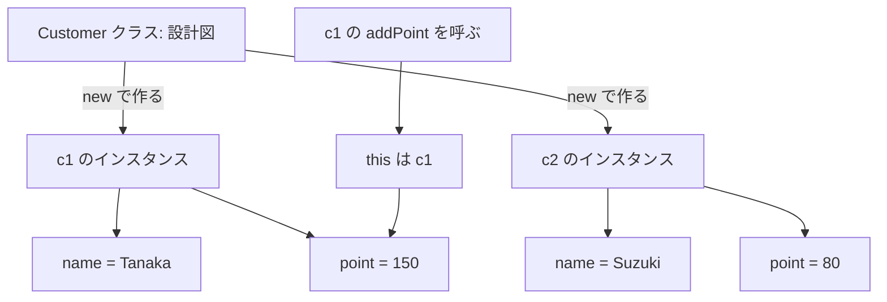

# Java-10 ハンズオン: インスタンスとクラス

前章とのつながり: [Java-09 複数クラスを用いた開発](./java-09-multi-class-development.md) では `new` を先に使って連携を体験した。この章で「クラスは設計図 / インスタンスは実体」を整理する。

補講（任意）: [Java-10A Stringの参照比較と値比較](./java-10a-string-reference-and-value-comparison.md)

## 1. この資料のゴール
- クラスとインスタンスの違いを説明できる
- Java-09で先に使った `new` の意味を説明できる
- 同じクラスから複数インスタンスを作成し、状態が独立することを確認できる
- `this` の基本的な意味を理解する

---

## 2. 事前準備
```bash
cd ~/order-management-springboot/practice/java
java -version
javac -version
```

期待状態:
- `java -version` と `javac -version` の両方で `17` が表示される
- 例: `17.0.x`

---

## 3. 先に覚えるポイント
1. この章の流れは「フィールド直接代入 -> メソッド経由の更新 -> `this` による明示」の3段階で、同じデータを別の書き方で扱えるようにすることが目的
2. クラスは設計図、インスタンスは実体。`new` で作った各インスタンスは別状態を持つ（`c1` を変えても `c2` は自動では変わらない）
3. `this` は「今このインスタンス自身」。引数名とフィールド名が同じとき（例: `name`）に、`this.name` と書いて「フィールド側」を明確にするために使う

### 全体構成図（クラスとインスタンス）


ポイント:
- `Customer` クラスは設計図
- `new Customer()` を2回実行すると、別々のインスタンスが2つできる
- `c1.addPoint(30)` の中では、`this` は `c1` を指す
- `c1` を変更しても、`c2` の値は自動では変わらない

### 前章のコードを読み直す
Java-09では、複数クラスを連携させるために次のコードを先に使いました。

```java
OrderItem item = new OrderItem();
```

Java-09では「使えること」を優先しました。
この章では、この1行の意味を整理します。

| Java-09で書いたもの | Java-10で整理する意味 |
| --- | --- |
| `OrderItem` | クラス。注文データの設計図 |
| `new OrderItem()` | インスタンスを作る処理。設計図から実体を1つ作る |
| `item` | 作った実体を参照する変数 |
| `item.quantity` | 実体が持つフィールド |
| `calcSubtotal(item)` | 作った実体を別メソッドへ渡す処理 |

この章では、同じクラスから `c1` と `c2` のように複数の実体を作り、それぞれが別の状態を持つことを確認します。

### 書式の基本

#### クラスとフィールド

```java
class Customer {
    String name;
    int point;
}
```

ポイント:
- クラスはデータや処理をまとめる設計図
- `name` や `point` のように、インスタンスが持つ値をフィールドと呼ぶ
- この段階では、まず最小形としてアクセス修飾子なしで書く

#### インスタンス生成とフィールド代入

```java
Customer c1 = new Customer();
c1.name = "Tanaka";
c1.point = 120;
```

ポイント:
- `new Customer()` で `Customer` のインスタンスを作る
- `c1` は作成したインスタンスを参照する変数
- `c1.name` のように `.` を使ってフィールドへアクセスする

#### インスタンスメソッド

```java
void addPoint(int value) {
    point += value;
}

c1.addPoint(30);
```

ポイント:
- インスタンスメソッドは、各インスタンスの状態を使って処理できる
- `c1.addPoint(30)` は `c1` のポイントだけを変更する
- 別のインスタンス `c2` には自動では影響しない

省略されている `this`:

```java
void addPoint(int value) {
    point += value;
}
```

上の `point += value;` は、次の省略形です。

```java
void addPoint(int value) {
    this.point += value;
}
```

`this` は「今このメソッドを呼び出しているインスタンス自身」です。
`c1.addPoint(30)` と呼んだときは `this` が `c1` を指し、`c2.addPoint(30)` と呼んだときは `this` が `c2` を指します。

`Customer` クラスの中で `c1.point` と書かない理由:
- `c1` は `main` メソッドの中で作った変数名
- `Customer` クラスの `addPoint` メソッドの中から `c1` という名前は見えない
- どのインスタンスを更新するかは、`c1.addPoint(30)` のように呼び出した側で決まる
- メソッド内では `this.point`、または省略して `point` と書く

#### フィールド・引数・ローカル変数の違い

```java
class Customer {
    int point; // フィールド

    void addPoint(int value) { // value は引数
        int bonus = 10; // bonus はローカル変数
        point += value + bonus;
    }
}
```

| 種類 | 宣言する場所 | 使える範囲 | 例 |
| --- | --- | --- | --- |
| フィールド | クラスの中、メソッドの外 | 各インスタンスが持つ値として使える | `int point;` |
| 引数 | メソッド名の後ろの `()` の中 | そのメソッドの中 | `int value` |
| ローカル変数 | メソッドやブロックの中 | 宣言したメソッドやブロックの中 | `int bonus = 10;` |

今回の Step 2 の元コードでは、`addPoint` メソッド内にローカル変数はありません。

```java
void addPoint(int value) {
    point += value;
}
```

このコードでは、`value` は引数です。
`point` という引数やローカル変数はないため、Javaは `point` をフィールドとして扱います。

もしメソッド内で同じ名前のローカル変数を作ると、その名前はローカル変数として扱われます。

```java
void addPoint(int value) {
    int point = 0;
    point += value; // フィールドではなく、ローカル変数 point を更新している
}
```

フィールドの `point` を更新したい場合は、`this.point` と書きます。

#### `this` でフィールドを明示する

```java
void setProfile(String name, int point) {
    this.name = name;
    this.point = point;
}
```

ポイント:
- `this` は今処理しているインスタンス自身を表す
- `this.name` はフィールド、右辺の `name` は引数
- 引数名とフィールド名が同じときに区別しやすくなる

`this` が必要な場合 / 省略できる場合:

| 書き方 | 判定 | 理由 |
| --- | --- | --- |
| `point += value;` | 省略できる | `point` という引数やローカル変数がないため、フィールドだと判断できる |
| `this.point += value;` | 書いてもよい | フィールドであることを明示している |
| `name = name;` | 不適切 | 左辺も右辺も引数の `name` になり、フィールドが更新されない |
| `this.name = name;` | 必要 | 左辺の `this.name` がフィールド、右辺の `name` が引数だと区別できる |
| `int point = 0; point += value;` | 不適切 | ローカル変数 `point` が優先され、フィールドが更新されない |
| `int point = 0; this.point += value;` | 必要 | 左辺の `this.point` がフィールドだと明示できる |

基本ルール:
- フィールド名と引数名・ローカル変数名が被っていない場合、`this` は省略できる
- フィールド名と引数名・ローカル変数名が被っている場合、フィールド側に `this` を付ける
- 初学者のうちは、迷ったらフィールド側に `this.` を付けて読むと分かりやすい

---

## 4. ハンズオン

目的:
- インスタンスが独立した状態を持つことを理解する

完了条件:
- `InstanceDemo.java` で複数インスタンスの独立性と `this` を確認できる

作成ファイル: `~/order-management-springboot/practice/java/handson10/InstanceDemo.java`

### Step 0: 作業フォルダを作る
```bash
mkdir -p ~/order-management-springboot/practice/java/handson10
cd ~/order-management-springboot/practice/java/handson10
```

### Step 1: クラスとインスタンスを作る
`InstanceDemo.java` を次の内容で作成:

```java
class Customer { // 顧客データを表すクラス
    String name; // 顧客名（フィールド）
    int point; // 保有ポイント（フィールド）
}

public class InstanceDemo { // 実行クラス
    public static void main(String[] args) {
        Customer c1 = new Customer(); // 1人目のインスタンス生成
        c1.name = "Tanaka"; // 1人目の名前
        c1.point = 120; // 1人目のポイント

        Customer c2 = new Customer(); // 2人目のインスタンス生成（c1とは別実体）
        c2.name = "Suzuki"; // 2人目の名前
        c2.point = 80; // 2人目のポイント

        System.out.println(c1.name + " point: " + c1.point); // c1 の状態を表示
        System.out.println(c2.name + " point: " + c2.point); // c2 の状態を表示
    } // main メソッドの終わり
} // クラス定義の終わり
```

実行:
```bash
javac -encoding UTF-8 InstanceDemo.java
java InstanceDemo
```

期待出力例:
```text
Tanaka point: 120
Suzuki point: 80
```

### Step 2: メソッドを追加する
`InstanceDemo.java` を次の内容に更新:

```java
class Customer { // 顧客クラス
    String name; // 顧客名
    int point; // ポイント

    void addPoint(int value) { // ポイント加算メソッド
        point += value; // 現在ポイントに value を加える
    }
}

public class InstanceDemo { // 実行クラス
    public static void main(String[] args) {
        Customer c1 = new Customer(); // 1人目を生成
        c1.name = "Tanaka"; // 名前設定
        c1.point = 120; // 初期ポイント設定
        c1.addPoint(30); // メソッド呼び出しで加算

        Customer c2 = new Customer(); // 2人目を生成
        c2.name = "Suzuki"; // 名前設定
        c2.point = 80; // 初期ポイント設定

        System.out.println(c1.name + " point: " + c1.point); // 加算後の c1 を表示
        System.out.println(c2.name + " point: " + c2.point); // c2 は影響を受けないことを表示
    } // main メソッドの終わり
} // クラス定義の終わり
```

実行:
```bash
javac -encoding UTF-8 InstanceDemo.java
java InstanceDemo
```

期待出力例:
```text
Tanaka point: 150
Suzuki point: 80
```

確認ポイント:
- `addPoint(30)` を呼んだ `c1` だけが変化し、`c2` は変化しない
- `point += value;` は `this.point += value;` の省略形
- `c1.addPoint(30)` と呼んだため、このときの `this` は `c1` を指す
- そのため、更新されるのは `c1.point` だけ


### Step 3: `this` を使う（仕上げ）
`InstanceDemo.java` を次の内容に更新:

```java
class Customer { // 顧客クラス
    String name; // 顧客名
    int point; // ポイント

    void setProfile(String name, int point) { // 顧客情報を一括設定するメソッド
        this.name = name; // this.name はフィールド、name は引数
        this.point = point; // this.point はフィールド、point は引数
    }
}

public class InstanceDemo { // 実行クラス
    public static void main(String[] args) {
        Customer c1 = new Customer(); // 1人目を生成
        c1.setProfile("Tanaka", 120); // プロフィール設定

        Customer c2 = new Customer(); // 2人目を生成
        c2.setProfile("Suzuki", 80); // プロフィール設定

        System.out.println(c1.name + " point: " + c1.point); // c1 の状態を表示
        System.out.println(c2.name + " point: " + c2.point); // c2 の状態を表示
    } // main メソッドの終わり
} // クラス定義の終わり
```

実行:
```bash
javac -encoding UTF-8 InstanceDemo.java
java InstanceDemo
```

期待出力例:
```text
Tanaka point: 120
Suzuki point: 80
```

確認ポイント:
- Step 3 の主目的は出力の変化ではなく、`this` を使った代入方法の理解
- `this.name = name;` のように「フィールド」と「引数」を明確に区別できる

`this` を省略した失敗例:

```java
void setProfile(String name, int point) {
    name = name;
    point = point;
}
```

このコードは、フィールドを更新できません。
メソッドの中に引数 `name` と `point` があるため、Javaは `name` を引数、`point` も引数として扱います。

つまり、次のように「引数へ同じ引数を代入しているだけ」になります。

```text
引数 name = 引数 name
引数 point = 引数 point
```

フィールドを更新したい場合は、左辺を `this.name` / `this.point` にします。

---

## 5. ミニ演習（10分）
### レベル1（基本）
1. `Customer` を3件作成して、それぞれの名前とポイントを表示する。

期待出力例:
```text
Tanaka point: 120
Suzuki point: 80
Sato point: 50
```

### レベル2（拡張）
1. `addPoint` メソッドを復活させ、1件だけポイント加算する。

期待出力例:
```text
Tanaka point: 150
Suzuki point: 80
```

### レベル3（実務）
1. `setProfile` の `point` を、`0` 未満なら `0` に補正する。

期待出力例:
```text
Tanaka point: 0
```

---

## 6. つまずきポイント
- `NullPointerException`
  -> インスタンス生成 (`new`) 前にアクセスしていないか確認
- `this` を使わず代入が効かない
  -> 引数名とフィールド名が同じときは `this` を付ける
- `point += value;` でなぜ `c1.point` が更新されるか分からない
  -> `point` は `this.point` の省略形。`c1.addPoint(30)` と呼んだときの `this` は `c1`
- ローカル変数がどれか分からない
  -> メソッドやブロックの中で宣言した変数。例: `int bonus = 10;`
- インスタンス間で値が混ざると誤解
  -> 各 `new` は別実体
