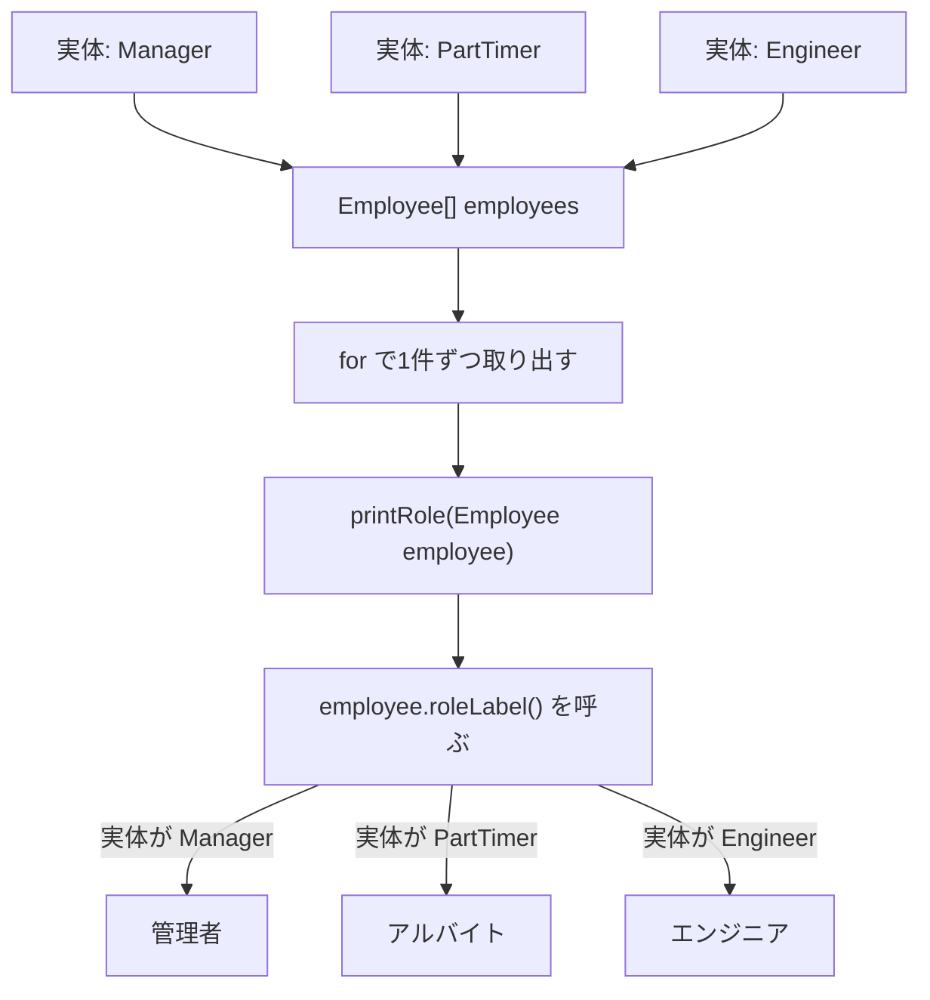

# Java-15 ハンズオン: 多態性（ポリモーフィズム）

対応参考資料: `Java-15_多態性.pptx`

## 1. この資料のゴール
- 親型の変数に子クラスのインスタンスを入れられることを説明できる
- 同じメソッド呼び出しでも、実体に応じて処理が切り替わることを確認できる
- 親型で受けると、呼び出し側の処理を共通化できることを説明できる
- 必要な場合だけ `instanceof` とダウンキャストを使える

---

## 2. 事前準備
```bash
cd ~/order-management-springboot/practice/java
java -version
javac -version
```

期待状態:
- `java -version` と `javac -version` の両方で `17` が表示される
- 例: `17.0.x`

---

## 3. 先に覚えるポイント
1. 多態性は「同じ呼び出しでも、実体によって動きが変わる」仕組み
2. 変数の型は「その変数から何を呼べるか」を決める
3. 実体の型は「オーバーライドされたメソッドのうち、どれが実行されるか」を決める
4. `instanceof` とダウンキャストは、多態性の中心ではなく補助手段

### 通常の継承・オーバーライドとの違い

最初に、次の2つを比べます。

```java
Manager manager = new Manager();
System.out.println(manager.roleLabel());

Employee employee = new Manager();
System.out.println(employee.roleLabel());
```

`Manager` が `roleLabel()` をオーバーライドしていれば、どちらも同じ結果になります。

```text
管理者
管理者
```

インスタンスを1件だけ扱う場合は、どちらの書き方でも `Manager` 側のメソッドを呼べます。つまり、**オーバーライドしたメソッドを動かすだけなら、`Manager manager = new Manager();` でも問題ありません。**

違いが分かりやすくなるのは、複数種類の子クラスを扱う場合です。

```java
Employee[] employees = {
    new Manager(),
    new PartTimer(),
    new Engineer()
};

for (Employee employee : employees) {
    System.out.println(employee.roleLabel());
}
```

`Manager`、`PartTimer`、`Engineer` は異なるクラスですが、すべて「`Employee` の一種」です。そのため、`Employee[]` にまとめ、同じ `for` 文と同じ `roleLabel()` 呼び出しで処理できます。実行される `roleLabel()` は、各要素の実体に応じて切り替わります。

整理すると、3つの仕組みには次の違いがあります。

| 仕組み | 役割 |
| --- | --- |
| 継承 | 子クラスが親クラスのフィールドやメソッドを引き継ぐ |
| オーバーライド | 継承したメソッドの処理を子クラスごとに変更する |
| 多態性 | 異なる子クラスを親クラス型としてまとめ、同じ呼び出し方で処理する |

### 親型と実体を分けて考える基本形

```java
Employee e = new Manager();
```

この1行では、次の2つを分けて考えます。

| 見る場所 | 例 | 意味 |
| --- | --- | --- |
| 左辺の型 | `Employee` | 変数 `e` から呼べるメンバーの範囲 |
| 右辺の実体 | `new Manager()` | 実際に作られるインスタンス |

ポイント:
- `e` の型は `Employee`
- 実体は `Manager`
- `Employee` に定義されているメソッドは `e` から呼べる
- そのメソッドが `Manager` でオーバーライドされていれば、`Manager` 側の処理が動く
- この書式の主な目的は、`Manager` をほかの子クラスと同じ `Employee` として扱いやすくすること

### 全体構成図（同じ処理で複数の実体を扱う）


ポイント:
- 配列の型は `Employee[]` で、各要素は `Employee` として扱う
- 実体は `Manager`、`PartTimer`、`Engineer` のように異なってよい
- 呼び出し側は `employee.roleLabel()` と同じ書き方だけでよい
- どの `roleLabel()` が動くかは、実体のクラスで決まる

### 書式の基本

#### 親型の変数で子クラスの実体を受ける

```java
Employee employee = new Manager();
```

ポイント:
- `Manager` は `Employee` を継承しているため、`Employee` 型の変数へ入れられる
- 「Manager は Employee の一種」と考える
- 同じ考え方で、`PartTimer` や `Engineer` も `Employee` 型として扱える

#### 実体に応じたメソッドが呼ばれる

```java
class Employee {
    String roleLabel() {
        return "社員";
    }
}

class Manager extends Employee {
    @Override
    String roleLabel() {
        return "管理者";
    }
}
```

```java
Employee employee = new Manager();
System.out.println(employee.roleLabel());
```

出力:
```text
管理者
```

ポイント:
- 変数型は `Employee`
- 実体は `Manager`
- `roleLabel()` は `Manager` 側の実装が呼ばれる
- 多態性で切り替わる中心は、オーバーライドされたメソッド

#### 親型を引数にする共通処理

```java
static void printRole(Employee employee) {
    System.out.println(employee.name + " は " + employee.roleLabel());
}
```

ポイント:
- 引数を `Employee` 型にすると、`Manager` も `PartTimer` も受け取れる
- 呼び出し側は、子クラスごとに別メソッドを作らなくてよい
- 子クラスが増えても、共通処理を使い回しやすい

#### 配列やループでまとめて扱う

```java
Employee[] employees = { manager, partTimer, engineer };

for (Employee employee : employees) {
    printRole(employee);
}
```

ポイント:
- 配列の型は `Employee[]`
- 中身の実体は別々の子クラスでよい
- 同じ `printRole(employee)` で、実体ごとの結果になる

このハンズオンでは、親型で受けている場所がコード上ではっきり分かるように、Step 2以降の変数をすべて`Employee`型で宣言します。まずは、左辺を親型へ統一すると、同じメソッド・配列・ループへまとめられる流れを確認してください。

#### 親型では親にあるメンバーだけ呼べる

```java
Employee employee = new Manager();

employee.name = "Yamada"; // OK: Employee に name がある
// employee.teamName = "Platform"; // NG: Employee に teamName はない
```

ポイント:
- `employee` の変数型は `Employee`
- コンパイラは `Employee` に定義されたメンバーだけを許可する
- 実体が `Manager` でも、親型のままでは `Manager` 固有の `teamName` を直接使えない

#### 必要な場合だけ `instanceof` とダウンキャストを使う

```java
if (employee instanceof Manager) {
    Manager manager = (Manager) employee;
    manager.teamName = "Platform";
}
```

ポイント:
- 親型変数から子クラス固有のフィールドやメソッドを使うにはダウンキャストが必要
- 先に `instanceof` で実体の型を確認する
- 確認せずに誤った型へキャストすると実行時エラーになる
- `instanceof` 分岐が増えすぎる場合は、共通メソッドへ移せないかを先に考える

---

## 4. ハンズオン

目的:
- 子クラス型でもオーバーライドが動作することを確認する
- 親クラス型の変数で、異なる子クラスの実体を受けられることを確認する
- 同じメソッド呼び出しでも、実体に応じて実行結果が切り替わることを確認する
- 親クラス型の仮引数・配列・ループで、呼び出し側を共通化する
- 子クラス固有情報が必要な場合だけ、`instanceof` とダウンキャストを使う

完了条件:
- `Manager manager = new Manager();`と`Employee employee = new Manager();`の違いを説明できる
- 親型の変数へ子クラスの実体を代入できる理由を説明できる
- 親型で受けても、オーバーライドされた子クラス側のメソッドが実行されることを説明できる
- 共通処理では親クラス型、固有処理では子クラス型を選ぶ理由を説明できる

作成ファイル: `~/order-management-springboot/practice/java/handson15/PolymorphismDemo.java`

### Step 0: 作業フォルダを作る
```bash
mkdir -p ~/order-management-springboot/practice/java/handson15
cd ~/order-management-springboot/practice/java/handson15
```

### Step 1: 通常の継承とオーバーライドを確認する

まず、子クラス型の変数でインスタンスを受けます。親クラス型を使わなくても、オーバーライドが動作することを確認します。

`PolymorphismDemo.java` を次の内容に更新:

```java
class Employee { // 親クラス
    String name; // 社員名

    String roleLabel() { // 役割名
        return "社員";
    }

    int monthlyBonus() { // 月額手当
        return 0;
    }
}

class Manager extends Employee { // 管理者
    @Override
    String roleLabel() {
        return "管理者";
    }

    @Override
    int monthlyBonus() {
        return 50000;
    }
}

class PartTimer extends Employee { // アルバイト
    @Override
    String roleLabel() {
        return "アルバイト";
    }

    @Override
    int monthlyBonus() {
        return 0;
    }
}

class Engineer extends Employee { // エンジニア
    @Override
    String roleLabel() {
        return "エンジニア";
    }

    @Override
    int monthlyBonus() {
        return 30000;
    }
}

class Contractor extends Employee { // 業務委託
    @Override
    String roleLabel() {
        return "業務委託";
    }

    @Override
    int monthlyBonus() {
        return 10000;
    }
}

public class PolymorphismDemo { // 実行クラス
    public static void main(String[] args) {
        Manager manager = new Manager(); // 子クラス型で受ける通常の書き方
        manager.name = "Yamada";

        PartTimer partTimer = new PartTimer();
        partTimer.name = "Kato";

        Engineer engineer = new Engineer();
        engineer.name = "Tanaka";

        Contractor contractor = new Contractor();
        contractor.name = "Sato";

        System.out.println(manager.name + " は " + manager.roleLabel());
        System.out.println("手当: " + manager.monthlyBonus());
        System.out.println(partTimer.name + " は " + partTimer.roleLabel());
        System.out.println("手当: " + partTimer.monthlyBonus());
        System.out.println(engineer.name + " は " + engineer.roleLabel());
        System.out.println("手当: " + engineer.monthlyBonus());
        System.out.println(contractor.name + " は " + contractor.roleLabel());
        System.out.println("手当: " + contractor.monthlyBonus());
    } // main メソッドの終わり
} // クラス定義の終わり
```

実行:
```bash
javac -encoding UTF-8 PolymorphismDemo.java
java PolymorphismDemo
```

期待出力例:
```text
Yamada は 管理者
手当: 50000
Kato は アルバイト
手当: 0
Tanaka は エンジニア
手当: 30000
Sato は 業務委託
手当: 10000
```

この段階で確認すること:
- `roleLabel()` と `monthlyBonus()` を親クラス `Employee` に用意している
- 子クラスごとの差分は、それぞれのクラスでオーバーライドしている
- `Manager manager = new Manager();`のように子クラス型で受けても、オーバーライドは動作する
- ただし、表示処理を社員の種類ごとに繰り返している

### Step 2: 変数の型だけを親クラス型へ変更する

`PolymorphismDemo.java`を次の内容に更新します。Step 1から変更した範囲をコメント行で囲んでいます。

```java
class Employee { // 親クラス
    String name; // 社員名

    String roleLabel() { // 役割名
        return "社員";
    }

    int monthlyBonus() { // 月額手当
        return 0;
    }
}

class Manager extends Employee { // 管理者
    @Override
    String roleLabel() {
        return "管理者";
    }

    @Override
    int monthlyBonus() {
        return 50000;
    }
}

class PartTimer extends Employee { // アルバイト
    @Override
    String roleLabel() {
        return "アルバイト";
    }

    @Override
    int monthlyBonus() {
        return 0;
    }
}

class Engineer extends Employee { // エンジニア
    @Override
    String roleLabel() {
        return "エンジニア";
    }

    @Override
    int monthlyBonus() {
        return 30000;
    }
}

class Contractor extends Employee { // 業務委託
    @Override
    String roleLabel() {
        return "業務委託";
    }

    @Override
    int monthlyBonus() {
        return 10000;
    }
}

public class PolymorphismDemo { // 実行クラス
    public static void main(String[] args) {
        // ===== Step 2で変更: 左辺だけを子クラス型から親クラス型へ変更 =====
        Employee manager = new Manager(); // Step 1: Manager manager = new Manager();
        manager.name = "Yamada";

        Employee partTimer = new PartTimer(); // Step 1: PartTimer partTimer = new PartTimer();
        partTimer.name = "Kato";

        Employee engineer = new Engineer(); // Step 1: Engineer engineer = new Engineer();
        engineer.name = "Tanaka";

        Employee contractor = new Contractor(); // Step 1: Contractor contractor = new Contractor();
        contractor.name = "Sato";

        System.out.println(manager.name + " は " + manager.roleLabel());
        System.out.println("手当: " + manager.monthlyBonus());
        System.out.println(partTimer.name + " は " + partTimer.roleLabel());
        System.out.println("手当: " + partTimer.monthlyBonus());
        System.out.println(engineer.name + " は " + engineer.roleLabel());
        System.out.println("手当: " + engineer.monthlyBonus());
        System.out.println(contractor.name + " は " + contractor.roleLabel());
        System.out.println("手当: " + contractor.monthlyBonus());
        // ===== Step 2で変更ここまで =====
    } // main メソッドの終わり
} // クラス定義の終わり
```

コンパイルして実行する。出力はStep 1と同じになります。

```bash
javac -encoding UTF-8 PolymorphismDemo.java
java PolymorphismDemo
```

確認すること:

- Step 1から変更したのは、各変数宣言の左辺にある型
- 右辺の`new Manager()`や`new Engineer()`は変更していない
- 作成される実体は、Step 1と同じ`Manager`や`Engineer`
- すべての変数型を`Employee`に統一できる
- 変数型が`Employee`でも、実体に応じた子クラス側のオーバーライドが動く

2つの宣言を比較します。

| 宣言 | 代入できる主な実体 | 適している処理 |
| --- | --- | --- |
| `Manager manager = new Manager();` | `Manager`（またはその子クラス） | `Manager`固有のフィールドやメソッドを使う処理 |
| `Employee manager = new Manager();` | `Manager`、`Engineer`、`PartTimer`など | 社員の種類に依存しない共通処理 |

Step 2では、まだ表示処理を個別に書いています。Step 3では、変数型を`Employee`に統一した利点を使って、表示処理を1つのメソッドへまとめます。

### Step 3: 親クラス型の仮引数で、呼び出し側を共通化する

`PolymorphismDemo.java`を次の内容に更新します。Step 2から追加・変更した範囲をコメント行で囲んでいます。

```java
class Employee { // 親クラス
    String name; // 社員名

    String roleLabel() { // 役割名
        return "社員";
    }

    int monthlyBonus() { // 月額手当
        return 0;
    }
}

class Manager extends Employee { // 管理者
    @Override
    String roleLabel() {
        return "管理者";
    }

    @Override
    int monthlyBonus() {
        return 50000;
    }
}

class PartTimer extends Employee { // アルバイト
    @Override
    String roleLabel() {
        return "アルバイト";
    }

    @Override
    int monthlyBonus() {
        return 0;
    }
}

class Engineer extends Employee { // エンジニア
    @Override
    String roleLabel() {
        return "エンジニア";
    }

    @Override
    int monthlyBonus() {
        return 30000;
    }
}

class Contractor extends Employee { // 業務委託
    @Override
    String roleLabel() {
        return "業務委託";
    }

    @Override
    int monthlyBonus() {
        return 10000;
    }
}

public class PolymorphismDemo { // 実行クラス
    // ===== Step 3で追加: 親型の仮引数を持つ共通処理 =====
    static void printEmployee(Employee employee) { // Employeeの子クラスなら受け取れる
        System.out.println(employee.name + " は " + employee.roleLabel());
        System.out.println("手当: " + employee.monthlyBonus());
    }
    // ===== Step 3で追加ここまで =====

    public static void main(String[] args) {
        // ===== Step 3で変更: Employee型の変数を同じ共通メソッドへ渡す =====
        Employee manager = new Manager();
        manager.name = "Yamada";

        Employee partTimer = new PartTimer();
        partTimer.name = "Kato";

        Employee engineer = new Engineer();
        engineer.name = "Tanaka";

        Employee contractor = new Contractor();
        contractor.name = "Sato";

        printEmployee(manager);
        printEmployee(partTimer);
        printEmployee(engineer);
        printEmployee(contractor);
        // ===== Step 3で変更ここまで =====
    } // main メソッドの終わり
} // クラス定義の終わり
```

コンパイルして実行する。出力はStep 1、Step 2と同じになります。

```bash
javac -encoding UTF-8 PolymorphismDemo.java
java PolymorphismDemo
```

4つの変数はすべて`Employee`型なので、同じ`printEmployee(Employee employee)`へそのまま渡せます。呼び出し側は、社員の種類ごとに別の表示メソッドを用意する必要がありません。

メソッド内の呼び出し方は常に`employee.roleLabel()`ですが、実体が`Manager`なら`Manager`側、実体が`Engineer`なら`Engineer`側のメソッドが動きます。これが、親型で受けても実体に応じて処理が切り替わる動きです。

### Step 4: 親クラス型の配列とループでまとめて扱う

`PolymorphismDemo.java`を次の内容に更新します。Step 3から変更した範囲をコメント行で囲んでいます。

```java
class Employee { // 親クラス
    String name; // 社員名

    String roleLabel() { // 役割名
        return "社員";
    }

    int monthlyBonus() { // 月額手当
        return 0;
    }
}

class Manager extends Employee { // 管理者
    @Override
    String roleLabel() {
        return "管理者";
    }

    @Override
    int monthlyBonus() {
        return 50000;
    }
}

class PartTimer extends Employee { // アルバイト
    @Override
    String roleLabel() {
        return "アルバイト";
    }

    @Override
    int monthlyBonus() {
        return 0;
    }
}

class Engineer extends Employee { // エンジニア
    @Override
    String roleLabel() {
        return "エンジニア";
    }

    @Override
    int monthlyBonus() {
        return 30000;
    }
}

class Contractor extends Employee { // 業務委託
    @Override
    String roleLabel() {
        return "業務委託";
    }

    @Override
    int monthlyBonus() {
        return 10000;
    }
}

public class PolymorphismDemo { // 実行クラス
    static void printEmployee(Employee employee) { // Employeeの子クラスなら受け取れる
        System.out.println(employee.name + " は " + employee.roleLabel());
        System.out.println("手当: " + employee.monthlyBonus());
    }

    public static void main(String[] args) {
        Employee manager = new Manager();
        manager.name = "Yamada";

        Employee partTimer = new PartTimer();
        partTimer.name = "Kato";

        Employee engineer = new Engineer();
        engineer.name = "Tanaka";

        Employee contractor = new Contractor();
        contractor.name = "Sato";

        // ===== Step 4で変更: 親型の配列とループでまとめて処理する =====
        Employee[] employees = { manager, partTimer, engineer, contractor };

        for (Employee employee : employees) {
            printEmployee(employee);
        }
        // ===== Step 4で変更ここまで =====
    } // main メソッドの終わり
} // クラス定義の終わり
```

再度コンパイルして実行する。出力はStep 1からStep 3までと同じになります。

```bash
javac -encoding UTF-8 PolymorphismDemo.java
java PolymorphismDemo
```

Step 1からStep 4までの流れを整理します。

1. 子クラス型でも、オーバーライドは動作する
2. 親クラス型の変数なら、異なる子クラスの実体を同じ変数で受けられる
3. 親クラス型の仮引数なら、異なる子クラスを同じメソッドで処理できる
4. `Employee[]`なら、異なる子クラスの実体を同じ配列とループで処理できる

`Manager manager = new Manager();`と`Employee employee = new Manager();`は、どちらが常に優れているという関係ではありません。子クラス固有の機能を使う場合は子クラス型、複数の子クラスを共通処理へ渡す場合は親クラス型が適しています。

### Step 5: 新しい種類を追加して、共通処理を変えずに動かす
`PolymorphismDemo.java` を次の内容に更新:

```java
class Employee { // 親クラス
    String name; // 社員名

    String roleLabel() { // 役割名
        return "社員";
    }

    int monthlyBonus() { // 月額手当
        return 0;
    }
}

class Manager extends Employee { // 管理者
    @Override
    String roleLabel() {
        return "管理者";
    }

    @Override
    int monthlyBonus() {
        return 50000;
    }
}

class PartTimer extends Employee { // アルバイト
    @Override
    String roleLabel() {
        return "アルバイト";
    }

    @Override
    int monthlyBonus() {
        return 0;
    }
}

class Engineer extends Employee { // エンジニア
    @Override
    String roleLabel() {
        return "エンジニア";
    }

    @Override
    int monthlyBonus() {
        return 30000;
    }
}

class Contractor extends Employee { // 業務委託
    @Override
    String roleLabel() {
        return "業務委託";
    }

    @Override
    int monthlyBonus() {
        return 10000;
    }
}

// ===== Step 5で追加: 新しい社員種別 =====
class Intern extends Employee { // インターン
    @Override
    String roleLabel() {
        return "インターン";
    }

    @Override
    int monthlyBonus() {
        return 0;
    }
}
// ===== Step 5で追加ここまで =====

public class PolymorphismDemo { // 実行クラス
    static void printEmployee(Employee employee) { // この共通処理は変更しない
        System.out.println(employee.name + " は " + employee.roleLabel());
        System.out.println("手当: " + employee.monthlyBonus());
    }

    public static void main(String[] args) {
        Employee manager = new Manager();
        manager.name = "Yamada";

        Employee partTimer = new PartTimer();
        partTimer.name = "Kato";

        Employee engineer = new Engineer();
        engineer.name = "Tanaka";

        Employee contractor = new Contractor();
        contractor.name = "Sato";

        // ===== Step 5で追加: Internの作成 =====
        Employee intern = new Intern(); // 新しい子クラスも親型で受ける
        intern.name = "Suzuki";
        // ===== Step 5で追加ここまで =====

        // ===== Step 5で変更: 配列の末尾へinternを追加 =====
        Employee[] employees = { manager, partTimer, engineer, contractor, intern };
        // ===== Step 5で変更ここまで =====

        for (Employee employee : employees) { // この呼び出し方は変更しない
            printEmployee(employee);
        }
    } // main メソッドの終わり
} // クラス定義の終わり
```

実行:
```bash
javac -encoding UTF-8 PolymorphismDemo.java
java PolymorphismDemo
```

期待出力例:
```text
Yamada は 管理者
手当: 50000
Kato は アルバイト
手当: 0
Tanaka は エンジニア
手当: 30000
Sato は 業務委託
手当: 10000
Suzuki は インターン
手当: 0
```

コード解説:
- 新しい種類 `Intern` を追加している
- `Intern` の役割名と手当は、`Intern` クラスの中に書いている
- 個別の変数はすべて`Employee`型で宣言している
- 右辺の実体は`Manager`や`Engineer`など異なっていても、`Employee[]`へまとめて格納できる
- 配列から取り出す変数と`printEmployee(...)`の仮引数は`Employee`型であり、ここで共通に扱っている
- `printEmployee` に `if` 分岐を追加していない
- 種類ごとの差分を子クラス側へ移すことで、共通処理を変更しにくくできる
- これが多態性を使う主な理由

### Step 6: 必要な場合だけ `instanceof` で子クラス固有情報を扱う

共通処理では`Employee`型が便利ですが、親クラスにない子クラス固有の情報は、親型のままでは呼び出せません。`Manager`だけが持つ`teamName`を使い、子クラス型と親クラス型の使い分けを確認します。

`PolymorphismDemo.java` を次の内容に更新:

```java
class Employee { // 親クラス
    String name; // 社員名

    String roleLabel() { // 役割名
        return "社員";
    }

    int monthlyBonus() { // 月額手当
        return 0;
    }
}

class Manager extends Employee { // 管理者
    // ===== Step 6で追加: Managerだけが持つ固有フィールド =====
    String teamName; // Manager だけが持つ固有フィールド
    // ===== Step 6で追加ここまで =====

    @Override
    String roleLabel() {
        return "管理者";
    }

    @Override
    int monthlyBonus() {
        return 50000;
    }
}

class PartTimer extends Employee { // アルバイト
    @Override
    String roleLabel() {
        return "アルバイト";
    }

    @Override
    int monthlyBonus() {
        return 0;
    }
}

class Engineer extends Employee { // エンジニア
    @Override
    String roleLabel() {
        return "エンジニア";
    }

    @Override
    int monthlyBonus() {
        return 30000;
    }
}

class Contractor extends Employee { // 業務委託
    @Override
    String roleLabel() {
        return "業務委託";
    }

    @Override
    int monthlyBonus() {
        return 10000;
    }
}

class Intern extends Employee { // インターン
    @Override
    String roleLabel() {
        return "インターン";
    }

    @Override
    int monthlyBonus() {
        return 0;
    }
}

public class PolymorphismDemo { // 実行クラス
    static void printEmployee(Employee employee) { // 共通情報は多態性で扱う
        System.out.println(employee.name + " は " + employee.roleLabel());
        System.out.println("手当: " + employee.monthlyBonus());
    }

    // ===== Step 6で追加: Manager固有情報を扱う処理 =====
    static void printManagerTeam(Employee employee) { // Manager 固有情報が必要な場合だけ型判定する
        // employee.teamName はコンパイルエラー。EmployeeにはteamNameがない
        if (employee instanceof Manager) { // 実体が Manager か確認
            Manager manager = (Manager) employee; // 確認後に Manager 型として扱う
            System.out.println(manager.name + " / " + manager.teamName);
        }
    }
    // ===== Step 6で追加ここまで =====

    public static void main(String[] args) {
        // ===== Step 6で変更: 親型から子クラス固有フィールドを扱う =====
        Employee manager = new Manager(); // Step 2以降と同じく、親型で実体を受ける
        manager.name = "Yamada";
        // manager.teamName = "Platform"; // NG: Employee型からはManager固有フィールドを呼べない

        if (manager instanceof Manager) { // 実体がManagerであることを確認
            Manager managerDetail = (Manager) manager; // Manager型として扱えるようにする
            managerDetail.teamName = "Platform";
        }
        // ===== Step 6で変更ここまで =====

        Employee partTimer = new PartTimer();
        partTimer.name = "Kato";

        Employee engineer = new Engineer();
        engineer.name = "Tanaka";

        Employee contractor = new Contractor();
        contractor.name = "Sato";

        Employee intern = new Intern();
        intern.name = "Suzuki";

        Employee[] employees = { manager, partTimer, engineer, contractor, intern };

        for (Employee employee : employees) {
            printEmployee(employee);
        }

        // ===== Step 6で追加: 固有情報が必要な処理だけ型判定を使う =====
        System.out.println("管理チーム:");
        for (Employee employee : employees) {
            printManagerTeam(employee);
        }
        // ===== Step 6で追加ここまで =====
    } // main メソッドの終わり
} // クラス定義の終わり
```

実行:
```bash
javac -encoding UTF-8 PolymorphismDemo.java
java PolymorphismDemo
```

期待出力例:
```text
Yamada は 管理者
手当: 50000
Kato は アルバイト
手当: 0
Tanaka は エンジニア
手当: 30000
Sato は 業務委託
手当: 10000
Suzuki は インターン
手当: 0
管理チーム:
Yamada / Platform
```

コード解説:
- `name`、`roleLabel()`、`monthlyBonus()` は `Employee` にあるため、親型のまま扱える
- `Employee manager`からは、`Manager`固有の`teamName`を直接扱えない
- `instanceof` で実体が `Manager` であることを確認してから、`Manager` 型へダウンキャストしている
- 共通処理は多態性で扱い、子クラス固有情報が必要な場合だけ `instanceof` を使う
- `instanceof` 分岐が増えすぎる場合は、共通メソッドにできないかを先に考える

変数型の使い分け:

| やりたいこと | 適した変数型 | 理由 |
| --- | --- | --- |
| `teamName`など、`Manager`固有の機能を使う | `Manager` | 固有のメンバーを直接呼べる |
| 社員の種類を問わず、名前や手当を表示する | `Employee` | すべての子クラスを同じ処理へ渡せる |

親クラス型が常に優れているわけではありません。共通部分を扱うときは親クラス型、固有部分を扱うときは子クラス型、というように目的に応じて選びます。

---

## 5. ミニ演習（20分）
Step 6の完成コードを基準に、レベル1からレベル3まで順番に進めてください。各レベルは直前の変更を残したまま追記・変更します。

### レベル1（基本）
1. Step 6の`Intern`クラスより後、`PolymorphismDemo`クラスより前へ`Employee`を継承する`Director`クラスを追加する。
2. `roleLabel()` が `"役員"` を返すようにする。
3. `monthlyBonus()` が `80000` を返すようにする。
4. `main(...)`で`Employee director = new Director();`を生成し、`director.name = "Takahashi";`を設定する。
5. 親型で受けた`director`を`Employee[] employees`の末尾へ追加し、既存の`for`文で表示する。
6. 右辺が新しい`Director`でも、左辺をこれまでと同じ`Employee`型にできることを確認する。

確認対象の出力（抜粋）:
```text
Takahashi は 役員
手当: 80000
```

### レベル2（補足: 子クラス固有情報）
1. レベル1まで完了したコードの `Engineer` に、`skillName` フィールドを追加する。
2. Step 6の`engineer`変数は`Employee`型なので、名前設定の直後へ次の処理を追加する。

```java
if (engineer instanceof Engineer) {
    Engineer engineerDetail = (Engineer) engineer;
    engineerDetail.skillName = "Java";
}
```

3. `employees`を処理する最初の`for`文では、各要素を`Employee`型で受け取っている。`printEmployee(employee);`より後へ次の処理を追加する。

```java
if (employee instanceof Engineer) {
    Engineer engineer = (Engineer) employee;
    System.out.println(engineer.name + " / " + engineer.skillName);
}
```

4. `skillName`は`Engineer`固有のフィールドなので、親型のままでは直接扱えないことを確認する。
5. `Director`と既存の管理チーム表示は残す。

確認対象の出力（抜粋）:
```text
Tanaka / Java
```

### レベル3（実務）
1. レベル2まで完了したコードの `skillName` 表示を、`instanceof` 分岐を使わずに済むように見直す。
2. `Employee`に、`name + " は " + roleLabel()`を返す`detailLabel()`メソッドを追加する。
3. `Engineer`で`detailLabel()`をオーバーライドし、`name + " / " + skillName`を返す。
4. `printEmployee(Employee employee)`の1行目を、`System.out.println(employee.detailLabel());`へ変更する。
5. レベル2で`for`文へ追加した`Engineer`判定の`if`ブロック全体を削除する。
6. `skillName`の設定処理、`Director`、管理チーム表示は残す。

期待状態:
- 呼び出し側の `if` / `instanceof` 分岐を減らせる
- 子クラスごとの差分は、子クラス側のオーバーライドに閉じ込められる

---

## 6. つまずきポイント
- `Employee employee = new Manager();` の意味が分からない
  -> 左辺の `Employee` は変数から呼べる範囲、右辺の `Manager` は実際に作られる実体
- `Manager manager = new Manager();` でもオーバーライドできるので、違いが分からない
  -> 1件だけなら実行結果は同じ。親型を使う主な利点は、異なる子クラスを同じ配列・引数・ループでまとめて扱えること
- `employee.roleLabel()` でなぜ `Manager` 側が呼ばれるのか分からない
  -> オーバーライドされたメソッドは、変数型ではなく実体の型で実行先が決まる
- 親型で子クラス固有フィールドを直接呼んでエラー
  -> 親型参照では、親に定義されたメンバーだけ呼べる
- キャストで `ClassCastException`
  -> `instanceof` 判定を先に行う
- `instanceof` 分岐が増えてコードが読みにくい
  -> 共通メソッドを親に定義し、子クラス側でオーバーライドできないか考える
- 多態性のメリットが見えない
  -> `Employee[]` と `for` で、複数の子クラスを同じ処理で扱える点に着目する
