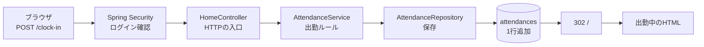
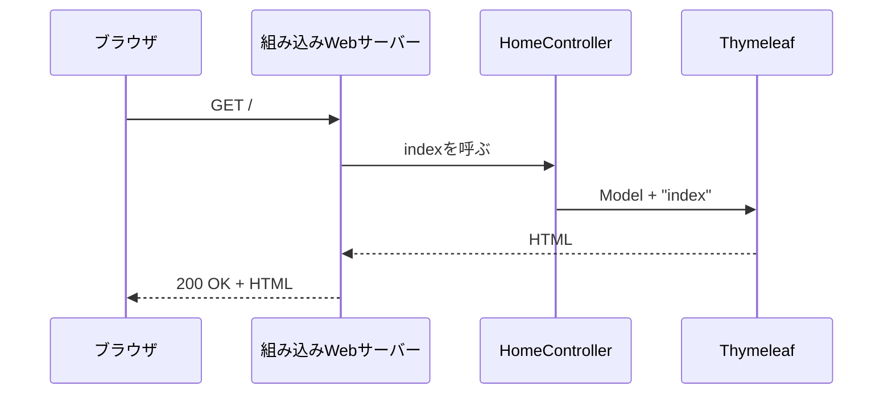
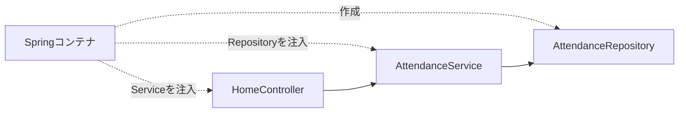
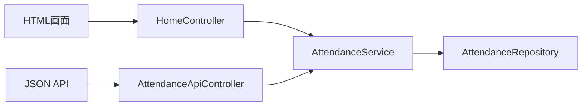
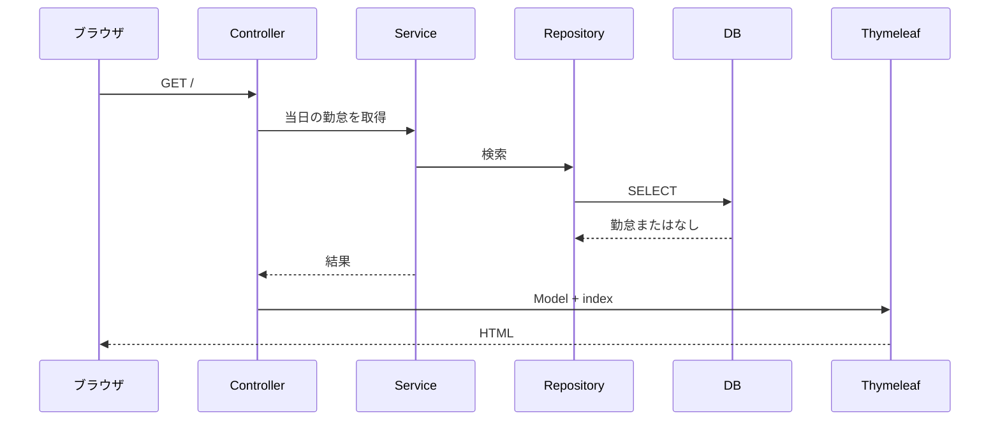
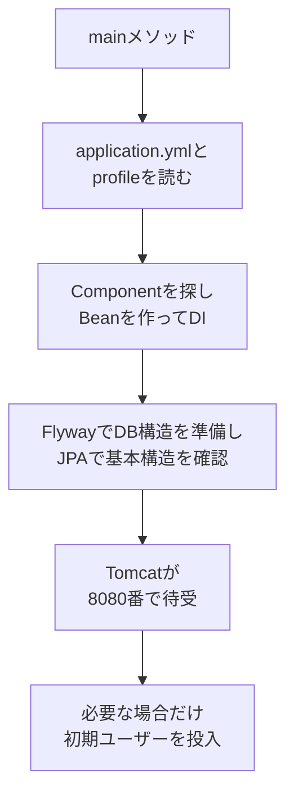
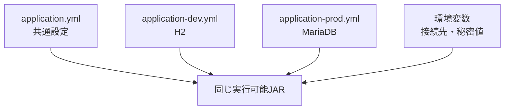

# Spring Boot概要

## この資料の目的

この資料は、変数、分岐、繰り返し、クラス、メソッドを一度学んだ受講者が、Spring Bootの全体像をつかむためのものです。Web、SQL、Springを初めて学ぶ前提で説明します。

先に[JavaからWeb・データベースへ進むための基礎](./00-java-web-database-primer.md)を読み、次を確認してください。

- ブラウザとWebサーバー
- HTTPリクエストとHTTPレスポンス
- HTMLフォームとJSON
- DBのテーブル、行、列
- 主キー、外部キー、SQL

分からない言葉は[用語集](./glossary.md)で確認できます。最初からアノテーション名を暗記する必要はありません。

この章では、次の順番で理解します。

1. 完成版の出勤1件を見る
2. 最小のSpring Boot画面を読む
3. Controller、Service、Repositoryへ役割を分ける
4. Springがオブジェクトを作って接続する仕組みを知る
5. DB、入力検証、ログイン、REST APIへ広げる
6. 同じJARを設定でH2とMariaDBへ切り替える

---

## 1. まず完成版の出勤1件を見る

### 1.1 利用者から見える動作

一般ユーザー`user1`は、次の順で勤怠を操作します。

1. ログイン画面でユーザー名とパスワードを入力する
2. トップ画面で「出勤」を押す
3. 状態が「未出勤」から「出勤中」へ変わる
4. 「退勤」を押す
5. 状態が「退勤済み」へ変わる
6. 自分の勤怠一覧で勤務日と時刻を確認する

画面では一回のボタン操作に見えますが、出勤時は次の処理が行われます。



### 1.2 同じ値を端から端まで追う

ログイン中のユーザー名:

```text
user1
```

DBから取得するユーザー:

```text
User {
  id = 2,
  username = "user1",
  role = "ROLE_USER"
}
```

Serviceが作る勤怠:

```text
Attendance {
  userId = 2,
  workDate = 2026-07-28,
  startTime = 2026-07-28T08:55:00,
  status = WORKING
}
```

DBへ保存された行:

| id | user_id | work_date | start_time | end_time | status |
| ---: | ---: | --- | --- | --- | --- |
| 102 | 2 | 2026-07-28 | 08:55:00 |  | WORKING |

ブラウザへ返す画面:

```html
<p>現在の状態: 出勤中</p>
```

実際のid、日付、時刻は実行時に決まります。重要なのは、同じ`user1`と`user_id=2`が、HTTP、Java、DB、HTMLを通っていることです。

### 1.3 最初に覚える一本の道

```text
ブラウザ
  -> Spring Security
  -> Controller
  -> Service
  -> Repository
  -> DB
```

この後に多くの用語が登場しますが、すべてこの道のどこかに置かれます。

---

## 2. 最小のSpring Boot画面

### 2.1 起動クラス

Spring Bootアプリケーションも、通常のJavaと同じ`main`メソッドから始まります。

次は、適切なMaven依存関係があるSpring Bootプロジェクト内でコンパイルできる完全なクラスです。

`src/main/java/com/example/hello/HelloApplication.java`:

```java
package com.example.hello;

import org.springframework.boot.SpringApplication;
import org.springframework.boot.autoconfigure.SpringBootApplication;

@SpringBootApplication
public class HelloApplication {

    public static void main(String[] args) {
        SpringApplication.run(HelloApplication.class, args);
    }
}
```

`@SpringBootApplication`は、Spring Bootへ「このクラスを起点にアプリを準備する」と伝える目印です。

`SpringApplication.run`を呼ぶと、Springは必要なオブジェクトを作り、組み込みWebサーバーを起動し、HTTPリクエストを待ち始めます。

### 2.2 最小Controller

`src/main/java/com/example/hello/HomeController.java`:

```java
package com.example.hello;

import org.springframework.stereotype.Controller;
import org.springframework.ui.Model;
import org.springframework.web.bind.annotation.GetMapping;

@Controller
public class HomeController {

    @GetMapping("/")
    public String index(Model model) {
        model.addAttribute("message", "Spring Bootへようこそ");
        return "index";
    }
}
```

このクラスも、Spring WebとThymeleafの依存関係があるプロジェクト内でコンパイルできます。

Springは次のように読み取ります。

| 記述 | Springが理解すること |
| --- | --- |
| `@Controller` | このクラスはHTML画面用の入口 |
| `@GetMapping("/")` | `GET /`が届いたら`index`を呼ぶ |
| `Model` | Templateへ渡す名前と値の入れ物 |
| `return "index"` | `templates/index.html`を使う |

ここで使う`Model`は、DBへ保存するEntityとは別物です。画面へ渡す値を一時的に持つ入れ物です。

### 2.3 最小Template

`src/main/resources/templates/index.html`:

```html
<!doctype html>
<html lang="ja" xmlns:th="http://www.thymeleaf.org">
<head>
  <meta charset="utf-8">
  <title>Spring Boot入門</title>
</head>
<body>
  <h1 th:text="${message}">ここへメッセージが入ります</h1>
</body>
</html>
```

Thymeleafは、HTMLのひな形であるTemplateへModelの値を埋め込みます。

```text
Modelの message
  = "Spring Bootへようこそ"
        |
        v
th:text="${message}"
        |
        v
<h1>Spring Bootへようこそ</h1>
```

### 2.4 リクエストの一往復



開発者が`new HomeController()`や`controller.index(...)`を`main`へ書いていない点に注目してください。SpringがControllerを作り、HTTPリクエストに応じてメソッドを呼びます。

---

## 3. Spring FrameworkとSpring Boot

### 3.1 Frameworkとは

普通のJavaプログラムでは、自分のコードが処理の順番を決め、必要なライブラリを呼びます。

Frameworkはアプリ全体の実行の流れを持ち、決められた場所で開発者のコードを呼びます。

```text
通常のJava
main -> 自分のメソッド -> ライブラリ

Springを使うWebアプリ
HTTPリクエスト -> Spring -> 自分のControllerメソッド
```

### 3.2 Spring Frameworkの役割

Spring Frameworkは、主に次の基盤を提供します。

- オブジェクトを作って接続する
- HTTPリクエストをControllerへ対応付ける
- DB更新をトランザクションとして扱う
- 入力検証やセキュリティ機能と連携する

### 3.3 Spring Bootの役割

Spring Bootは、Spring Frameworkを置き換えるものではありません。Springを使うアプリの依存関係、初期設定、起動、外部設定、配布をまとめやすくします。

| 観点 | Spring Framework | Spring Boot |
| --- | --- | --- |
| 中心的な役割 | DI、Spring MVC、トランザクションなど | Springアプリの準備と実行を簡単にする |
| オブジェクト管理 | Springコンテナを提供 | 一般的な構成を自動で準備する |
| Web | Spring MVCを提供 | Tomcatなどを組み込み、すぐ起動しやすくする |
| 依存関係 | 必要なライブラリを選ぶ | Starterで目的別にまとめる |
| 設定 | Java設定などを利用する | `application.yml`や環境変数と統合する |
| 配布 | 構成により外部サーバーも使う | 実行可能JARを作りやすい |

たとえるなら、Spring FrameworkはWebアプリを作るための主要部品、Spring Bootは部品の一般的な組み合わせ、起動方法、設定方法を整える仕組みです。

---

## 4. Starterと自動設定

### 4.1 Starter

Web画面を作るには、HTTP処理、組み込みWebサーバー、HTML Templateなど、複数のライブラリが必要です。

Starterは、一つの目的に必要な依存関係をまとめて導入する入口です。Mavenは、`pom.xml`を読み、必要な依存ライブラリを取得するツールです。

最初に押さえるStarter:

| Starter | できるようになること |
| --- | --- |
| `spring-boot-starter-web` | HTTPリクエスト、Spring MVC、JSON変換、組み込みTomcat |
| `spring-boot-starter-thymeleaf` | HTML Templateへ値を埋め込む |
| `spring-boot-starter-data-jpa` | EntityとRepositoryを使ったDB操作 |
| `spring-boot-starter-validation` | 必須、文字数、形式などの入力検証 |
| `spring-boot-starter-security` | ログイン、認証、認可 |

Mavenでは、依存関係を`pom.xml`へ記述します。

```xml
<dependency>
  <groupId>org.springframework.boot</groupId>
  <artifactId>spring-boot-starter-web</artifactId>
</dependency>
```

このXMLは依存関係部分の抜粋です。完全なMaven設定は完成版の[`pom.xml`](../../../complete/pom.xml)にあります。

### 4.2 自動設定

Spring Bootは、主に次を見て一般的な初期構成を準備します。

1. `pom.xml`にどのライブラリがあるか
2. `application.yml`にどの設定値があるか
3. 開発者がどのBeanを定義したか

たとえば、Web StarterがあればSpring MVCとTomcatを準備します。Thymeleaf StarterがあればTemplateを探す仕組みを準備します。

```text
pom.xmlにWeb Starterがある
        |
        v
Spring BootがWebアプリだと判断
        |
        v
Spring MVCとTomcatを準備
```

自動設定は、アプリの業務機能まで作るものではありません。出勤ルールや勤怠画面は開発者が実装します。

---

## 5. DI: Javaオブジェクトを作って接続する

### 5.1 まず普通のJavaで確認する

次のファイルは、Springを使わないJava 17の完全な例です。

```java
public class ConstructorInjectionDemo {

    interface MessageSource {
        String message();
    }

    static class JapaneseMessageSource implements MessageSource {
        @Override
        public String message() {
            return "出勤しました";
        }
    }

    static class AttendanceService {
        private final MessageSource messageSource;

        AttendanceService(MessageSource messageSource) {
            this.messageSource = messageSource;
        }

        String clockIn() {
            return messageSource.message();
        }
    }

    public static void main(String[] args) {
        MessageSource source = new JapaneseMessageSource();
        AttendanceService service = new AttendanceService(source);
        System.out.println(service.clockIn());
    }
}
```

```bash
javac ConstructorInjectionDemo.java
java ConstructorInjectionDemo
```

`AttendanceService`は、`JapaneseMessageSource`を自分で`new`せず、コンストラクタから`MessageSource`を受け取ります。

必要なオブジェクトを外から渡す考え方をDI、Dependency Injectionと呼びます。日本語では依存性の注入です。

### 5.2 Springではコンテナが接続する

Springでは、Springコンテナが管理するオブジェクトをBeanと呼びます。

```java
@Service
public class AttendanceService {
    private final AttendanceRepository attendanceRepository;

    public AttendanceService(AttendanceRepository attendanceRepository) {
        this.attendanceRepository = attendanceRepository;
    }
}
```

このコードはDI部分だけを示す抜粋です。完全なクラスは[`AttendanceService.java`](../../../complete/src/main/java/com/shinesoft/attendance/service/AttendanceService.java)にあります。

Springは次を行います。

1. `@Service`の付いた`AttendanceService`を見つける
2. `AttendanceRepository`を利用できるようにする
3. `AttendanceService`のコンストラクタへRepositoryを渡す
4. 完成したServiceを必要なControllerへ渡す



### 5.3 IoC

普通のJava例では、`main`がオブジェクトを作って接続しました。Springでは、その制御の一部をSpringコンテナへ任せます。

この役割の逆転をIoC、Inversion of Controlと呼びます。

IoCは考え方、DIは必要なオブジェクトを外から渡す具体的な方法、と整理できます。

### 5.4 コンストラクタ注入の利点

- クラスが必要とするものをコンストラクタから確認できる
- フィールドを`final`にできる
- クラス自身が依存先の作り方を知らなくてよい
- 依存関係を別の実装へ差し替えやすい

---

## 6. Controller、Service、Repository

### 6.1 役割を分ける

完成版では、HTTP、業務ルール、DB操作を別のクラスへ分けます。

| レイヤー | 主な責務 | 置かないもの |
| --- | --- | --- |
| Controller | URL、HTTP入力、Service呼出、画面名やJSON | SQL、複雑な業務判断 |
| Service | 出勤・退勤などの業務ルール、トランザクション | HTML生成、HTTPステータスの選択 |
| Repository | Entityの検索、保存、削除 | 画面遷移、業務ルール |
| DB | 行、関連、制約を使った永続保存 | HTMLやURL |

```text
Controller -> Service -> Repository -> DB
```

この矢印は、左側が右側の機能を必要とする依存の方向です。

### 6.2 出勤での責務

Controller:

```text
POST /clock-inを受ける
ログイン中のusernameを取得する
Serviceを呼ぶ
成功またはエラーメッセージを設定する
トップ画面へredirectする
```

Service:

```text
今日の勤怠がすでにあるか確認する
あれば二重出勤として拒否する
なければWORKINGの勤怠を作る
Repositoryへ保存を依頼する
```

Repository:

```text
userIdと勤務日で検索する
Attendance Entityを保存する
```

DB:

```text
同じuser_idとwork_dateの重複を禁止する
ユーザーとの外部キー関係を守る
```

### 6.3 Serviceへ業務ルールを置く理由

完成版には、HTML画面とREST APIという二つの入口があります。



出勤ルールをServiceへ一度だけ実装すれば、画面とAPIの両方で同じルールを使えます。

---

## 7. Spring MVCとThymeleaf

### 7.1 MVC

MVCは、画面処理をModel、View、Controllerへ分ける考え方です。

| 名前 | この教材での意味 |
| --- | --- |
| Model | ControllerからViewへ渡す名前と値 |
| View | 利用者へ返すHTML |
| Controller | HTTPリクエストを受け、ModelとView名を決める |

DBのEntityも広い意味ではデータモデルですが、Spring MVCの`Model`引数とは別物です。

### 7.2 Thymeleaf

Thymeleafは、TemplateへModelの値を埋め込み、最終的なHTMLを作ります。

Controller:

```java
model.addAttribute("statusLabel", "出勤中");
return "index";
```

Templateの抜粋:

```html
<p th:text="${statusLabel}">状態</p>
```

ブラウザへ返るHTML:

```html
<p>出勤中</p>
```

`th:text`はサーバー側で処理されます。ブラウザへ届く時点では、通常のHTMLになっています。

### 7.3 画面表示の流れ



実際にはControllerより前にSpring Securityと組み込みWebサーバーも動きます。まずは画面処理の中心だけを追っています。

### 7.4 PRG

データ更新後はPost/Redirect/Getを使います。

```text
POST /clock-in
  -> DB更新
  -> 302 Location: /
  -> GET /
  -> 更新後のHTML
```

これにより、画面の再読み込みで同じPOSTを再送しにくくします。

---

## 8. 起動時にSpring Bootが行うこと

ここまでに、Bean、DI、Starter、Controller、Repositoryを確認しました。これらを使って起動処理を読みます。

### 8.1 最初に覚える四段階

```text
1. 設定を読む
2. 必要なBeanを作って接続する
3. DB構造を準備して確認する
4. Webサーバーを起動して待つ
```

### 8.2 完成版の起動



profileは環境別設定を切り替える仕組みです。詳しくは「13. 設定とprofile」で扱います。

Springが管理対象として探すクラスをComponentと呼びます。`@SpringBootApplication`を置いたpackage以下が、標準のComponent Scan対象です。そのため、完成版のControllerやServiceは`com.shinesoft.attendance`以下へ置きます。

Springコンテナの中心的な仕組みを`ApplicationContext`と呼びます。最初の段階では、「Beanを作り、接続し、管理するSpringコンテナ」と理解すれば十分です。

### 発展: 自動設定を詳しく見る

Spring Bootはclasspath上のライブラリ、設定値、既存Beanを条件として、自動設定を選びます。

たとえば、開発者が独自の`PasswordEncoder` Beanを定義した場合、Spring Security側はそのBeanを利用できます。自動設定がアプリ要件に合わない部分は、設定値や自作Beanで調整します。

---

## 9. JPAとデータベース

### 9.1 三つの名前を分ける

| 名前 | 役割 |
| --- | --- |
| JPA | JavaオブジェクトとRDBテーブルを対応付ける仕様 |
| Hibernate | JPAに従って実際にSQLを実行する実装 |
| Spring Data JPA | Repositoryの一般的な実装を提供するSpringの仕組み |

```text
自分のService
    |
    v
Spring Data JPA Repository
    |
    v
Hibernate
    |
    v
H2 / MariaDB
```

### 9.2 Entity

完成版の`User`と`Attendance`はEntityです。

| Java | DB |
| --- | --- |
| `User` | `users` |
| `Attendance` | `attendances` |
| フィールド | 列 |
| 一つのEntity | 一行 |
| `@Id` | 主キー |
| `@ManyToOne` | 外部キーを使う関連 |

次は対応関係だけを示す抜粋です。

```java
@Entity
@Table(name = "users")
public class User {

    @Id
    @GeneratedValue(strategy = GenerationType.IDENTITY)
    private Long id;

    @Column(nullable = false, unique = true, length = 30)
    private String username;
}
```

単独でコンパイルする完全なクラスではありません。完全版は[`User.java`](../../../complete/src/main/java/com/shinesoft/attendance/domain/User.java)を参照してください。

### 9.3 Repository

次は、適切なEntityと依存関係があるSpring Bootプロジェクト内でコンパイルできる完全なRepositoryインターフェースです。

```java
package com.shinesoft.attendance.repository;

import java.util.Optional;

import org.springframework.data.jpa.repository.JpaRepository;

import com.shinesoft.attendance.domain.User;

public interface UserRepository extends JpaRepository<User, Long> {
    Optional<User> findByUsername(String username);
}
```

`JpaRepository<User, Long>`は、対象Entityが`User`、主キーのJava型が`Long`であることを表します。

Spring Data JPAは、保存、id検索、全件取得、削除などの一般的な処理を提供します。また、`findByUsername`というメソッド名から`username`を条件に検索する処理を組み立てます。

### 9.4 トランザクション

出勤では、「当日の行を確認する」と「新しい行を保存する」を一つの業務操作として扱います。

```java
@Transactional
public Attendance clockIn(Long userId) {
    // 当日勤怠を確認する
    // 業務ルールを判定する
    // 新しい勤怠を保存する
}
```

このコードは処理範囲を示す抜粋です。

- 正常終了: commitして変更を確定
- 途中で未処理例外: rollbackして変更を取り消す

トランザクション境界は、業務操作のまとまりを知るServiceへ置きます。

### 9.5 H2、MariaDB、Flyway

| 名前 | 役割 |
| --- | --- |
| H2 | PC上で手軽に使う開発用DB |
| MariaDB | Docker Composeで動かす本番相当DB |
| Flyway | DB構造の変更をバージョン付きSQLで管理する |

```text
V1__create_tables.sql
  -> usersとattendancesを作る

V2__add_index_to_attendance_work_date.sql
  -> 勤務日の検索用indexを追加する
```

適用済みのV1を書き換えず、次の変更をV2、V3として追加します。

完成版ではFlywayがDB構造を作り、Hibernateの`ddl-auto: validate`がEntityとDBの基本構造に不一致がないか確認します。

### 発展: ServiceとDB制約の二段構え

Serviceは、二重出勤を先に確認して分かりやすい業務エラーを返します。DBにも`(user_id, work_date)`の一意制約を置きます。

ほぼ同時に二つのリクエストが来ると、両方がServiceの事前確認を通る可能性があります。DB制約は、そのような場合にも重複行を保存しない最後の防御です。

---

## 10. 入力検証と業務例外

### 10.1 同じ失敗でも判定場所が違う

| 種類 | 例 | 主な判定場所 |
| --- | --- | --- |
| 入力形式 | ユーザー名が空、パスワードが短い | Form / Request DTO |
| 画面モード固有 | 新規作成なのにパスワードが空 | Controller |
| 業務ルール | 同名ユーザー、二重出勤 | Service |
| 最終的な整合性 | ユーザー名や勤務日の重複 | DB制約 |
| 想定外の問題 | プログラム不具合、接続障害 | ログへ詳細、利用者へ一般化した通知 |

### 10.2 Bean Validation

入力単体で判断できる条件は、アノテーションで表せます。

```java
package com.shinesoft.attendance.web.api.dto;

import jakarta.validation.constraints.NotBlank;
import jakarta.validation.constraints.Size;

public record UserCreateRequest(
        @NotBlank
        @Size(max = 30)
        String username,

        @NotBlank
        @Size(min = 8, max = 64)
        String password,

        @NotBlank
        String role) {
}
```

これは主要な制約だけを示す、コンパイル可能な説明用recordです。完成版ではroleの許可値も`@Pattern`で制限しています。

### 10.3 業務例外

ユーザー名が30文字以内でも、同名ユーザーがすでにDBにいれば作成できません。DB状態を必要とする判定はServiceで行います。

```java
if (userRepository.findByUsername(username).isPresent()) {
    throw new BusinessException("ユーザー名が既に存在します");
}
```

このコードはService内の抜粋です。

画面Controllerは業務例外を画面メッセージへ変換し、REST APIは409とJSONへ変換します。Service自身はHTMLやHTTPステータスを知る必要がありません。

---

## 11. Spring Security

### 11.1 Controllerの前にある入口

Spring Securityは、Controllerより前でリクエストを確認します。

```text
HTTPリクエスト
  |
  v
Spring Security
  |
  +-- 誰か分からない ----------> ログイン画面または401
  |
  +-- 権限がない --------------> 403
  |
  +-- 許可 --------------------> Controller
```

### 11.2 認証と認可

- 認証: 利用者が誰か確認する
- 認可: その利用者が操作してよいか確認する

完成版のrole:

| role | 主な操作 |
| --- | --- |
| `ROLE_USER` | 本人の出勤、退勤、勤怠一覧 |
| `ROLE_ADMIN` | 一般機能に加え、ユーザー管理と全員の勤怠管理 |

一般ユーザーが`/users`を直接開いても、Controllerより前に403となります。画面からリンクを隠すだけでは認可になりません。

### 11.3 画面ログインとAPI認証

| 入口 | 認証方式 | 状態 |
| --- | --- | --- |
| HTML画面 | Form Login | sessionとCookieでログイン状態を維持 |
| REST API | HTTP Basic | 各リクエストで認証情報を送る |

APIのHTTP Basicは講義と動作確認のための構成です。実際に公開するAPIでは、HTTPS、トークン方式、利用者管理などを要件に合わせて設計します。

### 11.4 本人を決める

出勤対象のユーザーidを、ブラウザから自由に送らせてはいけません。利用者が値を書き換えられるためです。

```text
Principalのusername
  -> UserServiceでUserを取得
  -> 取得したidで本人の勤怠を操作
```

`Principal`は、Spring Securityが保持する認証済み利用者の情報です。

### 11.5 パスワード

パスワードは平文でDBへ保存しません。完成版ではBCryptでハッシュ化した値を保存します。

```text
入力パスワード
  -> BCryptで照合
  -> DBのハッシュ値と一致するか確認
```

### 発展: CSRF

CSRFは、ログイン済みブラウザを悪用し、利用者が意図しない更新リクエストを送らせる攻撃です。

画面フォームではCSRF Tokenを使い、正しい画面から送られた更新か確認します。

完成版のAPIはsessionを使わないHTTP Basic専用のFilter Chainへ分けています。CSRFを無効にするかどうかは、「APIだから」という名前だけではなく、認証方式とクライアントの構成から判断します。

---

## 12. REST API

### 12.1 HTML以外の入口

REST APIは、HTTPメソッドとURLを使って、ユーザーや勤怠などの対象を操作するプログラム向けの入口です。

| HTTP | URL | 意味 |
| --- | --- | --- |
| `GET` | `/api/users` | ユーザー一覧を取得 |
| `GET` | `/api/users/{id}` | 指定ユーザーを取得 |
| `POST` | `/api/users` | ユーザーを作成 |
| `PUT` | `/api/users/{id}` | 指定ユーザーを更新 |
| `DELETE` | `/api/users/{id}` | 指定ユーザーを削除 |
| `POST` | `/api/attendances/clock-in` | 認証中の本人が出勤 |

`{id}`はpathの一部として対象idを受け取ることを表します。

### 12.2 Request DTO

APIクライアントが送るJSON:

```json
{
  "username": "user2",
  "password": "password123",
  "role": "ROLE_USER"
}
```

SpringはJacksonを使い、このJSONを`UserCreateRequest`へ変換します。

```text
JSON
  -> Jackson
  -> UserCreateRequest
  -> Validation
  -> UserApiController
```

### 12.3 Response DTO

EntityをそのままJSONへ返すと、パスワードなど内部項目を公開する危険があります。

完成版は、公開する項目だけを持つ`UserResponse`へ変換します。

```json
{
  "id": 3,
  "username": "user2",
  "role": "ROLE_USER"
}
```

DTOはData Transfer Objectの略で、外部との入出力に必要なデータだけを持つオブジェクトです。

### 12.4 HTTPステータスと統一エラー

| 場面 | HTTP | `code` |
| --- | ---: | --- |
| 入力不正 | 400 | `VALIDATION_ERROR` |
| 未認証 | 401 | `UNAUTHORIZED` |
| 権限不足 | 403 | `FORBIDDEN` |
| APIが存在しない | 404 | `NOT_FOUND` |
| HTTPメソッドが未対応 | 405 | `METHOD_NOT_ALLOWED` |
| 業務ルール違反 | 409 | `BUSINESS_ERROR` |
| Content-Typeが未対応 | 415 | `UNSUPPORTED_MEDIA_TYPE` |
| 想定外の問題 | 500 | `INTERNAL_SERVER_ERROR` |

```json
{
  "code": "BUSINESS_ERROR",
  "message": "すでに出勤済みです"
}
```

APIクライアントは、HTTPステータスと`code`を使って結果を機械的に判断できます。内部のスタックトレースやSQLは利用者へ返しません。

---

## 13. 設定とprofile

### 13.1 同じJavaコードで環境を切り替える

DB接続先やパスワードをJavaコードへ直接書くと、環境ごとにコード変更とJAR作成が必要になります。

Spring Bootは、設定ファイルと環境変数から値を受け取れます。



profileは、同じアプリで環境別の設定を切り替える仕組みです。

| 項目 | dev | prod |
| --- | --- | --- |
| 用途 | PC上の開発 | Docker Composeの本番相当環境 |
| DB | H2 | MariaDB |
| H2 Console | 有効 | 無効 |
| Templateキャッシュ | 無効 | 有効 |
| 初期ユーザー | 学習用既定値を利用可能 | 明示した外部設定を利用 |

### 13.2 設定値の優先

完成版では、共通値を`application.yml`、環境差をprofile別ファイル、秘密値や配備先固有値を環境変数へ置きます。

```text
application.yml
    +
application-dev.yml または application-prod.yml
    +
環境変数による上書き
    =
実際に使う設定
```

環境変数はアプリの外から名前と値を渡すOSの仕組みです。

### 発展: 外部設定の利点

- 同じJARを複数環境で使える
- DB接続先をコードから分離できる
- 秘密値をGitへ登録しない構成にできる
- コンテナやクラウド環境から設定を渡しやすい

---

## 14. 起動、JAR、Docker

### 14.1 開発中の起動

Mavenは、依存関係の取得、コンパイル、JAR作成などを行うツールです。

完成版では、プロジェクトルートから次で起動できます。

```bash
mvn spring-boot:run
```

Spring BootがTomcatを起動し、既定では`127.0.0.1:8080`でHTTPリクエストを待ちます。

確認後は`Ctrl + C`で停止します。

### 14.2 実行可能JAR

```bash
mvn clean package
java -jar target/attendance-management-complete-0.0.1-SNAPSHOT.jar
```

実行可能JARには、アプリのクラス、設定ファイル、依存ライブラリ、組み込みWebサーバーを起動する情報が含まれます。

### 発展: Docker Compose

Dockerは、アプリと実行環境を隔離されたcontainerとして動かす仕組みです。

```text
Dockerfile
  -> app image
  -> app container

MariaDB image
  -> db container
  -> DBデータはvolumeへ保存
```

Docker Composeは、appとdbの二つのcontainer、接続、環境変数、port、volumeを一つのYAMLで管理します。

```text
ブラウザ
  -> localhost:8080
  -> app container
  -> db:3306
  -> MariaDB container
  -> db_data volume
```

Dockerはコース後半で扱います。最初のMVC、JPA、Securityの実装には、Dockerの詳細理解は必要ありません。

---

## 15. 完成版の対応表

| 確認したいもの | 完成版の場所 |
| --- | --- |
| Maven設定 | [`pom.xml`](../../../complete/pom.xml) |
| 起動クラス | [`AttendanceManagementApplication.java`](../../../complete/src/main/java/com/shinesoft/attendance/AttendanceManagementApplication.java) |
| 共通設定 | [`application.yml`](../../../complete/src/main/resources/application.yml) |
| H2設定 | [`application-dev.yml`](../../../complete/src/main/resources/application-dev.yml) |
| MariaDB設定 | [`application-prod.yml`](../../../complete/src/main/resources/application-prod.yml) |
| Security | [`SecurityConfig.java`](../../../complete/src/main/java/com/shinesoft/attendance/config/SecurityConfig.java) |
| 画面の入口 | [`HomeController.java`](../../../complete/src/main/java/com/shinesoft/attendance/web/HomeController.java) |
| 出勤ルール | [`AttendanceService.java`](../../../complete/src/main/java/com/shinesoft/attendance/service/AttendanceService.java) |
| DB操作 | [`AttendanceRepository.java`](../../../complete/src/main/java/com/shinesoft/attendance/repository/AttendanceRepository.java) |
| DBと対応する勤怠 | [`Attendance.java`](../../../complete/src/main/java/com/shinesoft/attendance/domain/Attendance.java) |
| HTML | [`index.html`](../../../complete/src/main/resources/templates/index.html) |
| REST API | [`AttendanceApiController.java`](../../../complete/src/main/java/com/shinesoft/attendance/web/api/AttendanceApiController.java) |
| APIエラー | [`ApiExceptionHandler.java`](../../../complete/src/main/java/com/shinesoft/attendance/web/api/advice/ApiExceptionHandler.java) |
| DB構造 | [`V1__create_tables.sql`](../../../complete/src/main/resources/db/migration/V1__create_tables.sql) |
| コンテナ構成 | [`docker-compose.yml`](../../../complete/docker-compose.yml) |

---

## 16. 一回目と二回目の読み方

### 一回目に説明できればよいこと

- ブラウザからDBまでの順番
- Controller、Service、Repositoryの役割
- Beanとコンストラクタ注入
- HTMLとJSONの違い
- 認証と認可の違い
- H2とMariaDBの使い分け

### 実装後に戻る内容

- 自動設定が選ばれる詳しい条件
- ServiceとDB制約による並行操作への備え
- CSRFと認証方式の関係
- Docker image、container、volume

---

## 17. 次へ進む

[理解チェックと解答](./checkpoints-and-answers.md)で、必須項目を自分の言葉で説明してください。

次に[アーキテクチャとリクエスト処理](./02-architecture-and-request-flow.md)を読みます。最初は次の節だけを追い、残りはハンズオンの各Phaseで戻ると理解しやすくなります。

1. システム全体
2. 画面表示の処理
3. 出勤処理
4. 退勤処理

その後、[講師デモ](./03-instructor-demo.md)で完成版の動作とコードを対応付け、[完成版ハンズオン](./04-handson-guide.md)で空プロジェクトから実装します。
