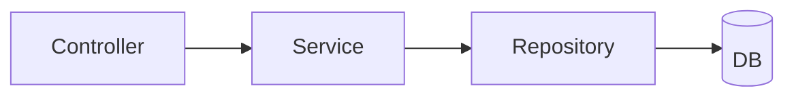
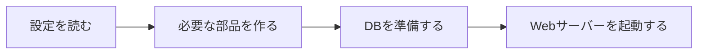
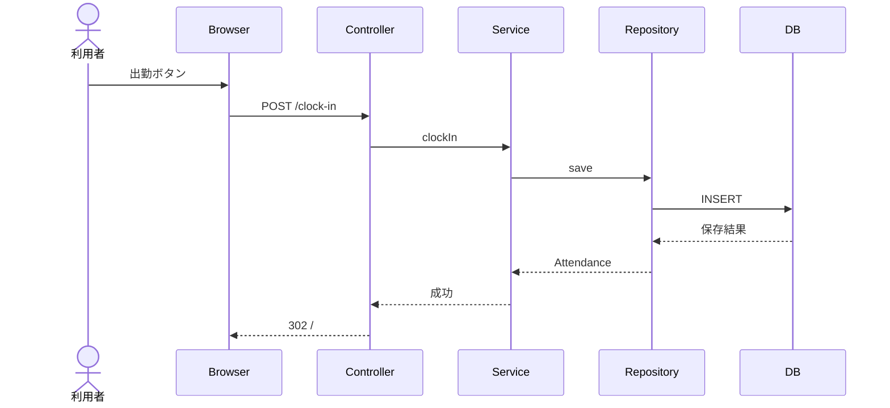
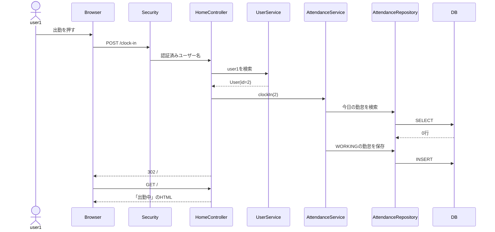
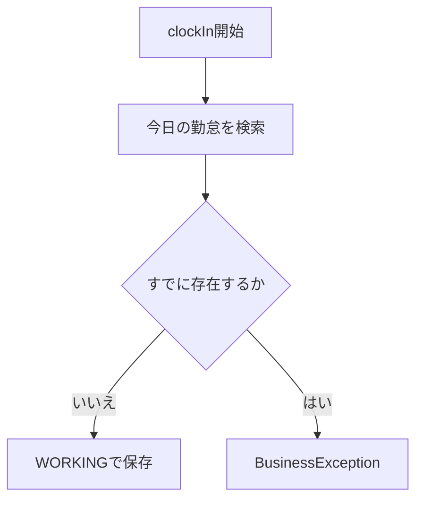
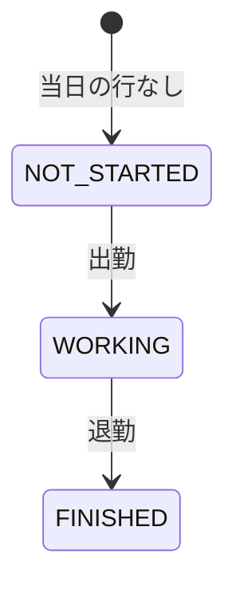
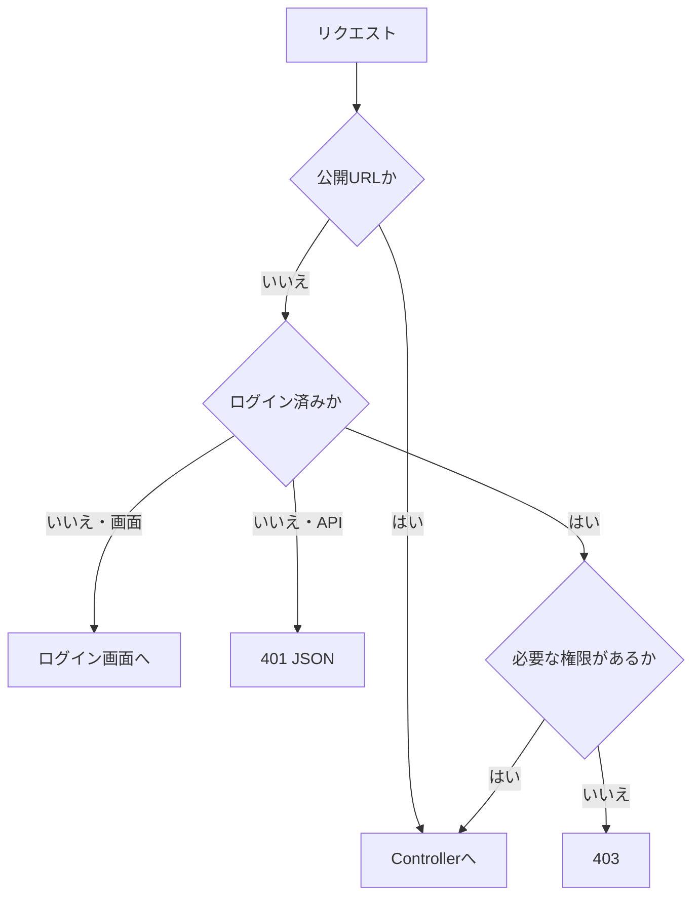
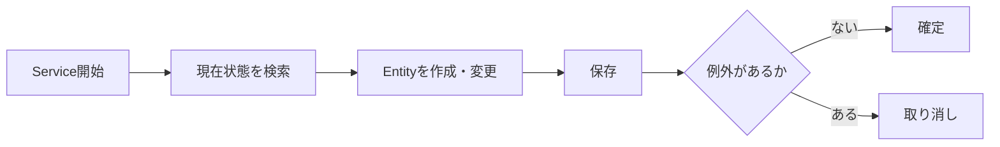
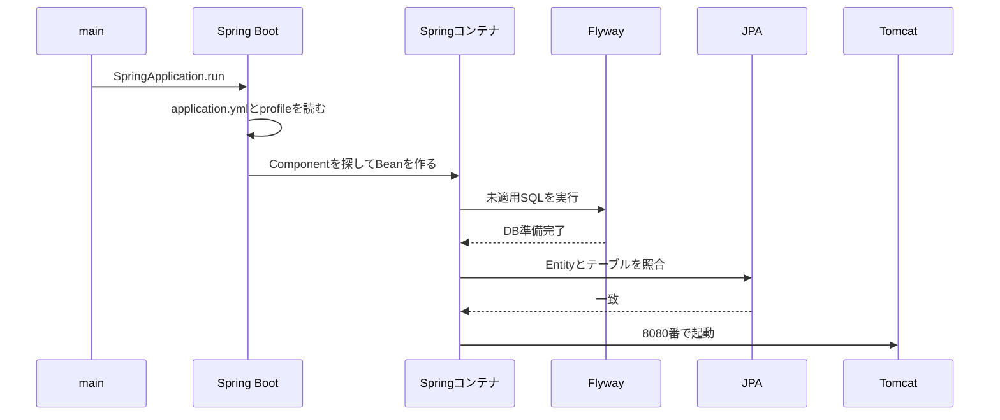

# アーキテクチャとリクエスト処理

この資料では、完成版のコードを「一つの出勤操作」から読み解きます。

最初から全クラスを覚える必要はありません。まず次の一本道を説明できれば十分です。

```text
ブラウザ
  → Controller
  → Service
  → Repository
  → DB
  → Controller
  → HTML
  → ブラウザ
```

分からない言葉は[用語集](./glossary.md)で確認してください。

## 1. 最初に一つの操作を見る

`user1`がトップ画面の「出勤」ボタンを押すと、ブラウザは次のHTTPリクエストを送ります。

```text
POST /clock-in
```

アプリケーション内では、次のデータへ変化します。

```text
認証済みユーザー名: "user1"
  ↓
Userオブジェクト: id=2, username="user1"
  ↓
Attendanceオブジェクト:
  userId=2
  workDate=今日
  startTime=現在時刻
  status=WORKING
  ↓
attendancesテーブルの1行
  ↓
画面の表示: 「出勤中」
```

この一本を、役割ごとに分けて追います。

| 順番 | 担当 | この操作で行うこと |
| ---: | --- | --- |
| 1 | Spring Security | ログイン済みか確認する |
| 2 | `HomeController` | ユーザー名を受け取り、Serviceを呼ぶ |
| 3 | `UserService` | ユーザー名から`User`を探す |
| 4 | `AttendanceService` | 二重出勤を確認し、勤怠を作る |
| 5 | `AttendanceRepository` | 勤怠をDBへ保存する |
| 6 | `HomeController` | トップ画面へリダイレクトする |
| 7 | Thymeleaf | DBの結果をHTMLとして表示する |

## 2. 三つの図を混ぜない

Spring Bootでは、似た矢印が別の意味で使われます。初学者は、次の三つを分けて考えてください。

### 2.1 クラスがどのクラスを使うか

これは、Javaコードの依存関係です。



矢印は「左のクラスが右のクラスを使う」という意味です。

### 2.2 アプリ起動時に何が起きるか

これは、HTTPリクエストを受ける前の準備です。



詳しい起動処理は後半で確認します。

### 2.3 一回のHTTPリクエストがどう進むか

これは、利用者が操作したときの実行順です。



## 3. Controller、Service、Repository

### Controller

ControllerはWebの入口です。

- URLとHTTPメソッドを受け取る
- フォームやURLの値を受け取る
- ログイン中のユーザーを確認する
- Serviceを呼ぶ
- HTMLの名前、リダイレクト先、JSONを返す

ControllerへSQLや複雑な出勤ルールは書きません。

### Service

Serviceは業務ルールの担当です。

- 同じ日に二回出勤できない
- 出勤前に退勤できない
- 退勤済みの勤怠を再度退勤できない
- 最後の管理者を削除できない
- 終了時刻は開始時刻より前にできない

画面とREST APIの両方が同じServiceを使います。入口が二つあっても、業務ルールは一つです。

### Repository

RepositoryはDB操作の入口です。

- Entityを保存する
- IDやユーザー名で検索する
- 一覧を取得する
- 削除する

完成版ではSpring Data JPAがRepositoryインターフェースの実装を作ります。

```java
public interface UserRepository extends JpaRepository<User, Long> {
    Optional<User> findByUsername(String username);
}
```

この宣言を見たら、次のように読みます。

```text
Userを保存・検索するRepository
主キーの型はLong
usernameで1人を検索できる
見つからない可能性はOptionalで表す
```

## 4. なぜ役割を分けるのか

出勤処理をControllerへすべて書くと、画面とAPIに同じルールを二回書くことになります。

```text
画面Controller ─┐
                ├→ AttendanceService → Repository → DB
API Controller ─┘
```

分ける利点:

- 同じルールを画面とAPIで共有できる
- エラーの原因を探す範囲が狭くなる
- URL変更と業務ルール変更を分けられる
- DBアクセス方法をControllerが知らなくてよい

## 5. DIで部品をつなぐ

通常のJavaでは、利用するクラスを`new`できます。

```java
AttendanceService service = new AttendanceService(repository);
```

Springでは、Controllerが必要とするServiceをコンストラクタで受け取ります。

```java
@Controller
public class HomeController {

    private final AttendanceService attendanceService;

    public HomeController(AttendanceService attendanceService) {
        this.attendanceService = attendanceService;
    }
}
```

ここでの重要点:

- `@Controller`は「このクラスはWebの入口」という目印
- `attendanceService`はControllerが必要とする部品
- Springが`AttendanceService`を作る
- Springがコンストラクタへ渡す

この「必要な部品を外から渡す」考え方がDIです。Springが管理するオブジェクトをBeanと呼びます。

## 6. パッケージは役割別に分ける

完成版の中心部分:

```text
com.shinesoft.attendance
├── AttendanceManagementApplication.java
├── config/
│   ├── DataSeeder.java
│   └── SecurityConfig.java
├── domain/
│   ├── User.java
│   ├── Attendance.java
│   └── AttendanceStatus.java
├── exception/
│   └── BusinessException.java
├── repository/
│   ├── UserRepository.java
│   └── AttendanceRepository.java
├── service/
│   ├── UserService.java
│   └── AttendanceService.java
└── web/
    ├── HomeController.java
    ├── AttendanceController.java
    ├── UserController.java
    ├── AdminAttendanceController.java
    ├── form/
    └── api/
```

最初から全ファイルを開かず、URLから次の順で探します。

```text
URL
→ Controller
→ Service
→ Repository
→ Entity
→ Migration SQL
→ TemplateまたはResponse DTO
```

## 7. EntityとDBの行

`User`オブジェクトと`users`テーブルの1行を対応付けます。

```text
Java:
User {
  id = 2
  username = "user1"
  role = "ROLE_USER"
}

DB:
+----+----------+-----------+
| id | username | role      |
+----+----------+-----------+
|  2 | user1    | ROLE_USER |
+----+----------+-----------+
```

| Java | DB |
| --- | --- |
| `User`クラス | `users`テーブル |
| `User`インスタンス | 1行 |
| フィールド | 列 |
| `@Id` | 主キー |
| `@ManyToOne` | 外部キーを使った関連 |

完成版には二つのテーブルがあります。

```text
users 1人
  └── attendances 複数日分
```

主な制約:

| 制約 | 日常語での意味 |
| --- | --- |
| 主キー | 各行を区別する番号 |
| ユーザー名の一意制約 | 同じログイン名を二つ作れない |
| 外部キー | 存在するユーザーの勤怠だけ作れる |
| ユーザーIDと勤務日の一意制約 | 同じ人の同じ日の勤怠は1行だけ |
| NOT NULL | 必須値を空にできない |

Serviceは分かりやすいメッセージを返し、DB制約は最後の整合性を守ります。

## 8. 出勤の正常な流れ



`302`は、ブラウザへ別のURLを開くよう指示するステータスです。更新後に`GET /`へ移動することで、画面再読み込み時に同じ出勤POSTを送り直しにくくします。

## 9. 二重出勤の流れ



画面とAPIでは、同じ例外の見せ方が異なります。

| 入口 | 利用者へ返すもの |
| --- | --- |
| 画面 | メッセージを表示して画面へ戻す |
| API | 409とJSONを返す |

ServiceはHTMLやJSONを知りません。「すでに出勤済み」という業務上の失敗だけを通知します。

## 10. 勤怠の状態



注意点:

- `NOT_STARTED`は画面上の表示状態として使う
- 当日のDB行がまだ存在しない場合も、画面では未出勤と表示する
- 出勤後に保存される値は`WORKING`
- 退勤後に保存される値は`FINISHED`

拒否する操作:

| 現在 | 操作 | 結果 |
| --- | --- | --- |
| 未出勤 | 退勤 | 「先に出勤してください」 |
| 出勤中 | 再出勤 | 「すでに出勤済みです」 |
| 退勤済み | 再出勤 | 拒否 |
| 退勤済み | 再退勤 | 「すでに退勤済みです」 |

## 11. 入力検証を置く場所

ユーザー作成には、異なる種類の検査があります。

| 種類 | 例 | 担当 |
| --- | --- | --- |
| 入力形式 | 空欄、文字数、許可されないrole | FormまたはRequest DTO |
| 画面固有 | 新規作成ではパスワード必須 | Controller |
| 業務ルール | ユーザー名重複、最後の管理者 | Service |
| 最終整合性 | 一意制約、外部キー | DB |

`@Valid`ですべてを判定するわけではありません。DBの現在状態が必要な判断はServiceで行います。

## 12. SecurityはControllerより前に動く



- 認証: 誰であるかを確認する
- 認可: その人が操作してよいかを確認する

| URL | 一般ユーザー | 管理者 |
| --- | --- | --- |
| `/`、`/attendances` | 許可 | 許可 |
| `/clock-in`、`/clock-out` | 許可 | 許可 |
| `/users/**` | 403 | 許可 |
| `/admin/**` | 403 | 許可 |
| `/api/attendances/**` | 許可 | 許可 |
| `/api/users/**` | 403 | 許可 |

出勤対象のユーザーIDは、ブラウザから自由に送らせません。認証済みの`Principal`からユーザー名を取得し、本人のIDを決めます。

## 13. 画面とREST API

画面とAPIは、入口と返却形式が異なります。

| 項目 | 画面 | REST API |
| --- | --- | --- |
| Controller | `@Controller` | `@RestController` |
| 主な入力 | HTMLフォーム | JSON |
| 成功結果 | HTMLまたはリダイレクト | JSONまたは本文なし |
| 入力クラス | Form | Request DTO |
| 公開する値 | Model | Response DTO |
| エラー | 画面内メッセージ | HTTPステータスとJSON |

共通するのはService以降です。

```text
HTML Form → 画面Controller ─┐
                            ├→ Service → Repository → DB
JSON      → API Controller ─┘
```

APIでEntityをそのまま返さずResponse DTOを使う理由:

- パスワードを公開しない
- DBの内部構造と外部APIを分ける
- 返してよい項目を明確にする

## 14. APIのHTTPステータス

| 状況 | HTTP | `code` |
| --- | ---: | --- |
| 成功 | 200 | － |
| 作成成功 | 201 | － |
| 削除成功 | 204 | － |
| JSONまたは入力が不正 | 400 | `VALIDATION_ERROR` |
| 未認証 | 401 | `UNAUTHORIZED` |
| 権限不足 | 403 | `FORBIDDEN` |
| 未定義のAPI | 404 | `NOT_FOUND` |
| 未対応HTTPメソッド | 405 | `METHOD_NOT_ALLOWED` |
| 業務ルール違反 | 409 | `BUSINESS_ERROR` |
| 未対応Content-Type | 415 | `UNSUPPORTED_MEDIA_TYPE` |

エラーJSON:

```json
{
  "code": "BUSINESS_ERROR",
  "message": "すでに出勤済みです"
}
```

## 15. トランザクション

出勤では、現在状態の確認と保存を一つの業務操作として扱います。



`@Transactional`をServiceへ付けると、Serviceメソッドをトランザクションの境界にできます。

## 16. 起動時の処理

各用語を学んだ後で、起動処理を詳しく見ます。



SpringコンテナとApplicationContextは、この教材では「Beanを作って管理し、必要な場所へ渡す仕組み」と理解すれば十分です。

## 17. devとprod

同じJavaコードとJARを、設定によって別のDBへ接続します。

| 環境 | DB | 主な設定 |
| --- | --- | --- |
| dev | H2 | `application-dev.yml` |
| prod | MariaDB | `application-prod.yml`と環境変数 |

共通設定は`application.yml`へ置きます。

```text
同じJAR
  ├→ dev設定 → H2
  └→ prod設定 → MariaDB
```

パスワード、DB接続先、ポートなどはJavaコードへ埋め込まず、環境変数で変更できるようにします。

## 18. 発展: 遅延ロードとN+1

この節は、最初のハンズオンでは暗記不要です。

完成版は`open-in-view: false`にしています。TemplateがDBを追加検索する設計にせず、表示に必要な関連をService処理中に準備します。

管理者向け勤怠一覧では、勤怠を一件ずつ表示するたびにユーザー検索が発生しないよう、Repositoryの`@EntityGraph`で関連ユーザーをまとめて取得します。

まず覚えることは次の一文だけです。

> 画面に必要なデータは、Serviceの処理が終わる前に準備する。

## 19. コード追跡ワークシート

一つの機能を読むとき、次を埋めます。

| 質問 | 記入欄 |
| --- | --- |
| 操作 |  |
| URLとHTTPメソッド |  |
| 必要な認証・権限 |  |
| Controller |  |
| 入力FormまたはDTO |  |
| Service |  |
| 業務ルール |  |
| Repository |  |
| Entity |  |
| 更新されるテーブル |  |
| 成功時の画面またはJSON |  |
| 失敗時の画面またはステータス |  |

## 20. 理解チェック

### 必須

1. Controller、Service、Repositoryの役割を一文ずつ説明してください。
2. 出勤ボタンからDBのINSERTまでを、クラス名の順に説明してください。
3. 二重出勤をServiceで判定する理由を説明してください。
4. 一般ユーザーが管理画面へ入れないのは、Controllerより前のどこで判定されますか。
5. 画面とAPIが同じServiceを使う利点は何ですか。

### ハンズオン完成後

6. Entityとテーブルの対応を説明してください。
7. 入力形式と業務ルールは、それぞれどこで判定しますか。
8. devとprodで同じJARを使える理由を説明してください。

### 発展

9. Serviceの検査に加えてDB一意制約も必要な理由は何ですか。
10. `open-in-view: false`で表示に必要な関連データをいつ準備しますか。

回答例は[理解チェックと回答](./checkpoints-and-answers.md)にあります。
