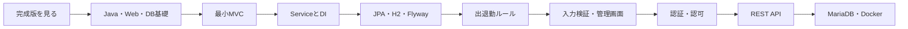

# Java初学者向け Spring Boot完成版コース

このコースでは、Javaの基本を一度学んだ受講者が、空のSpring Bootプロジェクトから勤怠管理アプリケーションを完成させます。

最初から仕組みを暗記するのではなく、次の順番で進みます。

1. 完成版を動かして、これから作るものを見る
2. Webとデータベースの基礎を確認する
3. 小さな画面を一つ作る
4. 機能を一つずつ追加する
5. 操作結果をブラウザ、curl、H2 Consoleで確かめる
6. 最後にMariaDBとDocker Composeで動かす

既存教材の `docs/curriculum/springboot` は変更していません。完成済みの参照実装は [`complete`](../../../complete/) にあります。

## 1. 対象者

次のJava基礎を一度学んでいれば開始できます。

- 変数、if、for
- クラスとインスタンス
- フィールドとメソッド
- コンストラクタ
- `List`などの基本的なコレクション

次の内容は、本コース内で必要になった時点で復習します。

- interface、enum、例外
- ジェネリクス、`Optional`
- アノテーション
- ラムダ式、`var`、`record`
- HTML、HTTP、JSON、SQL
- Maven、YAML、Docker

Spring Boot、Webアプリケーション、データベースの経験は不要です。

## 2. このコースで作るもの

作成するのは、一般ユーザーと管理者が利用する勤怠管理アプリケーションです。

| 利用者 | できること |
| --- | --- |
| 一般ユーザー | ログイン、出勤、退勤、自分の勤怠履歴の確認 |
| 管理者 | ユーザー管理、全ユーザーの勤怠確認・修正 |
| APIクライアント | JSONによる出退勤操作とユーザー管理 |

扱う主な技術:

- Spring Boot、Starter、自動設定、外部設定
- DIとコンストラクタ注入
- Spring MVCとThymeleaf
- Controller、Service、Repository
- JPA、Entity、H2、MariaDB
- FlywayによるDB構造管理
- 入力検証と業務例外
- Spring Securityによる認証・認可
- REST APIとJSON
- Maven、実行可能JAR、Docker Compose

自動化された検証コードの作成は受講範囲に含めません。動作確認は、画面操作、HTTPレスポンス、DBの行を対応付けながら行います。

## 3. 最初に見る完成版デモ

最初のデモでは、すべてを説明しません。まず次の一本だけを見ます。

```text
ログイン
  ↓
出勤ボタンを押す
  ↓
画面が「出勤中」へ変わる
  ↓
H2のattendancesテーブルに1行増える
```

その後、同じ操作をコードで追います。

```text
Browser
  → HomeController
  → AttendanceService
  → AttendanceRepository
  → H2
  → index.html
  → Browser
```

この一本道を理解してから、管理機能、Security、REST API、MariaDBを追加します。

## 4. 教材一覧

| 順番 | 教材 | 目的 |
| ---: | --- | --- |
| 0 | [講師デモ](./03-instructor-demo.md) | 最初に完成版の操作を短く見る |
| 1 | [Java・Web・DBの準備](./00-java-web-database-primer.md) | JavaとWeb、HTTP、JSON、SQLの橋渡し |
| 2 | [Spring Boot概要](./01-spring-boot-overview.md) | デモで見た動作とSpring Bootの全体像を結ぶ |
| 3 | [ハンズオン](./04-handson-guide.md) | 空プロジェクトから全機能を順に作る |
| 4 | [アーキテクチャ](./02-architecture-and-request-flow.md) | 各Phaseで処理経路を詳しく追う |
| 5 | [ビルドとデプロイ](./05-deployment.md) | JAR、MariaDB、Docker Compose |
| 補助 | [用語集](./glossary.md) | 分からない用語を一文で確認 |
| 補助 | [理解チェックと回答](./checkpoints-and-answers.md) | 各Phaseの理解を自己確認 |
| 補助 | [トラブルシューティング](./troubleshooting.md) | 起動、DB、認証、API、Dockerの問題を切り分ける |
| 講師用 | [講師ガイド](./instructor-guide.md) | 進行、問いかけ、チェックポイント |

講師デモは、最初はログインと出勤だけを見せます。仕組みの説明は基礎資料を確認してから行います。アーキテクチャ資料も最初から最後まで一度に読まず、ハンズオンで作った機能に対応する節だけを読みます。

## 5. 学習の流れ



各段階で必ずアプリを停止、再起動し、期待結果を確認します。複数Phaseの変更をまとめてから初めて起動する進め方はしません。

## 6. 開始時に必要な環境

最初の画面作成までに必要:

- Windows 11
- Java 17
- Maven 3.9以降
- VS Code
- Git Bash
- Webブラウザ

REST APIの章で `curl`、最後のデプロイ章でDocker Desktopを使います。Dockerはコース開始時には起動していなくても構いません。

Git Bashで確認します。

```bash
java -version
mvn -version
pwd
```

`java`または`mvn`が見つからない場合は、先に[トラブルシューティング](./troubleshooting.md)を確認します。

## 7. 完成版を先に動かす

ターミナルAを開き、リポジトリルートから実行します。

```bash
cd complete
pwd
test -f pom.xml && echo "project root: OK"
mvn spring-boot:run
```

ログに `Started AttendanceManagementApplication` が表示されたら、ブラウザで次を開きます。

```text
http://localhost:8080/login
```

開発用アカウント:

| 権限 | ユーザー名 | パスワード |
| --- | --- | --- |
| 管理者 | `admin` | `admin123` |
| 一般ユーザー | `user1` | `password` |

確認する操作:

1. `user1`でログインする
2. 出勤する
3. 画面が「出勤中」へ変わる
4. もう一度出勤し、二重出勤が拒否される
5. 退勤する
6. ログアウトする

確認後はターミナルAで `Ctrl + C` を押します。

## 8. ハンズオンの作業場所

参照実装と混ざらないよう、受講者用フォルダを作ります。

```bash
cd ~/order-management-springboot
mkdir -p practice/springboot-complete-handson
cd practice/springboot-complete-handson
pwd
```

リポジトリの配置先が異なる場合は、最初の `cd` を実際の場所へ読み替えます。

以降の各章では、コマンドの前に次を確認します。

```bash
pwd
test -f pom.xml && echo "project root: OK"
```

`project root: OK` が表示されない場合は、コマンドを続けず作業場所を確認してください。

## 9. 完了条件

次をブラウザ、curl、H2 ConsoleまたはMariaDBで自分で確認できれば完了です。

- 最小のThymeleaf画面を表示できる
- Controller、Service、Repositoryの役割を説明できる
- EntityとDBの行を対応付けられる
- 一般ユーザーが出勤・退勤・本人履歴を操作できる
- 二重出勤、出勤前退勤、再退勤が拒否される
- 管理者がユーザーと全員の勤怠を管理できる
- 一般ユーザーは管理画面へ入れない
- 入力不正と業務ルール違反を区別できる
- REST APIがJSONと適切なHTTPステータスを返す
- H2とMariaDBで同じアプリケーションを起動できる
- Docker ComposeでAppとMariaDBを起動できる

## 10. 教材の読み方

- 初めて見る用語は、先に[用語集](./glossary.md)で一文だけ確認します。
- 「必須」は、そのPhaseで説明できるようにします。
- 「発展」は、最初は仕組みの存在を知るだけで構いません。
- コードはファイルパスを確認してから入力します。
- 完成版へのリンクは答え合わせです。最初からファイル全体を置き換えません。
- エラーが出たら、画面を消す前にメッセージと直前の変更を確認します。
- パスワードなどの秘密値をGitへ保存しません。

学習を始める場合は、[Java・Web・DBの準備](./00-java-web-database-primer.md)へ進んでください。
