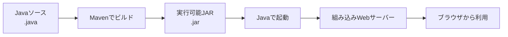
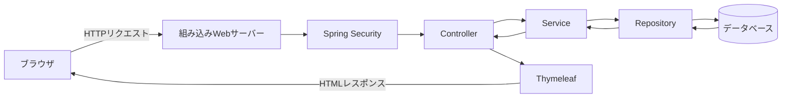
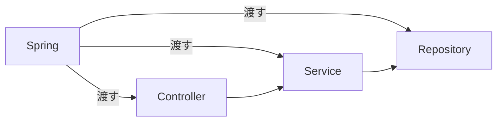
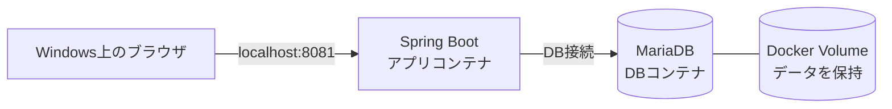

# 01 Spring Bootの概要

[前へ：Docker Desktopのインストール](./00-docker-desktop-install.md) ｜ [次へ：完成版アプリを確認する](./02-completed-app-overview.md)

## この章のゴール

この章では、Spring Bootのコードを一から作りません。完成版アプリを動かす前に、次のことを自分の言葉で説明できる状態を目指します。

- Spring Bootが何を助けてくれるのか
- ブラウザからデータベースまで、処理がどのように進むのか
- Controller、Service、Repositoryの役割
- JavaアプリとDockerの関係

用語を一度ですべて暗記する必要はありません。まずは「どの部品が、何を担当するか」をつかみましょう。

## Spring Bootとは

Spring Bootは、JavaでWebアプリケーションを作り、動かしやすくするための仕組みです。

Webアプリには、画面の表示、入力の受付、データの保存、ログイン確認など、多くの共通処理が必要です。Spring Bootは、それらを作るための部品と、部品を組み合わせて起動する仕組みを提供します。

関係を簡単に整理すると、次のようになります。

| 名前 | この教材での意味 |
|---|---|
| Java | アプリの処理を書くプログラミング言語 |
| Spring Framework | Javaのクラスを組み合わせ、WebやDBなどの機能を提供する土台 |
| Spring Boot | Springの設定や起動を簡単にする仕組み |

Spring Bootを使うと、Webサーバーを別に用意して複雑な設定をする代わりに、Javaアプリ自身をWebサーバーとして起動できます。

## Javaコードが起動するまで

この教材では、JavaコードをMavenでビルドし、実行可能なJARファイルにまとめます。



### Maven

Mavenは、Javaアプリのビルドを担当する道具です。

主な仕事は次のとおりです。

- 必要なライブラリを取得する
- Javaコードをコンパイルする
- 実行に必要なものをJARへまとめる

どのライブラリや設定を使うかは、主に`pom.xml`へ書かれています。

### JAR

JARは、Javaのクラスや設定ファイルなどをまとめたファイルです。Spring Bootの実行可能JARには、アプリの起動に必要なライブラリと組み込みWebサーバーも含まれます。

そのため、基本的には次のようなコマンドでアプリを起動できます。

```bash
java -jar attendance-management-container-0.0.1-SNAPSHOT.jar
```

この教材では、後ほどDockerコンテナの中で同じ考え方によりJARを起動します。

## リクエストとレスポンス

ブラウザでリンクを開いたりボタンを押したりすると、ブラウザはアプリへHTTPリクエストを送ります。アプリは処理結果をHTTPレスポンスとして返します。



たとえば、出勤ボタンを押すと、おおむね次の順に進みます。

1. ブラウザが「出勤する」というリクエストを送る
2. Spring Securityがログイン済みかを確認する
3. Controllerがリクエストを受け取る
4. Serviceが「今日はまだ出勤していないか」などを判断する
5. Repositoryが勤怠データをデータベースへ保存する
6. 処理後の画面をブラウザへ返す

## Controller、Service、Repository

アプリを役割ごとに分けると、処理の場所を探しやすくなります。

| 部品 | 主な役割 | 店にたとえると |
|---|---|---|
| Controller | リクエストを受け、返す画面やデータを決める | 受付 |
| Service | 業務上の判断や処理の順序を担当する | 担当者 |
| Repository | データベースへの保存や検索を担当する | 保管庫の窓口 |
| Database | ユーザーや勤怠を保存する | 保管庫 |

Controllerへすべてを書くのではなく、業務の判断はService、DB操作はRepositoryへ分けます。この分担により、機能が増えてもコードを整理しやすくなります。

## DI：必要な部品を渡してもらう

DIはDependency Injectionの略で、日本語では「依存性の注入」と呼ばれます。難しい名前ですが、最初は「必要な部品をSpringから渡してもらう仕組み」と考えてください。

たとえば、ControllerはServiceを使い、ServiceはRepositoryを使います。それぞれが自分で部品を作るのではなく、Springが起動時に部品を作って組み合わせます。



この仕組みにより、クラスは「自分の役割」に集中できます。

## EntityとJPA

### Entity

Entityは、データベースの1行をJavaのオブジェクトとして扱うためのクラスです。

たとえば、ユーザーの1行にはID、ユーザー名、パスワード、権限があります。Java側では、それらを持つ`User`というEntityとして扱います。勤怠の1行は`Attendance`というEntityに対応します。

### JPA

JPAは、Javaのオブジェクトとデータベースの表を対応させるための共通ルールです。Spring Data JPAを利用すると、Repositoryを通じてEntityを保存したり検索したりできます。

つまり、役割は次のように分かれます。

```text
Javaで扱うデータ     Entity
保存・検索の窓口     Repository
実際に保存する場所   Database
```

## Thymeleaf

Thymeleafは、Java側のデータをHTMLへ埋め込むためのテンプレートエンジンです。

通常のHTMLは固定された内容を表示します。Thymeleafを使うと、次のような実行時の情報をHTMLへ反映できます。

- ログイン中のユーザー名
- 今日の出勤状態
- 勤怠履歴の一覧
- 入力内容に問題がある場合のメッセージ

最終的にブラウザが受け取るのは通常のHTMLです。ブラウザがJavaのEntityを直接表示しているわけではありません。

## Spring Security

Spring Securityは、ログインやアクセス制限を担当します。特に次の2つを区別しましょう。

| 用語 | 確認すること | 例 |
|---|---|---|
| 認証 | 誰であるか | ユーザー名とパスワードが正しいか |
| 認可 | 何をしてよいか | 管理画面を開ける権限があるか |

ログインに成功しても、全員が同じ操作をできるわけではありません。一般ユーザーは本人の勤怠を操作でき、管理者はユーザー管理や全員の勤怠管理も行えます。

なお、パスワードはそのままデータベースへ保存せず、元の文字列へ簡単に戻せない形へ変換して保存します。

## 入力値の検証

画面やAPIから送られた値を、そのまま保存してはいけません。未入力、長すぎる文字、許可されていない権限名などを確認する必要があります。この確認をバリデーションと呼びます。

さらに、「同じ日に2回出勤できない」「退勤には先に出勤が必要」といった業務上のルールは、主にServiceで確認します。

## `application.yml`、プロファイル、環境変数

アプリには、Javaコードとは別に変更したい設定があります。

- 接続するデータベース
- サーバーのポート番号
- ログの出力量
- 初期ユーザーのパスワード

Spring Bootでは、共通設定を主に`application.yml`へ書きます。

開発用とコンテナ実行用の設定を分けたい場合は、プロファイルを使います。

| ファイル例 | 用途 |
|---|---|
| `application.yml` | 共通設定 |
| `application-dev.yml` | PC上での開発向け設定 |
| `application-prod.yml` | この教材のコンテナ実行用設定 |

`prod`はこのアプリで付けたプロファイル名です。この名前を使っただけで、実際の本番環境に必要なセキュリティや運用の要件をすべて満たすという意味ではありません。

パスワードのように環境ごとに変える値は、設定ファイルへ固定せず、環境変数から受け取れます。

```yaml
password: ${DB_PASSWORD}
```

この例は、「`DB_PASSWORD`という環境変数の値を使う」という意味です。後の章では、環境変数の値を`.env`で用意し、Docker Composeからアプリへ渡します。

## Spring BootとDockerの関係

Spring BootとDockerは、同じものではありません。

- Spring Boot：JavaのWebアプリを作り、動かす仕組み
- Docker：アプリと実行環境をひとまとめにして動かす仕組み

今回の構成では、Spring BootアプリとMariaDBを別々のコンテナにします。Docker Composeが2つのコンテナ、ネットワーク、環境変数、保存領域をまとめて管理します。



アプリコンテナを作り直しても、Volumeを削除しない限り、MariaDBのデータを残せます。

## 用語集

| 用語 | 短い説明 |
|---|---|
| HTTP | ブラウザとWebアプリが情報をやり取りするための決まり |
| リクエスト | ブラウザなどからアプリへ送る要求 |
| レスポンス | アプリが要求に対して返す結果 |
| フレームワーク | アプリを作るための土台と部品 |
| Maven | Javaアプリの依存関係管理とビルドを行う道具 |
| 依存関係 | アプリが利用する外部ライブラリ |
| JAR | Javaアプリをまとめたファイル |
| 組み込みサーバー | Spring Bootアプリに含まれるWebサーバー |
| DI | 必要な部品をSpringに組み合わせてもらう仕組み |
| Entity | DBのデータをJavaオブジェクトとして表したクラス |
| JPA | JavaのオブジェクトとDBの表を対応させる仕組み |
| Thymeleaf | Java側のデータをHTMLへ反映する仕組み |
| 認証 | 利用者が誰かを確認すること |
| 認可 | 利用者に操作権限があるかを確認すること |
| プロファイル | 環境ごとに設定を切り替える仕組み |
| 環境変数 | 実行環境からアプリへ渡す設定値 |
| コンテナ | アプリと実行環境をまとめて分離して動かす単位 |

## 理解度チェック

資料を見ながらで構わないので、次の問いに答えてみましょう。

1. Spring Bootは何を助ける仕組みですか。
2. Controller、Service、Repositoryは、それぞれ何を担当しますか。
3. 認証と認可は何が違いますか。
4. Javaコードがブラウザから利用できるようになるまでに、MavenとJARはどのような役割を持ちますか。
5. DBのパスワードをJavaコードへ直接書かず、環境変数から渡すのはなぜですか。
6. Spring BootアプリとMariaDBを別のコンテナにする場合、両者はどのように連携しますか。

説明に詰まったときは、上の図と用語集へ戻って確認してください。完全な用語説明よりも、処理の流れを順番に話せることが大切です。

## 次の章へ

次は、これらの仕組みが組み込まれた完成版の勤怠管理アプリを確認します。Javaコードを書き直すのではなく、機能とファイルの役割をつかみます。

[前へ：Docker Desktopのインストール](./00-docker-desktop-install.md) ｜ [次へ：完成版アプリを確認する](./02-completed-app-overview.md)
