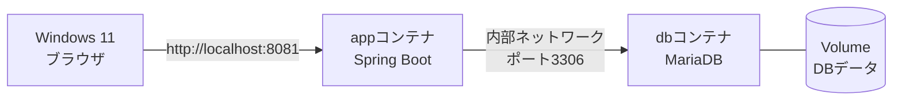

# 02 完成版アプリを確認する

[前へ：Spring Bootの概要](./01-spring-boot-overview.md) ｜ [次へ：コンテナ化ハンズオン](./03-container-handson.md)

## この章のゴール

この章では、完成済みの勤怠管理アプリについて、次のことを確認します。

- どのような機能が用意されているか
- 主要なファイルがどの役割を持つか
- アプリコンテナとMariaDBコンテナをどう組み合わせるか

Javaコードを一行ずつ読む必要はありません。完成しているアプリの全体像をつかみ、次章からコンテナ化へ進みます。

## 使用する完成版

作業場所は次のディレクトリです。

```text
~/order-management-springboot/stages/springboot-container
```

以降の章でも、このディレクトリ内で作業します。

この中にあるJavaコード、HTML、CSS、JavaScript、DBマイグレーションは完成済みです。これらを一から書き直さないでください。受講者が作成する主なファイルは、次章以降で扱う`Dockerfile`、`.dockerignore`、`docker-compose.yml`、`.env`です。

第4章では画面のメッセージを一か所だけ変更し、コンテナを再ビルドして反映を確認します。

## アプリの機能

このアプリには、次の機能が実装されています。

### 一般ユーザー向け

| 機能 | 内容 |
|---|---|
| ログイン・ログアウト | ユーザー名とパスワードでログインする |
| 今日の勤怠表示 | 未出勤、出勤中、退勤済みの状態を表示する |
| 出勤 | ログイン中のユーザーの出勤時刻を登録する |
| 退勤 | 出勤済みの勤怠へ退勤時刻を登録する |
| 勤怠履歴 | 自分の過去の勤怠を新しい日付から表示する |

### 管理者向け

| 機能 | 内容 |
|---|---|
| ユーザー一覧 | 登録済みユーザーを一覧表示する |
| ユーザー登録 | ユーザー名、パスワード、権限を登録する |
| ユーザー編集 | ユーザー名、パスワード、権限を変更する |
| ユーザー削除 | 業務ルールを確認したうえでユーザーを削除する |
| 全勤怠一覧 | 全ユーザーの勤怠を確認する |
| 勤怠編集 | 日付、時刻、状態などを管理者が修正する |

管理者を0人にする変更や、勤怠履歴が残っているユーザーの削除などは、Serviceの業務ルールによって防止されます。

### API

ブラウザ画面のほかに、JSONをやり取りするAPIも用意されています。

| URL | 主な用途 | 利用できる人 |
|---|---|---|
| `/api/attendances/clock-in` | 出勤を登録する | ログイン可能なユーザー |
| `/api/attendances/clock-out` | 退勤を登録する | ログイン可能なユーザー |
| `/api/users` | ユーザーの一覧・登録 | 管理者 |
| `/api/users/{id}` | ユーザーの取得・更新・削除 | 管理者 |

画面ではフォームログイン、APIではHTTP Basic認証を使います。不正な入力や権限不足がある場合、APIは内容に応じたHTTPステータスとJSONを返します。

## ユーザーと権限

初回起動時に、次のユーザー名を持つアカウントを作成します。

| ユーザー名 | 権限 | 主な操作 |
|---|---|---|
| `admin` | `ROLE_ADMIN` | 一般機能に加え、ユーザー管理と全勤怠管理 |
| `user1` | `ROLE_USER` | 自分の出勤、退勤、勤怠履歴 |

次章では手順を単純にするため、公開済みの研修専用サンプルパスワードを`.env`へ設定します。アプリには、次の環境変数として渡します。

```text
APP_SEED_ADMIN_PASSWORD
APP_SEED_USER_PASSWORD
```

教材に掲載する値はローカル研修専用であり、秘密情報ではありません。ほかのシステムや実際の業務では再利用しないでください。

実際の開発でも、本当のパスワードをGitへ登録せず、各PCだけに置く`.env`や専用の秘密情報管理機能などで管理します。Javaコードへパスワードを直接書かない点は、研修でも実際の開発でも同じです。

## 入力検証と業務ルール

このアプリは、画面やAPIから受け取った値を検証します。

入力形式の例：

- ユーザー名は必須で、最大文字数が決まっている
- 新規パスワードは必須で、文字数の範囲が決まっている
- 権限は`ROLE_USER`または`ROLE_ADMIN`のみ
- 勤怠編集ではユーザー、勤務日、状態が必須

業務ルールの例：

- 同じユーザーは同じ日に2回出勤できない
- 出勤していない状態では退勤できない
- 退勤時刻は出勤時刻より前にできない
- 最後の管理者は削除したり一般ユーザーへ変更したりできない

入力検証は値の形を確かめ、Serviceはその操作が業務上正しいかを判断します。

## FlywayによるDB管理

Flywayは、データベースの表や索引を決められた順番で作成・更新する仕組みです。

完成版には次のファイルがあります。

```text
src/main/resources/db/migration/
├── V1__create_tables.sql
└── V2__add_index_to_attendance_work_date.sql
```

- `V1`：ユーザー表と勤怠表を作る
- `V2`：勤怠の日付検索に使う索引を追加する

アプリ起動時にFlywayが未適用のファイルだけを順番に適用します。MariaDBコンテナを初めて起動したときも、受講者が手作業で表を作る必要はありません。

適用済みのマイグレーションはDBに履歴として記録されます。既存の`V1`や`V2`を書き換えるのではなく、将来DB構造を変更するときは`V3`以降を追加する、という考え方で運用します。

## ファイル構成

全ファイルを暗記する必要はありません。まずは次の地図を使って、役割から場所を探せるようにしましょう。

```text
stages/springboot-container/
├── pom.xml
└── src/main/
    ├── java/com/shinesoft/attendance/
    │   ├── AttendanceManagementApplication.java  起動クラス
    │   ├── config/        セキュリティと初期ユーザー
    │   ├── domain/        User、AttendanceなどのEntity
    │   ├── repository/    DBの検索・保存
    │   ├── service/       業務ルール
    │   └── web/           画面とAPIのController
    └── resources/
        ├── application.yml       共通設定
        ├── application-dev.yml   PC上の開発向け設定
        ├── application-prod.yml  コンテナ向け設定
        ├── db/migration/         FlywayのSQL
        ├── templates/            ThymeleafのHTML
        └── static/               CSSとJavaScript
```

主なファイルは次のとおりです。

| 確認したいこと | ファイル |
|---|---|
| アプリの開始地点 | [`AttendanceManagementApplication.java`](../../../stages/springboot-container/src/main/java/com/shinesoft/attendance/AttendanceManagementApplication.java) |
| ログインとアクセス制限 | [`SecurityConfig.java`](../../../stages/springboot-container/src/main/java/com/shinesoft/attendance/config/SecurityConfig.java) |
| 出勤・退勤の業務処理 | [`AttendanceService.java`](../../../stages/springboot-container/src/main/java/com/shinesoft/attendance/service/AttendanceService.java) |
| ユーザー管理の業務処理 | [`UserService.java`](../../../stages/springboot-container/src/main/java/com/shinesoft/attendance/service/UserService.java) |
| 共通設定 | [`application.yml`](../../../stages/springboot-container/src/main/resources/application.yml) |
| コンテナ向けDB設定 | [`application-prod.yml`](../../../stages/springboot-container/src/main/resources/application-prod.yml) |
| 最初のDB構造 | [`V1__create_tables.sql`](../../../stages/springboot-container/src/main/resources/db/migration/V1__create_tables.sql) |

## 処理の具体例

コードを細かく追わず、入口と出口を見てみましょう。

### 例1：一般ユーザーが出勤する

```text
user1が出勤ボタンを押す
  → HomeControllerがリクエストを受け取る
  → AttendanceServiceが重複出勤でないか判断する
  → AttendanceRepositoryが勤怠をMariaDBへ保存する
  → 更新後のトップ画面を表示する
```

### 例2：管理者がユーザーを登録する

```text
adminが登録フォームを送信する
  → Spring Securityが管理者権限を確認する
  → UserControllerが入力を受け取る
  → 入力値とUserServiceの業務ルールを確認する
  → UserRepositoryがユーザーをMariaDBへ保存する
  → ユーザー一覧へ戻る
```

### 例3：APIでユーザー一覧を取得する

```text
APIへHTTPリクエストを送る
  → HTTP Basic認証と管理者権限を確認する
  → UserApiControllerがUserServiceを呼ぶ
  → 取得したユーザー一覧をJSONで返す
```

同じServiceとRepositoryを、画面用ControllerとAPI用Controllerの両方から利用しています。

## コンテナ化後の完成イメージ

このアプリは、次の2コンテナで動かします。



| 対象 | 入れるもの・役割 |
|---|---|
| `app`コンテナ | Java 17、完成版JAR、Spring Bootアプリ |
| `db`コンテナ | MariaDB、ユーザーと勤怠のデータ |
| Volume | DBコンテナを作り直しても残したいデータ |
| Docker Compose | コンテナ、ネットワーク、環境変数、起動順をまとめる |

ブラウザからは`app`へ接続し、`app`はDocker内部のネットワークを通して`db`へ接続します。MariaDBの接続先に`localhost`を使わず、Composeで決めるサービス名を使うことが重要です。

## スターターファイルを確認する

Git Bashを開き、作業ディレクトリへ移動します。

```bash
cd ~/order-management-springboot/stages/springboot-container
pwd
ls
```

`pom.xml`と`src`が表示されることを確認します。主要なソースも確認します。

```bash
find src/main -type f | sort
```

少なくとも、次が含まれていれば準備できています。

```text
src/main/java/com/shinesoft/attendance/AttendanceManagementApplication.java
src/main/resources/application.yml
src/main/resources/application-prod.yml
src/main/resources/db/migration/V1__create_tables.sql
src/main/resources/templates/login.html
```

この時点では、`Dockerfile`、`.dockerignore`、`docker-compose.yml`、`.env`がなくても正常です。次の章で作成します。

## 章の完了確認

- 完成版Javaコードを書き直さないことを確認した
- 一般ユーザーと管理者の機能の違いを説明できる
- `admin`と`user1`の研修用パスワードは次章で`.env`へ設定すると分かった
- Controller、Service、Repositoryの場所を確認した
- FlywayがDB構造を順番に反映する仕組みだと分かった
- `app`コンテナと`db`コンテナを分ける構成を説明できる
- `pom.xml`と`src/main`が作業ディレクトリにある

## 次の章へ

次は、完成版アプリを変更せずに包むための`Dockerfile`、`.dockerignore`、`docker-compose.yml`、`.env`を作成します。

[前へ：Spring Bootの概要](./01-spring-boot-overview.md) ｜ [次へ：コンテナ化ハンズオン](./03-container-handson.md)
