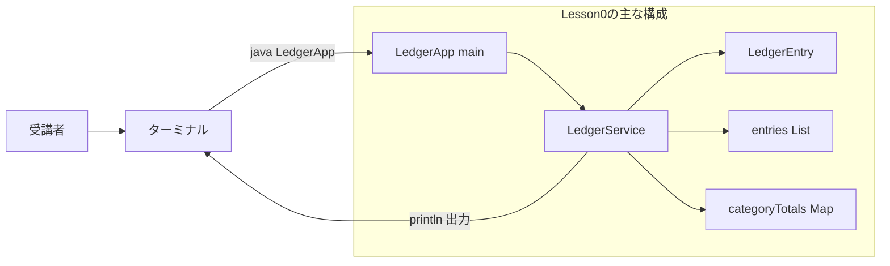
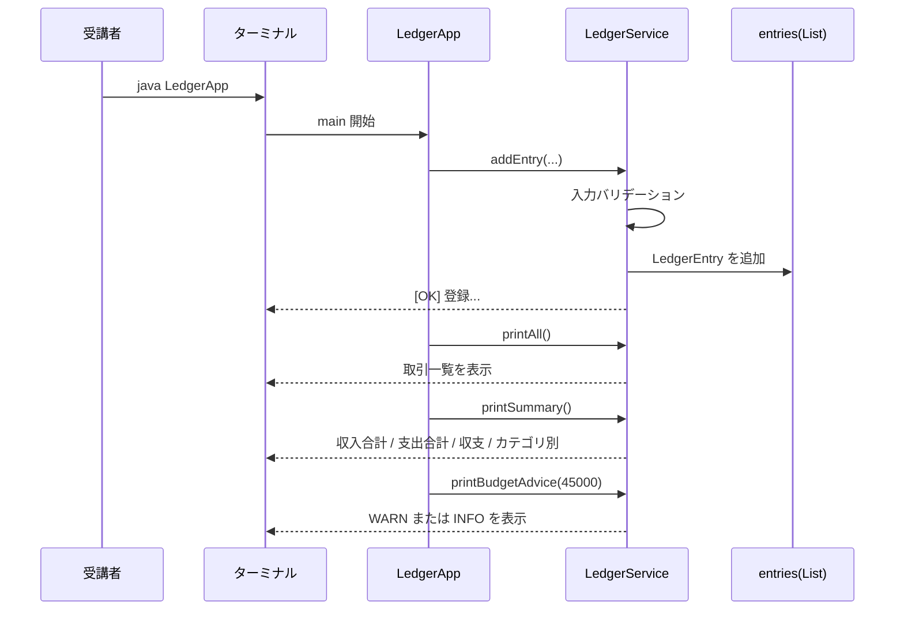
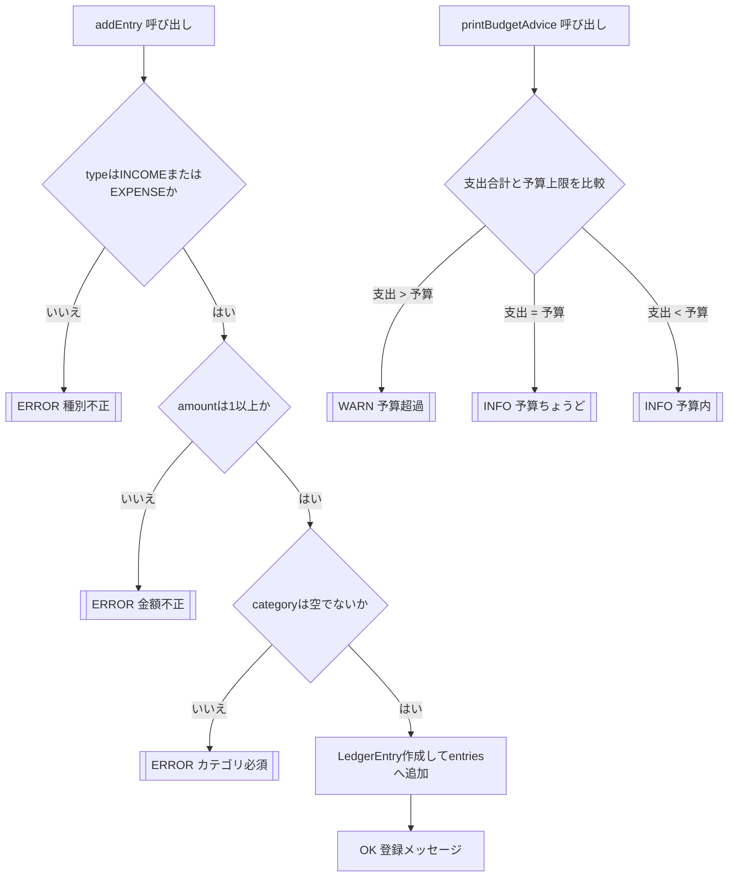

# Lesson0 ミニ制作: 家計簿Lite（コンソール）

## 1. 目的
`lesson0.md` で学んだ範囲だけで、動くコンソールアプリを作る。

- クラス/メソッド
- `if/else`
- `for`
- `List` / `Map`

画面（GUI）やDBは使わない。

## 1.5 Lesson0で作るもの（コンソール）
- アプリ入口: `LedgerApp`（`main`）
- 処理: `LedgerService`（登録 / 一覧 / 集計 / 予算チェック）
- データ: `LedgerEntry`（`type` / `category` / `amount` / `memo`）
- 動作: サンプル登録 -> バリデーション確認 -> 一覧表示 -> 集計表示 -> 予算チェック

### 全体構成図（ファイルと役割）


### データ受け渡し最小メモ（JSONは未使用）
- このLessonは Web API ではないため JSON は使わない。
- 値の受け渡しは「メソッド引数」と「オブジェクト」で行う。
- 登録時の例:
  ```java
  service.addEntry("EXPENSE", "食費", 18000, "スーパー");
  ```
- 内部で `LedgerEntry` を作成して `entries` に追加する。
- 結果はコンソールへ `System.out.println(...)` で表示する。

### 実行時の時系列（正常系）


### 入力検証と判定の分岐（ERROR/WARN/INFO）


---

## 2. 作業フォルダ
```bash
cd ~/order-management-springboot
mkdir -p practice/lesson00/java/lesson0-console-ledger
cd practice/lesson00/java/lesson0-console-ledger
```

---

## 3. ファイル1: `LedgerEntry.java`
`LedgerEntry.java` を作成:

```java
public class LedgerEntry {
    String type;      // INCOME or EXPENSE
    String category;  // 例: 給料, 食費
    int amount;       // 金額
    String memo;      // メモ

    LedgerEntry(String type, String category, int amount, String memo) {
        this.type = type;
        this.category = category;
        this.amount = amount;
        this.memo = memo;
    }
}
```

---

## 4. ファイル2: `LedgerService.java`
`LedgerService.java` を作成:

```java
import java.util.ArrayList;
import java.util.HashMap;
import java.util.List;
import java.util.Map;

public class LedgerService {
    List<LedgerEntry> entries = new ArrayList<>();

    void addEntry(String type, String category, int amount, String memo) {
        if (!"INCOME".equals(type) && !"EXPENSE".equals(type)) {
            System.out.println("[ERROR] 種別は INCOME または EXPENSE を指定してください");
            return;
        }

        if (amount <= 0) {
            System.out.println("[ERROR] 金額は1以上を指定してください");
            return;
        }

        if (category == null || category.isBlank()) {
            System.out.println("[ERROR] カテゴリは必須です");
            return;
        }

        LedgerEntry entry = new LedgerEntry(type, category.trim(), amount, normalizeMemo(memo));
        entries.add(entry);
        System.out.println("[OK] 登録: " + type + " / " + category + " / " + amount);
    }

    void printAll() {
        System.out.println("=== 取引一覧 ===");
        if (entries.isEmpty()) {
            System.out.println("データがありません");
            return;
        }

        int index = 1;
        for (LedgerEntry entry : entries) {
            System.out.println(index + ". "
                    + entry.type
                    + " | "
                    + entry.category
                    + " | "
                    + entry.amount
                    + "円 | "
                    + entry.memo);
            index++;
        }
    }

    void printSummary() {
        int incomeTotal = 0;
        int expenseTotal = 0;
        Map<String, Integer> categoryTotals = new HashMap<>();

        for (LedgerEntry entry : entries) {
            if ("INCOME".equals(entry.type)) {
                incomeTotal += entry.amount;
            } else {
                expenseTotal += entry.amount;
            }

            String key = entry.type + ":" + entry.category;
            int current = categoryTotals.getOrDefault(key, 0);
            categoryTotals.put(key, current + entry.amount);
        }

        int balance = incomeTotal - expenseTotal;

        System.out.println("=== 集計 ===");
        System.out.println("収入合計: " + incomeTotal + "円");
        System.out.println("支出合計: " + expenseTotal + "円");
        System.out.println("収支: " + balance + "円");

        System.out.println("=== カテゴリ別 ===");
        for (String key : categoryTotals.keySet()) {
            System.out.println(key + " -> " + categoryTotals.get(key) + "円");
        }
    }

    void printBudgetAdvice(int budgetLimit) {
        int expenseTotal = 0;
        for (LedgerEntry entry : entries) {
            if ("EXPENSE".equals(entry.type)) {
                expenseTotal += entry.amount;
            }
        }

        System.out.println("=== 予算チェック ===");
        System.out.println("予算上限: " + budgetLimit + "円");
        System.out.println("現在の支出: " + expenseTotal + "円");

        if (expenseTotal > budgetLimit) {
            System.out.println("[WARN] 予算を超えています");
        } else if (expenseTotal == budgetLimit) {
            System.out.println("[INFO] 予算ちょうどです");
        } else {
            System.out.println("[INFO] 予算内です");
        }
    }

    private String normalizeMemo(String memo) {
        if (memo == null || memo.isBlank()) {
            return "(メモなし)";
        }
        return memo.trim();
    }
}
```

---

## 5. ファイル3: `LedgerApp.java`
`LedgerApp.java` を作成:

```java
public class LedgerApp {
    public static void main(String[] args) {
        LedgerService service = new LedgerService();

        System.out.println("=== 家計簿Lite (Console) ===");

        // サンプルデータ登録
        service.addEntry("INCOME", "給料", 280000, "3月分");
        service.addEntry("EXPENSE", "食費", 18000, "スーパー");
        service.addEntry("EXPENSE", "交通費", 9000, "定期券");
        service.addEntry("EXPENSE", "娯楽", 12000, "映画・書籍");
        service.addEntry("INCOME", "副業", 30000, "Web制作");

        // バリデーション動作確認（意図的にエラー）
        service.addEntry("PAY", "不正種別", 1000, "テスト");
        service.addEntry("EXPENSE", "", 2000, "カテゴリ空");
        service.addEntry("EXPENSE", "食費", -500, "負の金額");

        // 一覧表示 / 集計表示 / 予算チェック
        service.printAll();
        service.printSummary();
        service.printBudgetAdvice(45000);
    }
}
```

---

## 6. コンパイルと実行
```bash
cd ~/order-management-springboot/practice/lesson00/java/lesson0-console-ledger
javac -encoding UTF-8 LedgerEntry.java LedgerService.java LedgerApp.java
java LedgerApp
```

---

## 7. 完了条件
- 登録メッセージ `[OK]` が表示される
- 不正データで `[ERROR]` が表示される
- 取引一覧が表示される
- `収入合計` `支出合計` `収支` が表示される
- 予算チェックが表示される

---

## 8. 1分拡張（任意）
1. `service.printBudgetAdvice(30000);` に変えて警告表示を確認  
2. `service.addEntry("EXPENSE", "通信費", 7000, "スマホ");` を追加  
3. `カテゴリ別` の出力が増えることを確認
