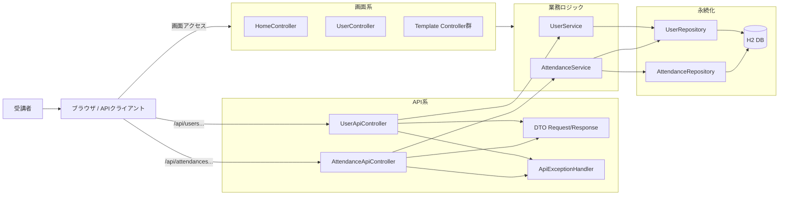
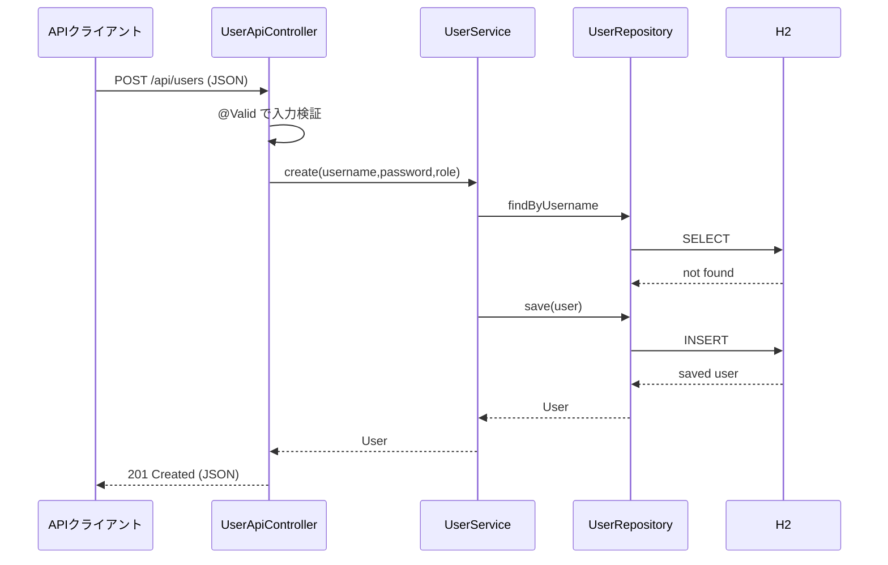
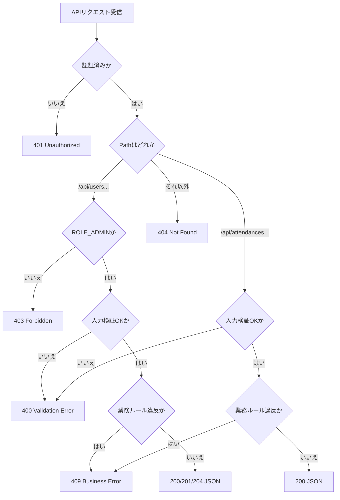

# Lesson8 REST API基礎（@RestController / DTO / 例外応答）

## 目的（Lesson8でできるようになること）
- `@RestController` で JSON API を実装できる
- DTO と `@Valid` で入力検証を実装できる
- `@RestControllerAdvice` でエラー応答形式を統一できる
- 画面系 Controller（Thymeleaf）と API 系 Controller を分けて設計できる

## 前提
- Lesson5 を完了している
- `docs/curriculum/web-app(簡易版)/bridge-to-springboot.md` の `fetch + JSON` と `Controller + Thymeleaf` の違いを説明できる
- `~/order-management-springboot/stages/lesson05` が起動できる
- `java -version` と `mvn -version` が通る

## 位置づけ
Lesson1〜5では、Spring MVCの基本を理解するために `@Controller + Model + Thymeleaf` を中心に扱いました。
このLessonでは、`web-app(簡易版)` で使った `fetch + JSON API` の考え方に戻り、Spring Bootではどう書くかを学びます。

対応関係:

| web-app(簡易版) | Spring Boot Lesson8 |
| --- | --- |
| `server.createContext("/api/...", ...)` | `@RestController` + `@GetMapping` / `@PostMapping` |
| 手書きJSON文字列 | DTOを返して Jackson がJSONへ変換 |
| `sendJson(status, body)` | `ResponseEntity` / Controllerの戻り値 |
| 個別のエラーJSON | `@RestControllerAdvice` で形式を統一 |
| ブラウザの `fetch` | `curl` やAPIクライアントからHTTPリクエスト |

## Lesson8で作るもの
- API:
  - `GET /api/users`
  - `GET /api/users/:id`
  - `POST /api/users`
  - `PUT /api/users/:id`
  - `DELETE /api/users/:id`
  - `POST /api/attendances/clock-in`
  - `POST /api/attendances/clock-out`
- 追加クラス:
  - `UserApiController`
  - `AttendanceApiController`
  - DTO（Request/Response）
  - `ApiExceptionHandler`

### 全体構成図（ファイルと役割）


### JSON最小メモ（このLessonで使用）
- 一覧レスポンス例:
  ```json
  [
    {"id":1,"username":"admin","role":"ROLE_ADMIN"},
    {"id":2,"username":"user1","role":"ROLE_USER"}
  ]
  ```
- 作成リクエスト例:
  ```json
  {"username":"user2","password":"password123","role":"ROLE_USER"}
  ```
- エラーレスポンス例（統一形式）:
  ```json
  {"code":"BUSINESS_ERROR","message":"ユーザー名が既に存在します"}
  ```

### API呼び出しの時系列（正常系）


### ルーティングと異常系の分岐（401/403/400/409）


---

## 0. 事前確認
```bash
java -version
mvn -version
git --version
```

---

## 1. 作業フォルダを準備（Lesson5を複製）
```bash
mkdir -p ~/order-management-springboot/stages/lesson08
cp -r ~/order-management-springboot/stages/lesson05/* ~/order-management-springboot/stages/lesson08/
cd ~/order-management-springboot/stages/lesson08
```

---

## 2. ディレクトリを追加
```bash
mkdir -p ~/order-management-springboot/stages/lesson08/src/main/java/com/shinesoft/attendance/web/api
mkdir -p ~/order-management-springboot/stages/lesson08/src/main/java/com/shinesoft/attendance/web/api/dto
mkdir -p ~/order-management-springboot/stages/lesson08/src/main/java/com/shinesoft/attendance/web/api/advice
```

---

## 3. DTOを作成

作成ファイル:
- `~/order-management-springboot/stages/lesson08/src/main/java/com/shinesoft/attendance/web/api/dto/UserCreateRequest.java`
- `~/order-management-springboot/stages/lesson08/src/main/java/com/shinesoft/attendance/web/api/dto/UserUpdateRequest.java`
- `~/order-management-springboot/stages/lesson08/src/main/java/com/shinesoft/attendance/web/api/dto/UserResponse.java`
- `~/order-management-springboot/stages/lesson08/src/main/java/com/shinesoft/attendance/web/api/dto/AttendanceActionRequest.java`
- `~/order-management-springboot/stages/lesson08/src/main/java/com/shinesoft/attendance/web/api/dto/ErrorResponse.java`

`UserCreateRequest.java`:
```java
package com.shinesoft.attendance.web.api.dto;

import jakarta.validation.constraints.NotBlank;
import jakarta.validation.constraints.Pattern;
import jakarta.validation.constraints.Size;

public record UserCreateRequest(
        @NotBlank @Size(max = 30) String username,
        @NotBlank @Size(min = 8, max = 64) String password,
        @NotBlank @Pattern(regexp = "ROLE_ADMIN|ROLE_USER") String role
) {
}
```

`UserUpdateRequest.java`:
```java
package com.shinesoft.attendance.web.api.dto;

import jakarta.validation.constraints.NotBlank;
import jakarta.validation.constraints.Pattern;
import jakarta.validation.constraints.Size;

public record UserUpdateRequest(
        @NotBlank @Size(max = 30) String username,
        @Size(min = 8, max = 64) String password,
        @NotBlank @Pattern(regexp = "ROLE_ADMIN|ROLE_USER") String role
) {
}
```

`UserResponse.java`:
```java
package com.shinesoft.attendance.web.api.dto;

public record UserResponse(
        Long id,
        String username,
        String role
) {
}
```

`AttendanceActionRequest.java`:
```java
package com.shinesoft.attendance.web.api.dto;

import jakarta.validation.constraints.NotNull;

public record AttendanceActionRequest(
        @NotNull Long userId
) {
}
```

`ErrorResponse.java`:
```java
package com.shinesoft.attendance.web.api.dto;

public record ErrorResponse(
        String code,
        String message
) {
}
```

---

## 4. `UserApiController` を作成
作成ファイル:
- `~/order-management-springboot/stages/lesson08/src/main/java/com/shinesoft/attendance/web/api/UserApiController.java`

```java
package com.shinesoft.attendance.web.api;

import java.util.List;

import org.springframework.http.HttpStatus;
import org.springframework.validation.annotation.Validated;
import org.springframework.web.bind.annotation.DeleteMapping;
import org.springframework.web.bind.annotation.GetMapping;
import org.springframework.web.bind.annotation.PathVariable;
import org.springframework.web.bind.annotation.PostMapping;
import org.springframework.web.bind.annotation.PutMapping;
import org.springframework.web.bind.annotation.RequestBody;
import org.springframework.web.bind.annotation.RequestMapping;
import org.springframework.web.bind.annotation.ResponseStatus;
import org.springframework.web.bind.annotation.RestController;

import com.shinesoft.attendance.domain.User;
import com.shinesoft.attendance.service.UserService;
import com.shinesoft.attendance.web.api.dto.UserCreateRequest;
import com.shinesoft.attendance.web.api.dto.UserResponse;
import com.shinesoft.attendance.web.api.dto.UserUpdateRequest;

import jakarta.validation.Valid;

@RestController
@RequestMapping("/api/users")
@Validated
public class UserApiController {
    private final UserService userService;

    public UserApiController(UserService userService) {
        this.userService = userService;
    }

    @GetMapping
    public List<UserResponse> list() {
        return userService.list().stream().map(this::toResponse).toList();
    }

    @GetMapping("/{id}")
    public UserResponse get(@PathVariable Long id) {
        return toResponse(userService.get(id));
    }

    @PostMapping
    @ResponseStatus(HttpStatus.CREATED)
    public UserResponse create(@Valid @RequestBody UserCreateRequest request) {
        User created = userService.create(request.username(), request.password(), request.role());
        return toResponse(created);
    }

    @PutMapping("/{id}")
    public UserResponse update(@PathVariable Long id, @Valid @RequestBody UserUpdateRequest request) {
        User updated = userService.update(id, request.username(), request.password(), request.role());
        return toResponse(updated);
    }

    @DeleteMapping("/{id}")
    @ResponseStatus(HttpStatus.NO_CONTENT)
    public void delete(@PathVariable Long id) {
        userService.delete(id);
    }

    private UserResponse toResponse(User user) {
        return new UserResponse(user.getId(), user.getUsername(), user.getRole());
    }
}
```

---

## 5. `AttendanceApiController` を作成
作成ファイル:
- `~/order-management-springboot/stages/lesson08/src/main/java/com/shinesoft/attendance/web/api/AttendanceApiController.java`

```java
package com.shinesoft.attendance.web.api;

import java.util.Map;

import org.springframework.web.bind.annotation.PostMapping;
import org.springframework.web.bind.annotation.RequestBody;
import org.springframework.web.bind.annotation.RequestMapping;
import org.springframework.web.bind.annotation.RestController;

import com.shinesoft.attendance.service.AttendanceService;
import com.shinesoft.attendance.web.api.dto.AttendanceActionRequest;

import jakarta.validation.Valid;

@RestController
@RequestMapping("/api/attendances")
public class AttendanceApiController {
    private final AttendanceService attendanceService;

    public AttendanceApiController(AttendanceService attendanceService) {
        this.attendanceService = attendanceService;
    }

    @PostMapping("/clock-in")
    public Map<String, String> clockIn(@Valid @RequestBody AttendanceActionRequest request) {
        attendanceService.clockIn(request.userId());
        return Map.of("message", "出勤しました");
    }

    @PostMapping("/clock-out")
    public Map<String, String> clockOut(@Valid @RequestBody AttendanceActionRequest request) {
        attendanceService.clockOut(request.userId());
        return Map.of("message", "退勤しました");
    }
}
```

---

## 6. `ApiExceptionHandler` を作成
作成ファイル:
- `~/order-management-springboot/stages/lesson08/src/main/java/com/shinesoft/attendance/web/api/advice/ApiExceptionHandler.java`

```java
package com.shinesoft.attendance.web.api.advice;

import org.springframework.http.HttpStatus;
import org.springframework.web.bind.MethodArgumentNotValidException;
import org.springframework.web.bind.annotation.ExceptionHandler;
import org.springframework.web.bind.annotation.ResponseStatus;
import org.springframework.web.bind.annotation.RestControllerAdvice;

import com.shinesoft.attendance.exception.BusinessException;
import com.shinesoft.attendance.web.api.dto.ErrorResponse;

@RestControllerAdvice(basePackages = "com.shinesoft.attendance.web.api")
public class ApiExceptionHandler {

    @ExceptionHandler(BusinessException.class)
    @ResponseStatus(HttpStatus.CONFLICT)
    public ErrorResponse handleBusiness(BusinessException ex) {
        return new ErrorResponse("BUSINESS_ERROR", ex.getMessage());
    }

    @ExceptionHandler(MethodArgumentNotValidException.class)
    @ResponseStatus(HttpStatus.BAD_REQUEST)
    public ErrorResponse handleValidation(MethodArgumentNotValidException ex) {
        String message = ex.getBindingResult().getFieldErrors().stream()
                .findFirst()
                .map(err -> err.getField() + ": " + err.getDefaultMessage())
                .orElse("入力値が不正です");
        return new ErrorResponse("VALIDATION_ERROR", message);
    }

    @ExceptionHandler(Exception.class)
    @ResponseStatus(HttpStatus.INTERNAL_SERVER_ERROR)
    public ErrorResponse handleUnknown(Exception ex) {
        return new ErrorResponse("INTERNAL_SERVER_ERROR", "予期しないエラーが発生しました");
    }
}
```

---

## 7. `SecurityConfig` を編集（API検証しやすくする）
編集ファイル:
- `~/order-management-springboot/stages/lesson08/src/main/java/com/shinesoft/attendance/config/SecurityConfig.java`

変更ポイント:
1. `import org.springframework.security.config.Customizer;` を追加
2. API権限を追加
3. `/api/**` はCSRF対象外にする
4. `httpBasic` を有効化（curl検証用）

```java
// 追加したい設定部分だけ抜粋
.authorizeHttpRequests(auth -> auth
    .requestMatchers("/login", "/styles.css").permitAll()
    .requestMatchers("/h2-console/**").permitAll()
    .requestMatchers("/api/users/**").hasRole("ADMIN")
    .requestMatchers("/api/attendances/**").authenticated()
    .requestMatchers("/users/**").hasRole("ADMIN")
    .requestMatchers("/admin/**").hasRole("ADMIN")
    .anyRequest().authenticated()
)
.httpBasic(Customizer.withDefaults())
.csrf(csrf -> csrf.ignoringRequestMatchers("/h2-console/**", "/api/**"))
```

---

## 8. 起動
```bash
cd ~/order-management-springboot/stages/lesson08
mvn clean spring-boot:run
```

---

## 9. 動作確認（必須）
別ターミナルで実行:

```bash
# 管理者でユーザー一覧を取得（成功: 200）
curl -i -u admin:admin123 http://localhost:8080/api/users

# 一般ユーザーでユーザー一覧を取得（失敗: 403）
curl -i -u user1:password http://localhost:8080/api/users

# バリデーションエラー（失敗: 400）
curl -i -u admin:admin123 -H "Content-Type: application/json" \
  -d "{\"username\":\"\",\"password\":\"short\",\"role\":\"ROLE_USER\"}" \
  http://localhost:8080/api/users

# 業務エラー（重複ユーザー名、失敗: 409）
curl -i -u admin:admin123 -H "Content-Type: application/json" \
  -d "{\"username\":\"user1\",\"password\":\"password123\",\"role\":\"ROLE_USER\"}" \
  http://localhost:8080/api/users
```

期待結果:
- 権限不足は `403`
- 入力不正は `400`
- 業務ルール違反は `409`
- すべてJSON形式でエラー応答が返る

---

## 10. コード確認ポイント
1. `@Controller` と `@RestController` の戻り値の違い
2. `@Valid` と DTO の責務（Controllerで検証）
3. `BusinessException` を `409` に変換する流れ
4. 画面系ルートとAPI系ルートのセキュリティ差分

---

## 11. つまずきポイント
- `@RequestBody` を付け忘れて `400` になる
  -> APIのJSON受け取りには `@RequestBody` が必須
- CSRF で `403` になる
  -> `/api/**` をCSRF除外しているか確認
- `ROLE_` 接頭辞の不一致で認可失敗する
  -> DB値は `ROLE_ADMIN` / `ROLE_USER` で統一

---

## 12. 時間割目安
- 0〜2: 15分
- 3〜7: 70分
- 8〜9: 20分
- 10〜11: 15分
