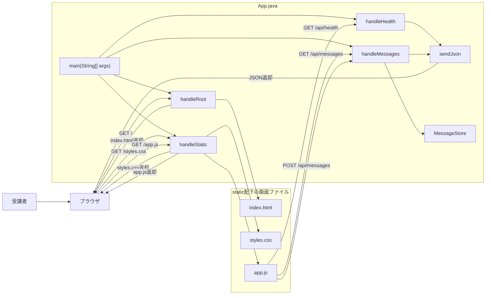
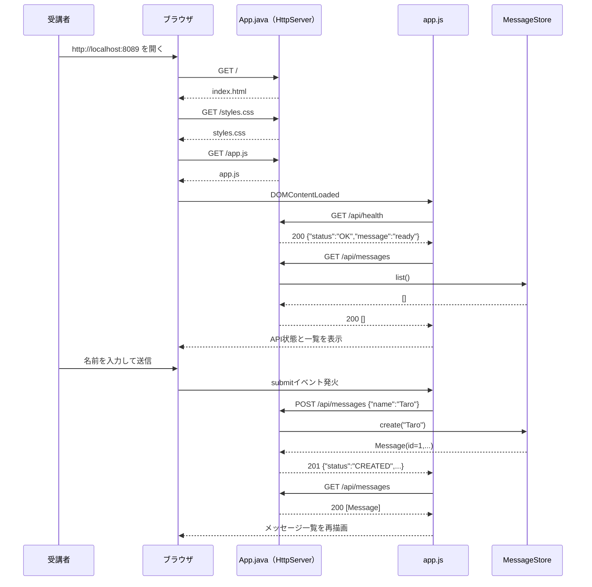
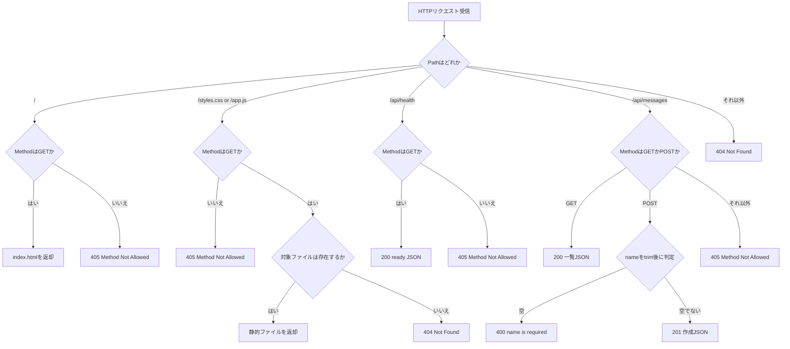

# Lesson0 Webアプリ前準備（Java API + fetch 入門）

## 目的（Lesson0でできるようになること）
- Java標準のHTTPサーバーで、最小APIを起動できる
- `GET` / `POST` と HTTPステータス（`200` / `201` / `400` / `404` / `405`）の役割が分かる
- JSON文字列を Java API で受け取り、JSON文字列を返せる
- JavaScript の `fetch` / `async` / `await` で API 通信できる
- `record` / `enum` / `AtomicLong` / `synchronized` の役割を、Webアプリ文脈で読める

## HTTPメソッドとステータスの対応表

### HTTPメソッド（リクエストの目的）
| メソッド | 主な役割 | Lesson0での使い方 |
| --- | --- | --- |
| `GET` | データを取得する | `GET /api/health`, `GET /api/messages` |
| `POST` | データを送信・登録する | `POST /api/messages` |
| `PUT` | データを丸ごと更新する | Lesson0では未使用 |
| `PATCH` | データの一部を更新する | Lesson0では未使用 |
| `DELETE` | データを削除する | Lesson0では未使用 |
| `OPTIONS` | 使えるメソッドなどを問い合わせる | Lesson0では未使用 |
| `HEAD` | `GET` と似ているが、本文なしでヘッダーだけ取得する | Lesson0では未使用 |

補足:
- Web API学習の最初は、まず `GET` と `POST` を押さえれば十分です。
- `PUT` / `PATCH` / `DELETE` は、Lesson2以降の「更新」「削除」で使う考え方につながります。
- `CONNECT` / `TRACE` というメソッドもありますが、通常のWebアプリ開発では最初に覚える必要はありません。

### HTTPステータス（レスポンスの結果）
| ステータス | 意味 | Lesson0で起きる例 |
| --- | --- | --- |
| `200 OK` | 成功。取得や処理が正常に終わった | `GET /api/health`, `GET /api/messages` |
| `201 Created` | 作成成功。新しいデータを登録できた | `POST /api/messages` でメッセージ登録成功 |
| `400 Bad Request` | リクエスト内容が不正 | 名前が空欄のまま `POST /api/messages` した |
| `404 Not Found` | URLやファイルが見つからない | `/api/health-x` など存在しないURLへアクセスした |
| `405 Method Not Allowed` | URLはあるが、そのHTTPメソッドは許可されていない | `/api/messages` に `PUT` を送る、または `/api/health` に `POST` を送る |

## 前提
- Java基礎学習を実施済み
- JavaScript基礎学習を実施済み
- Java補講 `java-20a-record-enum.md` / `java-20b-web-api-prep.md` を実施済み
- Git Bash を使える
- JDK 17 がインストール済み

## Lesson0で作るもの
- 画面: 名前入力フォーム + API状態表示 + メッセージ一覧
- API:
  - `GET /api/health`
  - `GET /api/messages`
  - `POST /api/messages`
- 動作:
  - APIの起動状態を画面に表示する
  - 入力した名前を `POST` で Java API に送る
  - Java側でメッセージをメモリ保存し、一覧をJSONで返す

### 全体構成図（ファイルと役割）


### JSON最小メモ（未学習者向け）
- JSONは「キー（項目名）: 値」の組でデータを表す文字列。
- APIへ送る例（リクエスト）:
  ```json
  {"name":"Taro"}
  ```
- APIから返る例（レスポンス）:
  ```json
  {"status":"CREATED","id":1,"name":"Taro","message":"こんにちは、Taroさん"}
  ```
- 一覧取得の例:
  ```json
  [{"id":1,"name":"Taro","text":"こんにちは、Taroさん"}]
  ```
- エラー時の例:
  ```json
  {"error":"name is required"}
  ```

補足:
- このLessonでは学習用に、JSONを文字列として組み立てます。
- 実務では Jackson などのライブラリでJSONを扱うことが多いです。
- ここでは「画面とAPIの通信の流れ」を優先します。

### 画面表示からメッセージ登録まで（正常系の時系列）


### ルーティングと異常系の分岐（404/405/400）


---

## 0. 事前確認（Git Bashで実行）

```bash
java -version
javac -version
```

期待状態:
- `java -version` と `javac -version` の両方で `17` が表示される
- `javac` が not found にならない

---

## 1. 作業フォルダ
作業場所（絶対パス）:
- `~/order-management-springboot/practice/pre-springboot/step0-webapp-bridge`

Git Bash:
```bash
cd ~/order-management-springboot
mkdir -p practice/pre-springboot/step0-webapp-bridge/static
cd ~/order-management-springboot/practice/pre-springboot/step0-webapp-bridge
```

---

## 2. ファイル構成を作成
以下の 4 ファイルを作成:

- `App.java`
- `static/index.html`
- `static/styles.css`
- `static/app.js`

---

## 3. `App.java` を作成
作成ファイル:
- `~/order-management-springboot/practice/pre-springboot/step0-webapp-bridge/App.java`

### 演習中に確認する用語（このStepで使用）
- `HttpServer`: Java標準の簡易HTTPサーバー。Spring Bootを使わずにWeb APIを待ち受ける。
- `HttpExchange`: 1回分のHTTP通信情報。リクエストメソッド、URL、本文、レスポンス出力先を扱う。
- `record`: 値をまとめる不変データ型。このLessonでは `Message` 1件分を表す。
- `enum`: 決まった候補だけを表す型。このLessonでは `OK` / `CREATED` のようなAPI状態を表す。
- `AtomicLong`: スレッド安全な連番カウンタ。このLessonでは `Message` の `id` 採番に使う。
- `synchronized`: 同時実行時の排他制御。このLessonではメモリ上の `messages` を安全に更新するために使う。
- `Files` / `Path`: HTML/CSS/JavaScript の静的ファイルを読み込むために使う。
- `Pattern` / `Matcher`: JSON文字列から `name` を取り出すために使う。

```java
import com.sun.net.httpserver.HttpExchange; // HTTPリクエスト/レスポンス本体を扱うクラス
import com.sun.net.httpserver.HttpServer; // Java標準の簡易HTTPサーバー

import java.io.IOException; // 入出力エラー例外
import java.net.InetSocketAddress; // IPアドレス + ポートの組み合わせ
import java.nio.charset.StandardCharsets; // UTF-8などの文字コード定数
import java.nio.file.Files; // ファイル存在確認・読み込みに使用
import java.nio.file.Path; // ファイルパスを安全に扱う型
import java.util.ArrayList; // 可変長リストの代表実装
import java.util.List; // リスト型のインターフェース
import java.util.concurrent.atomic.AtomicLong; // 同時アクセスでも安全に連番を増やすクラス
import java.util.regex.Matcher; // 正規表現の検索結果
import java.util.regex.Pattern; // 正規表現パターン

public class App { // Lesson0で作るWebアプリ本体
    private static final int DEFAULT_PORT = 8089; // Lesson0用の待受ポート
    private static final Path STATIC_DIR = Path.of("static"); // 画面ファイル置き場
    private static final Pattern NAME_PATTERN = Pattern.compile("\"name\"\\s*:\\s*\"(.*?)\""); // {"name":"..."} の name を抽出
    private static final MessageStore STORE = new MessageStore(); // メモリ上のメッセージ保存先

    // Javaアプリのエントリーポイント（JVMが最初に呼ぶメソッド）
    // public: 外部（JVM）から呼び出せるようにする
    // static: Appのインスタンス生成なしで呼び出せるようにする
    // void: 戻り値なし / String[] args: 起動引数（例: 8089）
    // throws IOException: ファイル・通信などの入出力エラーを呼び出し元へ伝える
    public static void main(String[] args) throws IOException {
        int port = resolvePort(args); // 引数があれば引数、なければDEFAULT_PORT

        // localhost:port で待ち受けるHTTPサーバーを生成
        // 第2引数の 0 は backlog（同時接続待ちキュー長）を OS 既定値に任せる指定
        HttpServer server = HttpServer.create(new InetSocketAddress(port), 0); // HTTPサーバー作成
        server.createContext("/", App::handleRoot); // / へのアクセス（トップ画面）
        // createContext(パス, 処理) で「そのURLが来た時の担当処理」を登録する
        // exchange は「今回1回分の通信情報」が入った箱（メソッド/URL/ヘッダー/本文/レスポンス書き込み先）
        // handleStatic(...) は共通メソッド。ここでは styles.css を返すように指定している
        server.createContext("/styles.css", exchange -> handleStatic(exchange, "styles.css", "text/css; charset=UTF-8")); // CSS
        server.createContext("/app.js", exchange -> handleStatic(exchange, "app.js", "text/javascript; charset=UTF-8")); // JavaScript
        server.createContext("/api/health", App::handleHealth); // APIの起動状態確認
        server.createContext("/api/messages", App::handleMessages); // メッセージ一覧/登録
        server.setExecutor(null); // 既定の実行方式（シンプル構成）
        server.start(); // 待受開始

        System.out.println("started: http://localhost:" + port); // 起動確認メッセージ
    }

    private static int resolvePort(String[] args) { // 起動引数からポート番号を決める
        if (args.length == 0) { // 引数なしなら既定ポート
            return DEFAULT_PORT;
        }

        try {
            return Integer.parseInt(args[0]); // 引数が数値ならそのポートを使う
        } catch (NumberFormatException e) { // 数値に変換できない場合
            return DEFAULT_PORT; // 既定ポートへフォールバック
        }
    }

    private static void handleRoot(HttpExchange exchange) throws IOException { // / へのアクセスを処理する
        if (!"GET".equalsIgnoreCase(exchange.getRequestMethod())) { // GET以外は拒否
            sendMethodNotAllowed(exchange);
            return;
        }

        if (!"/".equals(exchange.getRequestURI().getPath())) { // / 以外のパスは404
            sendNotFound(exchange);
            return;
        }

        handleStatic(exchange, "index.html", "text/html; charset=UTF-8"); // トップ画面HTMLを返す
    }

    // 共通メソッド: 指定された fileName を static 配下から読み込み、contentType で返す
    // exchange: 今回の通信情報（リクエスト情報 + レスポンス出力先）
    // fileName: 返す実ファイル名（例: styles.css）
    // contentType: 返すデータ種別（例: text/css; charset=UTF-8）
    private static void handleStatic(HttpExchange exchange, String fileName, String contentType) throws IOException {
        if (!"GET".equalsIgnoreCase(exchange.getRequestMethod())) { // 静的ファイルもGETのみ許可
            sendMethodNotAllowed(exchange);
            return;
        }

        Path file = STATIC_DIR.resolve(fileName); // static配下の対象ファイルを指すPathを作る
        if (!Files.exists(file)) { // ファイルがなければ404
            sendNotFound(exchange);
            return;
        }

        byte[] body = Files.readAllBytes(file); // ファイルをバイト配列で読み込み
        exchange.getResponseHeaders().set("Content-Type", contentType); // Content-Type設定
        exchange.sendResponseHeaders(200, body.length); // HTTP 200 + ボディ長を返す
        exchange.getResponseBody().write(body); // レスポンスボディへ書き込み
        exchange.close(); // レスポンスを閉じて完了
    }

    private static void handleHealth(HttpExchange exchange) throws IOException { // /api/health を処理する
        if (!"GET".equalsIgnoreCase(exchange.getRequestMethod())) { // API状態確認はGETのみ許可
            sendMethodNotAllowed(exchange);
            return;
        }

        ApiStatus status = ApiStatus.OK; // enumで固定値OKを表す
        sendJson(exchange, 200, "{\"status\":\"" + status + "\",\"message\":\"ready\"}"); // API稼働中をJSONで返す
    }

    private static void handleMessages(HttpExchange exchange) throws IOException { // /api/messages のGET/POSTを処理する
        String method = exchange.getRequestMethod(); // GET / POST などのHTTPメソッドを取得

        if ("GET".equalsIgnoreCase(method)) { // GETなら一覧取得
            List<Message> messages = STORE.list(); // 保存済みメッセージを取得
            sendJson(exchange, 200, toMessageListJson(messages)); // JSON配列として返す
            return;
        }

        if ("POST".equalsIgnoreCase(method)) { // POSTなら新規登録
            String body = new String(exchange.getRequestBody().readAllBytes(), StandardCharsets.UTF_8); // リクエスト本文(JSON文字列)をUTF-8で取得
            String name = extractName(body).trim(); // JSONからnameを取り出して前後空白を除去

            if (name.isEmpty()) { // nameが空なら入力エラー
                sendJson(exchange, 400, "{\"error\":\"name is required\"}"); // HTTP 400でエラーJSONを返す
                return;
            }

            Message message = STORE.create(name); // メモリ上にメッセージを保存
            sendJson(exchange, 201, toMessageJson(message, ApiStatus.CREATED)); // HTTP 201で作成結果を返す
            return;
        }

        sendMethodNotAllowed(exchange); // GET/POST以外は405
    }

    private static String extractName(String body) { // JSON文字列からname値を取り出す
        Matcher matcher = NAME_PATTERN.matcher(body); // name抽出用正規表現を適用
        if (!matcher.find()) { // nameが見つからなければ空文字
            return "";
        }

        return unescapeJson(matcher.group(1)); // 1番目のキャプチャグループ（name値）を復元して返す
    }

    private static String toMessageListJson(List<Message> messages) { // メッセージ一覧をJSON配列文字列へ変換する
        StringBuilder builder = new StringBuilder(); // 文字列連結を効率よく行うための入れ物
        builder.append("["); // JSON配列の開始

        for (int i = 0; i < messages.size(); i++) { // 一覧を先頭から順に処理
            if (i > 0) { // 2件目以降は要素区切りのカンマを入れる
                builder.append(",");
            }

            Message message = messages.get(i); // i番目のMessageを取得
            builder.append("{") // JSONオブジェクトの開始
                .append("\"id\":").append(message.id()).append(",") // idは数値として出力
                .append("\"name\":\"").append(escapeJson(message.name())).append("\",") // nameは文字列なのでエスケープして出力
                .append("\"text\":\"").append(escapeJson(message.text())).append("\"") // textも文字列として出力
                .append("}"); // JSONオブジェクトの終了
        }

        builder.append("]"); // JSON配列の終了
        return builder.toString(); // StringBuilderの内容をStringにして返す
    }

    private static String toMessageJson(Message message, ApiStatus status) { // 登録結果1件をJSON文字列へ変換する
        return "{" // JSONオブジェクトの開始
            + "\"status\":\"" + status + "\"," // 処理結果（CREATEDなど）
            + "\"id\":" + message.id() + "," // 採番されたID
            + "\"name\":\"" + escapeJson(message.name()) + "\"," // 入力された名前
            + "\"message\":\"" + escapeJson(message.text()) + "\"" // 画面表示用メッセージ
            + "}"; // JSONオブジェクトの終了
    }

    private static void sendMethodNotAllowed(HttpExchange exchange) throws IOException { // 405を返す共通処理
        sendJson(exchange, 405, "{\"error\":\"Method Not Allowed\"}"); // HTTPメソッド違反
    }

    private static void sendNotFound(HttpExchange exchange) throws IOException { // 404を返す共通処理
        sendJson(exchange, 404, "{\"error\":\"Not Found\"}"); // URLやファイルが見つからない
    }

    private static void sendJson(HttpExchange exchange, int status, String json) throws IOException { // JSONレスポンスの共通送信処理
        byte[] body = json.getBytes(StandardCharsets.UTF_8); // JSON文字列をUTF-8バイト列へ変換
        exchange.getResponseHeaders().set("Content-Type", "application/json; charset=UTF-8"); // JSONのMIMEタイプ
        exchange.sendResponseHeaders(status, body.length); // ステータスコードとボディ長を通知
        exchange.getResponseBody().write(body); // レスポンス本文を書き込む
        exchange.close(); // 必ずcloseしてレスポンス完了
    }

    private static String escapeJson(String value) { // JSON文字列として安全になるように特殊文字をエスケープする
        return value
            .replace("\\", "\\\\") // \ は最初にエスケープ
            .replace("\"", "\\\"") // " をエスケープ
            .replace("\n", "\\n") // 改行をエスケープ
            .replace("\r", "\\r") // CRをエスケープ
            .replace("\t", "\\t"); // タブをエスケープ
    }

    private static String unescapeJson(String value) { // JSON文字列内のエスケープを通常文字へ戻す
        return value
            .replace("\\\"", "\"") // \" を " へ戻す
            .replace("\\\\", "\\") // \\ を \ へ戻す
            .replace("\\n", "\n") // \n を改行文字へ戻す
            .replace("\\r", "\r") // \r をCRへ戻す
            .replace("\\t", "\t"); // \t をタブへ戻す
    }

    private enum ApiStatus { // APIの処理状態を固定候補で表す
        OK, // 正常に取得できた状態
        CREATED // 新規作成できた状態
    }

    private record Message(long id, String name, String text) { // メッセージ1件分のデータ
    }

    private static final class MessageStore { // メモリ上でメッセージを管理するクラス
        private final AtomicLong sequence = new AtomicLong(0); // ID採番用カウンタ
        private final List<Message> messages = new ArrayList<>(); // 保存済みメッセージ一覧

        public synchronized List<Message> list() { // 一覧取得。synchronizedで読み取り中の競合を防ぐ
            return new ArrayList<>(messages); // 内部リストを直接渡さずコピーを返す
        }

        public synchronized Message create(String name) { // 新規作成。synchronizedで同時登録時の競合を防ぐ
            String text = "こんにちは、" + name + "さん"; // 保存するメッセージ本文を作成
            Message message = new Message(sequence.incrementAndGet(), name, text); // IDを1つ進めてMessageを生成
            messages.add(message); // メモリ上の一覧へ追加
            return message; // 作成したデータを呼び出し元へ返す
        }
    }
}
```

確認ポイント:
- `server.createContext(...)` がURLとJavaメソッドを結び付けている
- `handleMessages` は同じ `/api/messages` でも `GET` と `POST` で処理を分けている
- `record Message(...)` は1件分のデータを表している
- `MessageStore` がメモリ上の保存先になっている
- `sendJson` がステータスコードとJSON本文をまとめて返している

---

## 4. `index.html` を作成
作成ファイル:
- `~/order-management-springboot/practice/pre-springboot/step0-webapp-bridge/static/index.html`

```html
<!doctype html> <!-- HTML5文書であることを宣言 -->
<html lang="ja"> <!-- 文書言語を日本語に指定 -->
<head>
  <meta charset="UTF-8"> <!-- 文字化け防止（UTF-8） -->
  <meta name="viewport" content="width=device-width, initial-scale=1.0"> <!-- スマホ表示対応 -->
  <title>Lesson0 Web API Bridge</title> <!-- ブラウザタブに表示されるタイトル -->
  <link rel="stylesheet" href="/styles.css"> <!-- サーバーから配信されるCSSを読み込む -->
</head>
<body>
  <main class="container"> <!-- ページ全体の中央寄せ用ラッパー -->
    <section class="panel"> <!-- 入力フォームと結果表示のパネル -->
      <p class="eyebrow">Lesson0</p> <!-- 小見出し -->
      <h1>Webアプリ前準備</h1> <!-- 画面タイトル -->
      <p class="muted">Java API + fetch の最小接続を確認します。</p> <!-- 補足説明 -->

      <div class="status-box"> <!-- API状態表示エリア -->
        <span>API状態</span>
        <strong id="health-status">確認中...</strong> <!-- JSでAPI状態を書き換える対象 -->
      </div>

      <form id="message-form" class="form"> <!-- JSから取得するためにIDを付与 -->
        <label for="name">名前</label> <!-- 入力欄の説明 -->
        <div class="form-row"> <!-- 入力欄とボタンを横並びにするための枠 -->
          <input id="name" name="name" type="text" placeholder="Taro"> <!-- APIへ送る名前入力欄 -->
          <button type="submit">送信</button> <!-- フォーム送信ボタン -->
        </div>
      </form>

      <p id="result-message" class="message" aria-live="polite"></p> <!-- JSで結果/エラーを表示する対象 -->
    </section>

    <section class="panel"> <!-- 登録済みメッセージ一覧のパネル -->
      <h2>メッセージ一覧</h2> <!-- 一覧見出し -->
      <ul id="message-list" class="message-list"></ul> <!-- JSでli要素を追加する対象 -->
    </section>
  </main>

  <script src="/app.js"></script> <!-- サーバーから配信されるJavaScriptを読み込む -->
</body>
</html>
```

確認ポイント:
- `<link rel="stylesheet" href="/styles.css">` でCSSを読み込む
- `<script src="/app.js"></script>` でJavaScriptを読み込む
- `id="message-form"` や `id="message-list"` は JavaScript から要素を取得するための目印

---

## 5. `styles.css` を作成
作成ファイル:
- `~/order-management-springboot/practice/pre-springboot/step0-webapp-bridge/static/styles.css`

```css
* {
  box-sizing: border-box; /* 幅計算にpadding/borderを含める */
}

body {
  margin: 0; /* 既定余白をリセット */
  font-family: system-ui, -apple-system, BlinkMacSystemFont, "Segoe UI", sans-serif; /* OS標準に近いフォント指定 */
  color: #1f2937; /* 基本文字色 */
  background: #eef2f7; /* ページ背景色 */
}

.container {
  width: min(920px, calc(100% - 32px)); /* 最大幅と画面端余白を両立 */
  margin: 32px auto; /* 上下余白 + 横方向中央寄せ */
  display: grid; /* パネルを縦並びにしやすくする */
  gap: 16px; /* パネル間余白 */
}

.panel {
  background: #ffffff; /* パネル背景色 */
  border: 1px solid #d8dee9; /* パネル枠線 */
  border-radius: 8px; /* 角丸 */
  padding: 24px; /* 内側余白 */
}

.eyebrow {
  margin: 0 0 8px; /* 下だけ余白 */
  color: #2563eb; /* 小見出しの強調色 */
  font-size: 0.85rem; /* 小さめの文字サイズ */
  font-weight: 700; /* 太字 */
}

h1,
h2 {
  margin: 0 0 12px; /* 見出し下の余白 */
}

.muted {
  margin: 0 0 20px; /* 補足説明下の余白 */
  color: #667085; /* 補助文字色 */
}

.status-box {
  display: flex; /* ラベルと状態を横並び */
  justify-content: space-between; /* 左右に分けて配置 */
  gap: 16px; /* 横並び要素の間隔 */
  margin-bottom: 20px; /* 下余白 */
  padding: 12px 14px; /* 内側余白 */
  border: 1px solid #bfdbfe; /* 状態表示の枠線 */
  border-radius: 8px; /* 角丸 */
  background: #eff6ff; /* 状態表示の背景色 */
}

.form {
  display: grid; /* ラベルと入力行を縦並び */
  gap: 8px; /* 項目間余白 */
}

.form-row {
  display: flex; /* 入力欄とボタンを横並び */
  gap: 8px; /* 入力欄とボタンの間隔 */
}

input {
  flex: 1; /* 横幅の残りを入力欄が使う */
  min-width: 0; /* 狭い画面で入力欄がはみ出すのを防ぐ */
  padding: 10px 12px; /* 入力しやすい高さを確保 */
  border: 1px solid #cbd5e1; /* 入力欄の枠線 */
  border-radius: 6px; /* 角丸 */
  font: inherit; /* bodyと同じフォントを使う */
}

button {
  padding: 10px 16px; /* クリックしやすい余白 */
  border: 0; /* 既定の枠線を消す */
  border-radius: 6px; /* 角丸 */
  font: inherit; /* bodyと同じフォントを使う */
  font-weight: 700; /* ボタン文字を太字 */
  color: #ffffff; /* ボタン文字色 */
  background: #2563eb; /* ボタン背景色 */
  cursor: pointer; /* ホバー時カーソルを手にする */
}

button:hover {
  background: #1d4ed8; /* ホバー時に少し濃くする */
}

.message {
  min-height: 24px; /* メッセージ未表示時も高さを確保 */
  margin: 16px 0 0; /* 上余白 */
  font-weight: 700; /* メッセージを目立たせる */
}

.message.error {
  color: #b42318; /* エラー時の文字色 */
}

.message-list {
  margin: 0; /* ulの既定余白をリセット */
  padding: 0; /* ulの既定左余白をリセット */
  list-style: none; /* 箇条書きマーカーを消す */
  display: grid; /* liを縦並びにする */
  gap: 8px; /* li同士の間隔 */
}

.message-list li {
  padding: 10px 12px; /* 一覧項目の内側余白 */
  border: 1px solid #e5e7eb; /* 一覧項目の枠線 */
  border-radius: 6px; /* 角丸 */
  background: #f9fafb; /* 一覧項目の背景色 */
}

@media (max-width: 560px) {
  .form-row {
    flex-direction: column; /* 狭い画面では縦並び */
  }

  button {
    width: 100%; /* スマホではボタン幅を入力欄に合わせる */
  }
}
```

---

## 6. `app.js` を作成
作成ファイル:
- `~/order-management-springboot/practice/pre-springboot/step0-webapp-bridge/static/app.js`

### 演習中に確認する用語（このStepで使用）
- `DOMContentLoaded`: HTML読み込み完了後にJavaScriptを実行するためのイベント。
- `fetch`: ブラウザからHTTPリクエストを送る関数。
- `async` / `await`: 非同期処理の完了を待ってから次の処理へ進める構文。
- `JSON.stringify(...)`: JavaScriptオブジェクトをJSON文字列へ変換する。
- `response.json()`: レスポンスJSONをJavaScriptオブジェクトへ変換する。
- `response.ok`: HTTPステータスが `200` 番台なら `true` になる。

```javascript
document.addEventListener("DOMContentLoaded", () => { // HTML読込完了後に処理を開始
  const healthStatus = document.getElementById("health-status"); // API状態表示要素を取得
  const form = document.getElementById("message-form"); // フォーム要素を取得
  const nameInput = document.getElementById("name"); // 名前入力欄を取得
  const resultMessage = document.getElementById("result-message"); // 結果/エラー表示要素を取得
  const messageList = document.getElementById("message-list"); // メッセージ一覧要素を取得

  // 要素が想定どおり取得できたかを型込みでチェック
  if (!(healthStatus instanceof HTMLElement) ||
      !(form instanceof HTMLFormElement) ||
      !(nameInput instanceof HTMLInputElement) ||
      !(resultMessage instanceof HTMLElement) ||
      !(messageList instanceof HTMLUListElement)) {
    return; // 取得失敗時は安全に処理終了
  }

  const showMessage = (text, isError = false) => { // 結果/エラー表示をまとめて更新する関数
    resultMessage.textContent = text; // 表示文字列を更新
    resultMessage.classList.toggle("error", isError); // エラー時だけerrorクラスを付ける
  };

  const loadHealth = async () => { // API状態を取得する非同期関数
    const response = await fetch("/api/health"); // Java APIへGETリクエスト
    const data = await response.json(); // レスポンスJSONをオブジェクト化

    if (!response.ok) { // HTTPエラー（400/404/405など）の場合
      throw new Error(data.error || "API状態確認に失敗しました"); // 呼び出し元のcatchへエラーを渡す
    }

    healthStatus.textContent = `${data.status}: ${data.message}`; // 画面のAPI状態を更新
  };

  const renderMessages = (messages) => { // メッセージ一覧を画面に描画する関数
    messageList.innerHTML = ""; // 既存の一覧表示を空にする

    if (messages.length === 0) { // 一覧が空の場合
      const emptyItem = document.createElement("li"); // 空表示用のli要素を作成
      emptyItem.textContent = "まだメッセージはありません。"; // 空表示メッセージ
      messageList.appendChild(emptyItem); // ulへliを追加
      return; // ここで描画処理を終了
    }

    messages.forEach((message) => { // メッセージを1件ずつ処理
      const item = document.createElement("li"); // 1件分のli要素を作成
      item.textContent = `#${message.id} ${message.text}`; // IDと本文を表示
      messageList.appendChild(item); // ulへliを追加
    });
  };

  const loadMessages = async () => { // メッセージ一覧をAPIから取得する非同期関数
    const response = await fetch("/api/messages"); // Java APIへGETリクエスト
    const messages = await response.json(); // レスポンスJSON配列をJavaScript配列へ変換

    if (!response.ok) { // HTTPエラーの場合
      throw new Error(messages.error || "一覧取得に失敗しました"); // 呼び出し元のcatchへエラーを渡す
    }

    renderMessages(messages); // 取得した一覧を画面へ描画
  };

  const createMessage = async (name) => { // メッセージを新規登録する非同期関数
    const response = await fetch("/api/messages", { // Java APIへPOSTリクエスト
      method: "POST", // 登録なのでPOSTを指定
      headers: {
        "Content-Type": "application/json" // JSON送信を宣言
      },
      body: JSON.stringify({ name }) // {name: "..."} をJSON文字列化
    });

    const data = await response.json(); // レスポンスJSONをオブジェクト化

    if (!response.ok) { // HTTPエラー（例: 400）の場合
      throw new Error(data.error || "登録に失敗しました"); // 呼び出し元のcatchへエラーを渡す
    }

    return data; // 正常時は作成結果を返す
  };

  form.addEventListener("submit", async (event) => { // フォーム送信イベントを監視
    event.preventDefault(); // ブラウザ既定の画面遷移を止める

    const name = nameInput.value.trim(); // 入力値の前後空白を除去
    showMessage(""); // 前回のメッセージを消す

    try {
      const created = await createMessage(name); // APIへ登録リクエストを送信
      showMessage(created.message); // 登録結果メッセージを表示
      nameInput.value = ""; // 入力欄を空に戻す
      await loadMessages(); // 登録後の一覧を再取得
    } catch (error) { // APIエラーや通信失敗時
      showMessage(error.message, true); // エラーメッセージを表示
    }
  });

  (async () => { // 初期表示用の即時実行非同期関数
    try {
      await loadHealth(); // API状態を取得
      await loadMessages(); // 初期一覧を取得
    } catch (error) { // 初期表示時に失敗した場合
      showMessage(error.message, true); // エラーメッセージを表示
    }
  })();
});
```

確認ポイント:
- `fetch("/api/health")` は Java側の `server.createContext("/api/health", ...)` に対応する
- `fetch("/api/messages", { method: "POST", ... })` は Java側の `handleMessages` の `POST` 分岐に対応する
- `await loadMessages();` によって登録後の一覧を再取得している
- `response.ok` によって `400` や `405` の失敗レスポンスを画面表示へつなげている

---

## 7. コンパイル

Git Bash:
```bash
cd ~/order-management-springboot/practice/pre-springboot/step0-webapp-bridge
javac -encoding UTF-8 App.java
```

期待状態:
```text
(コンパイル成功: 出力なし)
```

---

## 8. 起動

Git Bash:
```bash
cd ~/order-management-springboot/practice/pre-springboot/step0-webapp-bridge
java App
```

期待出力:
```text
started: http://localhost:8089
```

補足:
- 停止するときはターミナルで `Ctrl + C`
- 別ポートで起動したい場合:
  ```bash
  java App 8189
  ```

---

## 9. 画面確認（必須）

ブラウザで開く:
```text
http://localhost:8089
```

確認:
1. API状態に `OK: ready` が表示される
2. 名前を入力して送信するとメッセージが表示される
3. メッセージ一覧に `#1 こんにちは、〇〇さん` が追加される
4. 空欄で送信するとエラーメッセージが表示される

---

## 10. 目的達成演習（必須）
1. `GET` / `POST` と Java側の分岐を説明できる
2. `fetch` で API を呼び、レスポンスJSONを画面に表示できる
3. `record` / `enum` / `AtomicLong` / `synchronized` の役割を説明できる
4. `400` / `404` / `405` が起きる条件を説明できる

## 10.5 目的達成演習の具体手順
共通手順（各課題で共通）:
1. 該当ファイルを編集
2. コンパイル
   ```bash
   cd ~/order-management-springboot/practice/pre-springboot/step0-webapp-bridge
   javac -encoding UTF-8 App.java
   ```
3. 起動（起動中なら `Ctrl + C` で再起動）
   ```bash
   cd ~/order-management-springboot/practice/pre-springboot/step0-webapp-bridge
   java App
   ```
4. ブラウザで確認
5. 一時変更の課題は必ず元のコードに戻す

### 1. GET API と POST API の違いを確認する
編集ファイル:
- `~/order-management-springboot/practice/pre-springboot/step0-webapp-bridge/static/app.js`

`createMessage` の `method` を一時変更:
```javascript
method: "PUT",
```

確認:
1. 名前を送信すると `Method Not Allowed` が表示されること
2. `method: "POST"` に戻すと登録できること

コード解説:
- Java側の `handleMessages` は `GET` を一覧取得、`POST` を登録として扱う
- `/api/messages` に `PUT` を送ると、Java側に対応する分岐がないため `405 Method Not Allowed` になる
- `GET` に変更した場合は、登録ではなく一覧取得の扱いになる
- フロントとサーバーでHTTPメソッドの約束を揃える必要がある

### 2. 空入力の400エラーを確認する
編集ファイル:
- `~/order-management-springboot/practice/pre-springboot/step0-webapp-bridge/App.java`

該当箇所:
```java
if (name.isEmpty()) {
    sendJson(exchange, 400, "{\"error\":\"name is required\"}");
    return;
}
```

確認:
1. 空欄で送信すると `name is required` が表示されること
2. ステータスコード `400` は「入力が不正」を表すこと

発展確認:
- ブラウザの DevTools（Network）で `/api/messages` のステータスが `400` になることを確認する

### 3. `record` の項目を増やしてみる
編集ファイル:
- `~/order-management-springboot/practice/pre-springboot/step0-webapp-bridge/App.java`

変更前:
```java
private record Message(long id, String name, String text) {
}
```

変更後:
```java
private record Message(long id, String name, String text, String source) {
}
```

あわせて `new Message(...)` を修正:
```java
Message message = new Message(sequence.incrementAndGet(), name, text, "web");
```

確認:
1. `record` の項目を増やすと、生成時の引数も増やす必要があること
2. 確認後は元に戻すこと

コード解説:
- `record` はデータ項目をまとめる型
- `new Message(...)` の引数は `record Message(...)` の定義と一致する必要がある

### 4. `AtomicLong` の採番を確認する
編集ファイル:
- `~/order-management-springboot/practice/pre-springboot/step0-webapp-bridge/App.java`

該当箇所:
```java
Message message = new Message(sequence.incrementAndGet(), name, text);
```

確認:
1. メッセージを3件登録し、`#1`, `#2`, `#3` と増えること
2. サーバーを再起動すると `#1` から始まること

コード解説:
- `AtomicLong` はメモリ上の連番カウンタ
- 今回はDB保存していないため、サーバー再起動でデータは消える
- Lesson2以降の `TodoStore` でも同じ考え方を使う

### 5. `fetch` の接続先URLを確認する
編集ファイル:
- `~/order-management-springboot/practice/pre-springboot/step0-webapp-bridge/static/app.js`

`loadHealth` のURLを一時変更:
```javascript
const response = await fetch("/api/health-x");
```

確認:
1. 画面表示時に `Not Found` が表示されること
2. URLを `/api/health` に戻すと成功すること

コード解説:
- Java側に登録していないURLは `404 Not Found`
- `fetch` のURLと `server.createContext(...)` のURLを一致させる必要がある

---

## 11. 理解ポイント
- `HttpServer` は Spring Boot を使わずにHTTP通信を体験するための最小サーバー
- `server.createContext(...)` がルーティングの入口になる
- `GET` は取得、`POST` は登録や送信に使うことが多い
- `sendJson` は「ステータスコード + JSON本文」を返す共通処理
- `fetch` はブラウザからJava APIへHTTPリクエストを送る接続点
- `record` はデータ1件、`MessageStore` はメモリ上の保存先を表す
- `AtomicLong` と `synchronized` は、複数アクセス時のID重複やデータ競合を避けるために使う

---

## 12. つまずきポイント
- 日本語が文字化けする:
  - `javac -encoding UTF-8 App.java` でコンパイルする
- `404 Not Found`:
  - `static/index.html`, `static/styles.css`, `static/app.js` の配置を確認
  - `fetch` のURLと `server.createContext(...)` のURLが一致しているか確認
- `405 Method Not Allowed`:
  - `GET` と `POST` を取り違えていないか確認
- 空欄送信で登録されない:
  - Java側で `name.isEmpty()` を `400` として返している
- 一覧が更新されない:
  - `await loadMessages();` が登録後に呼ばれているか確認
- サーバーを再起動すると一覧が消える:
  - 今回はメモリ保持だけなので正常

---

## 13. Lesson1への接続
- Lesson1の `POST /api/greeting` は、このLesson0の `POST /api/messages` をさらに小さくしたもの
- Lesson1ではメモリ保存をせず、入力値から挨拶メッセージを返すことに集中する
- Lesson2以降では、このLesson0の `MessageStore` と同じ考え方で、ToDoや勤怠データをメモリ保持する
- Lesson4/5で出る `409 Conflict` や状態遷移は、`400` / `404` / `405` と同じく「サーバーが判断して結果を返す」考え方の応用
