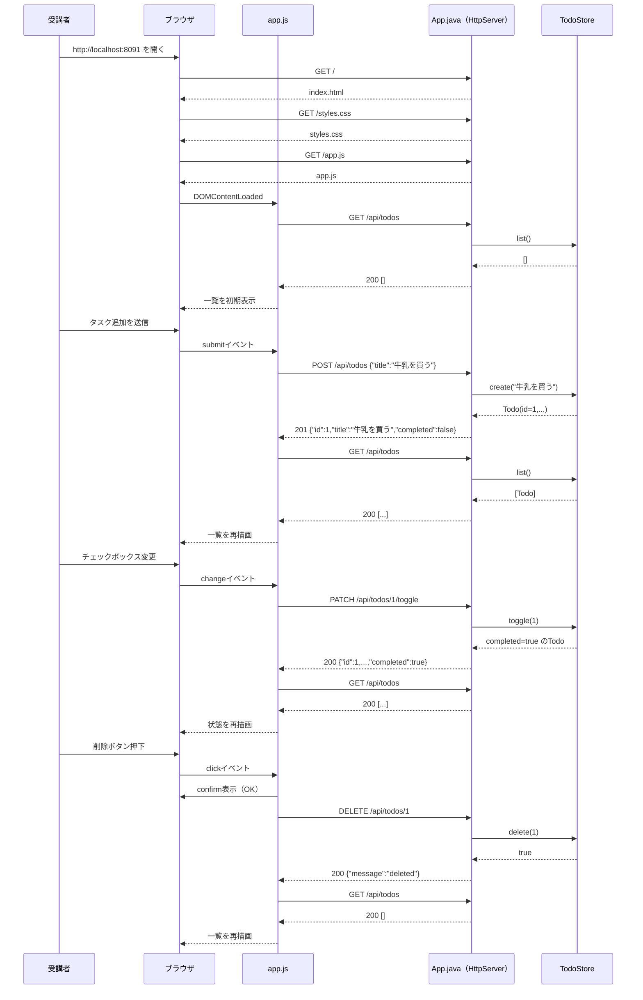

# Lesson2 CRUD入門（ToDo Lite）

## 目的（Lesson2でできるようになること）
- CRUD（Create / Read / Update / Delete）の基本をWebアプリで実装できる
- JavaScriptで画面遷移なしの一覧更新ができる
- 削除確認ダイアログを含む基本UI操作が分かる

## 前提
- Lesson1 を完了している
- Git Bash を使える
- JDK 17 がインストール済み

## Lesson2で作るもの
- 画面: タスク登録フォーム + 一覧
- API:
  - `GET /api/todos`
  - `POST /api/todos`
  - `PATCH /api/todos/{id}/toggle`
  - `DELETE /api/todos/{id}`
- 動作: タスク追加 / 完了切替 / 削除

### 全体構成図（ファイルと役割）
```mermaid
flowchart LR
  U[受講者] --> B[ブラウザ]

  subgraph ST[static配下の画面ファイル]
    IDX[index.html]
    CSS[styles.css]
    JS[app.js]
  end

  subgraph AP[App.java]
    MAIN["main(String[] args)"]
    ROOT[handleRoot]
    HSTATIC[handleStatic]
    TODOS[handleTodos]
    TODOID[handleTodoById]
    SJ[sendJson]
    STORE[TodoStore]
  end

  MAIN --> ROOT
  MAIN --> HSTATIC
  MAIN --> TODOS
  MAIN --> TODOID

  B -->|GET /| ROOT
  ROOT -->|index.html返却| B
  ROOT --> IDX

  B -->|GET /styles.css| HSTATIC
  HSTATIC -->|styles.css返却| B
  HSTATIC --> CSS

  B -->|GET /app.js| HSTATIC
  HSTATIC -->|app.js返却| B
  HSTATIC --> JS

  JS -->|GET /api/todos| TODOS
  JS -->|POST /api/todos| TODOS
  JS -->|PATCH /api/todos/{id}/toggle| TODOID
  JS -->|DELETE /api/todos/{id}| TODOID

  TODOS --> STORE
  TODOID --> STORE
  TODOS --> SJ
  TODOID --> SJ
  SJ -->|JSON返却| B
```

### JSON最小メモ（未学習者向け）
- JSONは「キー（項目名）: 値」の組でデータを表す文字列。
- 作成時の送信例（リクエスト）:
  ```json
  {"title":"牛乳を買う"}
  ```
- 一覧取得の返却例（レスポンス）:
  ```json
  [{"id":1,"title":"牛乳を買う","completed":false}]
  ```
- 切替時の返却例（レスポンス）:
  ```json
  {"id":1,"title":"牛乳を買う","completed":true}
  ```
- 削除時の返却例（レスポンス）:
  ```json
  {"message":"deleted"}
  ```
- エラー時の例:
  ```json
  {"error":"title is required"}
  {"error":"invalid id"}
  {"error":"todo not found"}
  ```

### 画面表示からCRUD操作まで（正常系の時系列）


### ルーティングと異常系の分岐（404/405/400）
```mermaid
flowchart TD
  A[HTTPリクエスト受信] --> P{Pathはどれか}

  P -->|/| R1{MethodはGETか}
  R1 -->|はい| OK1[index.htmlを返却]
  R1 -->|いいえ| E405A[405 Method Not Allowed]

  P -->|/styles.css or /app.js| R2{MethodはGETか}
  R2 -->|はい| F{対象ファイルは存在するか}
  F -->|はい| OK2[静的ファイルを返却]
  F -->|いいえ| E404A[404 Not Found]
  R2 -->|いいえ| E405B[405 Method Not Allowed]

  P -->|/api/todos| R3{MethodはGETかPOSTか}
  R3 -->|GET| OK3[200 一覧JSON]
  R3 -->|POST| T{titleをtrim後に判定}
  T -->|空| E400A[400 title is required]
  T -->|空でない| OK4[201 作成JSON]
  R3 -->|それ以外| E405C[405 Method Not Allowed]

  P -->|/api/todos/{id}/toggle| R4{idは数値か}
  R4 -->|いいえ| E400B[400 invalid id]
  R4 -->|はい| M1{MethodはPATCHか}
  M1 -->|いいえ| E405D[405 Method Not Allowed]
  M1 -->|はい| EX1{対象Todoは存在するか}
  EX1 -->|いいえ| E404B[404 todo not found]
  EX1 -->|はい| OK5[200 切替後JSON]

  P -->|/api/todos/{id}| R5{idは数値か}
  R5 -->|いいえ| E400C[400 invalid id]
  R5 -->|はい| M2{MethodはDELETEか}
  M2 -->|いいえ| E405E[405 Method Not Allowed]
  M2 -->|はい| EX2{削除対象は存在するか}
  EX2 -->|いいえ| E404C[404 todo not found]
  EX2 -->|はい| OK6[200 deleted]

  P -->|それ以外| E404D[404 Not Found]
```

---

## 0. 事前確認（Git Bashで実行）

```bash
java -version
javac -version
```

---

## 1. 作業フォルダ
作業場所（絶対パス）:
- `~/order-management-springboot/practice/pre-springboot/step2-todo-lite`

Git Bash:
```bash
cd ~/order-management-springboot
mkdir -p practice/pre-springboot/step2-todo-lite/static
cd ~/order-management-springboot/practice/pre-springboot/step2-todo-lite
```

---

## 2. ファイル構成を作成
以下の 4 ファイルを作成:

- `App.java`
- `static/index.html`
- `static/styles.css`
- `static/app.js`

---

## 3. `App.java` を作成
作成ファイル:
- `~/order-management-springboot/practice/pre-springboot/step2-todo-lite/App.java`

```java
// 1回分のHTTP通信（リクエスト情報 + レスポンス出力先）を扱う型
import com.sun.net.httpserver.HttpExchange;
// Java標準の簡易HTTPサーバー
import com.sun.net.httpserver.HttpServer;

// 入出力エラー例外
import java.io.IOException;
// 待受IP/ポートの指定に使う
import java.net.InetSocketAddress;
// UTF-8などの文字コード定数
import java.nio.charset.StandardCharsets;
// ファイル存在確認/読み込み
import java.nio.file.Files;
// OS差異を吸収してパスを扱う
import java.nio.file.Path;
// 可変長リスト実装
import java.util.ArrayList;
// リスト型のインターフェース
import java.util.List;
// スレッド安全に連番を採番
import java.util.concurrent.atomic.AtomicLong;
// 正規表現の検索結果
import java.util.regex.Matcher;
// 正規表現パターン
import java.util.regex.Pattern;

// アプリ全体のエントリポイントクラス
public class App {
    // 引数でポート指定が無いときに使う既定ポート
    private static final int DEFAULT_PORT = 8091;
    // HTML/CSS/JS の静的ファイルを置くディレクトリ
    private static final Path STATIC_DIR = Path.of("static");
    // JSON本文から必要項目を取り出すための正規表現
    private static final Pattern TITLE_PATTERN = Pattern.compile("\"title\"\\s*:\\s*\"(.*?)\"");
    // メモリ上でデータを保持するストア
    private static final TodoStore STORE = new TodoStore();

    // アプリ起動の入口。ルーティングを登録してサーバーを開始する
    public static void main(String[] args) throws IOException {
        int port = resolvePort(args);

        HttpServer server = HttpServer.create(new InetSocketAddress(port), 0);
        // ルーティング登録: "/" にアクセスされたときの処理を関連付ける
        server.createContext("/", App::handleRoot);
        // ルーティング登録: "/styles.css" にアクセスされたときの処理を関連付ける
        // exchange は今回1回分のHTTP通信情報。handleStatic に委譲して静的ファイルを返す
        server.createContext("/styles.css", exchange -> handleStatic(exchange, "styles.css", "text/css; charset=UTF-8"));
        // ルーティング登録: "/app.js" にアクセスされたときの処理を関連付ける
        // exchange は今回1回分のHTTP通信情報。handleStatic に委譲して静的ファイルを返す
        server.createContext("/app.js", exchange -> handleStatic(exchange, "app.js", "application/javascript; charset=UTF-8"));
        // ルーティング登録: "/api/todos" にアクセスされたときの処理を関連付ける
        server.createContext("/api/todos", App::handleTodos);
        // ルーティング登録: "/api/todos/" にアクセスされたときの処理を関連付ける
        server.createContext("/api/todos/", App::handleTodoById);
        // スレッド実行方式はデフォルト設定を使う
        server.setExecutor(null);
        // HTTPサーバーを起動して待受開始
        server.start();

        System.out.println("ToDo Lite started: http://localhost:" + port);
    }

    // 起動引数から使用ポートを決める（不正値なら既定ポート）
    private static int resolvePort(String[] args) {
        if (args.length == 0) {
            return DEFAULT_PORT;
        }
        try {
            return Integer.parseInt(args[0]);
        } catch (NumberFormatException ex) {
            return DEFAULT_PORT;
        }
    }

    // "/" へのアクセスを処理し、index.html を返す
    private static void handleRoot(HttpExchange exchange) throws IOException {
        // GET以外のHTTPメソッドは受け付けない
        if (!"GET".equalsIgnoreCase(exchange.getRequestMethod())) {
            sendJson(exchange, 405, "{\"error\":\"Method Not Allowed\"}");
            return;
        }
        if (!"/".equals(exchange.getRequestURI().getPath())) {
            sendJson(exchange, 404, "{\"error\":\"Not Found\"}");
            return;
        }
        handleStatic(exchange, "index.html", "text/html; charset=UTF-8");
    }

    // static配下のファイルを読み込み、指定Content-Typeで返す共通処理
    private static void handleStatic(HttpExchange exchange, String fileName, String contentType) throws IOException {
        // GET以外のHTTPメソッドは受け付けない
        if (!"GET".equalsIgnoreCase(exchange.getRequestMethod())) {
            sendJson(exchange, 405, "{\"error\":\"Method Not Allowed\"}");
            return;
        }
        Path file = STATIC_DIR.resolve(fileName);
        // 対象ファイルが存在しない場合は404を返す
        if (!Files.exists(file)) {
            sendJson(exchange, 404, "{\"error\":\"Not Found\"}");
            return;
        }

        byte[] body = Files.readAllBytes(file);
        // ブラウザが中身を正しく解釈できるようContent-Typeを設定
        exchange.getResponseHeaders().set("Content-Type", contentType);
        // ステータスコードとボディ長を先に送信する
        exchange.sendResponseHeaders(200, body.length);
        // レスポンス本文を書き込む
        exchange.getResponseBody().write(body);
        // 通信を終了してリソースを解放する
        exchange.close();
    }

    // /api/todos の GET/POST を処理する
    private static void handleTodos(HttpExchange exchange) throws IOException {
        String method = exchange.getRequestMethod().toUpperCase();
        if ("GET".equals(method)) {
            List<Todo> todos = STORE.list();
            sendJson(exchange, 200, toJsonList(todos));
            return;
        }

        if ("POST".equals(method)) {
            // リクエスト本文(JSON文字列)をUTF-8で読み取る
            String body = new String(exchange.getRequestBody().readAllBytes(), StandardCharsets.UTF_8);
            String title = extractTitle(body).trim();
            // 必須入力が空ならエラーとして返す
            if (title.isEmpty()) {
                sendJson(exchange, 400, "{\"error\":\"title is required\"}");
                return;
            }
            Todo created = STORE.create(title);
            sendJson(exchange, 201, toJson(created));
            return;
        }

        sendJson(exchange, 405, "{\"error\":\"Method Not Allowed\"}");
    }

    // /api/todos/{id} 系（toggle/delete）を処理する
    private static void handleTodoById(HttpExchange exchange) throws IOException {
        String path = exchange.getRequestURI().getPath();
        String method = exchange.getRequestMethod().toUpperCase();
        String suffix = path.substring("/api/todos/".length());

        if (suffix.isBlank()) {
            sendJson(exchange, 404, "{\"error\":\"Not Found\"}");
            return;
        }

        if (suffix.endsWith("/toggle")) {
            String idPart = suffix.substring(0, suffix.length() - "/toggle".length());
            long id = parseId(idPart);
            if (id < 0) {
                sendJson(exchange, 400, "{\"error\":\"invalid id\"}");
                return;
            }
            if (!"PATCH".equals(method)) {
                sendJson(exchange, 405, "{\"error\":\"Method Not Allowed\"}");
                return;
            }
            Todo updated = STORE.toggle(id);
            if (updated == null) {
                sendJson(exchange, 404, "{\"error\":\"todo not found\"}");
                return;
            }
            sendJson(exchange, 200, toJson(updated));
            return;
        }

        long id = parseId(suffix);
        if (id < 0) {
            sendJson(exchange, 400, "{\"error\":\"invalid id\"}");
            return;
        }

        if ("DELETE".equals(method)) {
            boolean deleted = STORE.delete(id);
            if (!deleted) {
                sendJson(exchange, 404, "{\"error\":\"todo not found\"}");
                return;
            }
            sendJson(exchange, 200, "{\"message\":\"deleted\"}");
            return;
        }

        sendJson(exchange, 405, "{\"error\":\"Method Not Allowed\"}");
    }

    // URL文字列からIDを数値へ変換する（失敗時は-1）
    private static long parseId(String idPart) {
        try {
            return Long.parseLong(idPart);
        } catch (NumberFormatException ex) {
            return -1;
        }
    }

    // JSONからtitleを抜き出してエスケープを復元する
    private static String extractTitle(String body) {
        Matcher matcher = TITLE_PATTERN.matcher(body);
        if (!matcher.find()) {
            return "";
        }
        return matcher.group(1)
            .replace("\\\"", "\"")
            .replace("\\\\", "\\")
            .replace("\\n", "\n")
            .replace("\\r", "\r")
            .replace("\\t", "\t");
    }

    // ToDoリストをJSON配列文字列へ変換する
    private static String toJsonList(List<Todo> todos) {
        StringBuilder builder = new StringBuilder();
        builder.append("[");
        for (int i = 0; i < todos.size(); i++) {
            if (i > 0) {
                builder.append(",");
            }
            builder.append(toJson(todos.get(i)));
        }
        builder.append("]");
        return builder.toString();
    }

    // 単一データをJSON文字列へ変換する
    private static String toJson(Todo todo) {
        return "{"
            + "\"id\":" + todo.id + ","
            + "\"title\":\"" + escapeJson(todo.title) + "\","
            + "\"completed\":" + todo.completed
            + "}";
    }

    // JSONレスポンスの共通送信処理
    private static void sendJson(HttpExchange exchange, int status, String json) throws IOException {
        byte[] body = json.getBytes(StandardCharsets.UTF_8);
        // ブラウザが中身を正しく解釈できるようContent-Typeを設定
        exchange.getResponseHeaders().set("Content-Type", "application/json; charset=UTF-8");
        // ステータスコードとボディ長を先に送信する
        exchange.sendResponseHeaders(status, body.length);
        // レスポンス本文を書き込む
        exchange.getResponseBody().write(body);
        // 通信を終了してリソースを解放する
        exchange.close();
    }

    // JSON文字列として安全になるようにエスケープする
    private static String escapeJson(String value) {
        return value
            .replace("\\", "\\\\")
            .replace("\"", "\\\"")
            .replace("\n", "\\n")
            .replace("\r", "\\r")
            .replace("\t", "\\t");
    }

    // record: 値をまとめる不変データ型（getter相当が自動で使える）
    private record Todo(long id, String title, boolean completed) {
    }

    private static final class TodoStore {
        // AtomicLong: 同時アクセス時も安全に連番を採番する
        private final AtomicLong sequence = new AtomicLong(0);
        private final List<Todo> todos = new ArrayList<>();

        // synchronized: 共有データ（todos）更新の競合を防ぐ
        public synchronized List<Todo> list() {
            return new ArrayList<>(todos);
        }

        // synchronized: 同時作成でもID重複やデータ破損を防ぐ
        public synchronized Todo create(String title) {
            Todo todo = new Todo(sequence.incrementAndGet(), title, false);
            todos.add(todo);
            return todo;
        }

        public synchronized Todo toggle(long id) {
            for (int i = 0; i < todos.size(); i++) {
                Todo current = todos.get(i);
                if (current.id == id) {
                    Todo updated = new Todo(current.id, current.title, !current.completed);
                    todos.set(i, updated);
                    return updated;
                }
            }
            return null;
        }

        public synchronized boolean delete(long id) {
            for (int i = 0; i < todos.size(); i++) {
                if (todos.get(i).id == id) {
                    todos.remove(i);
                    return true;
                }
            }
            return false;
        }
    }
}
```

---

## 4. `index.html` を作成
作成ファイル:
- `~/order-management-springboot/practice/pre-springboot/step2-todo-lite/static/index.html`

```html
<!-- HTML5文書であることを宣言 -->
<!doctype html>
<!-- このページの言語設定（日本語） -->
<html lang="ja">
<!-- 画面に表示しないメタ情報をまとめる領域 -->
<head>
  <!-- 文字コードをUTF-8にして文字化けを防ぐ -->
  <meta charset="utf-8">
  <!-- スマホ表示で幅を適切に合わせる -->
  <meta name="viewport" content="width=device-width, initial-scale=1">
  <!-- ブラウザタブに表示されるタイトル -->
  <title>ToDo Lite</title>
  <!-- CSSファイルを読み込む -->
  <link rel="stylesheet" href="/styles.css">
</head>
<!-- ユーザーに見える本体コンテンツ -->
<body>
  <!-- 画面の主コンテンツ領域 -->
  <main class="container">
    <!-- 画面の見出し領域 -->
    <header>
      <h1>ToDo Lite</h1>
      <p class="muted">Java + HTML/CSS/JavaScript（CRUD基礎）</p>
    </header>

    <section class="panel">
      <!-- 入力フォーム。submitイベントをJSで受け取る -->
      <form id="todo-form" class="row">
        <!-- ユーザーが値を入力する要素 -->
        <input id="todo-title" type="text" placeholder="タスクを入力" maxlength="100" required>
        <!-- 押下操作を行うボタン -->
        <button type="submit">追加</button>
      </form>
      <p id="message" class="muted"></p>
    </section>

    <section class="panel">
      <div class="row">
        <h2>一覧</h2>
        <span id="count" class="muted"></span>
      </div>
      <ul id="todo-list" class="todo-list"></ul>
    </section>
  </main>

  <!-- JavaScriptを読み込む。deferでHTML解析後に実行 -->
  <script src="/app.js" defer></script>
</body>
</html>
```

---

## 5. `styles.css` を作成
作成ファイル:
- `~/order-management-springboot/practice/pre-springboot/step2-todo-lite/static/styles.css`

```css
/* 画面全体で再利用するデザイン変数を定義 */
:root {
  /* ページ背景色 */
  --bg: #f5f7fb;
  /* カード/パネル背景色 */
  --panel: #ffffff;
  /* 基本文字色 */
  --text: #1f2937;
  /* 補助文字色 */
  --muted: #6b7280;
  /* 枠線色 */
  --border: #d1d5db;
  /* 強調色（主ボタン等） */
  --accent: #0284c7;
  /* 危険操作色（削除ボタン等） */
  --danger: #dc2626;
}

/* 要素の幅計算を扱いやすくする共通設定 */
* {
  box-sizing: border-box;
}

/* ページ全体の基本見た目 */
body {
  margin: 0;
  background: var(--bg);
  color: var(--text);
  font-family: "Segoe UI", sans-serif;
}

/* コンテンツの最大幅と中央寄せ */
.container {
  max-width: 760px;
  margin: 0 auto;
  padding: 24px;
}

header {
  margin-bottom: 12px;
}

h1 {
  margin: 0 0 4px;
}

h2 {
  margin: 0;
  font-size: 18px;
}

.muted {
  color: var(--muted);
}

/* カード風の共通パネルスタイル */
.panel {
  background: var(--panel);
  border: 1px solid var(--border);
  border-radius: 8px;
  padding: 16px;
  margin-bottom: 14px;
}

/* 横並び用の共通レイアウト */
.row {
  display: flex;
  align-items: center;
  gap: 8px;
  flex-wrap: wrap;
}

input[type="text"] {
  flex: 1;
  min-width: 240px;
  border: 1px solid var(--border);
  border-radius: 6px;
  padding: 10px;
}

/* ボタン共通スタイル */
button {
  border: none;
  border-radius: 6px;
  padding: 8px 12px;
  color: #fff;
  background: var(--accent);
  cursor: pointer;
}

button.delete {
  background: var(--danger);
}

.todo-list {
  list-style: none;
  margin: 12px 0 0;
  padding: 0;
  display: grid;
  gap: 8px;
}

.todo-item {
  border: 1px solid var(--border);
  border-radius: 6px;
  padding: 10px;
  display: flex;
  align-items: center;
  justify-content: space-between;
  gap: 10px;
}

.todo-left {
  display: flex;
  align-items: center;
  gap: 8px;
}

.todo-title.done {
  text-decoration: line-through;
  color: var(--muted);
}
```

---

## 6. `app.js` を作成
作成ファイル:
- `~/order-management-springboot/practice/pre-springboot/step2-todo-lite/static/app.js`

```javascript
// HTMLの読み込み完了後に初期化処理を開始する
document.addEventListener("DOMContentLoaded", () => {
  // HTML要素をIDで取得して、後続処理で使えるようにする
  const form = document.getElementById("todo-form");
  // HTML要素をIDで取得して、後続処理で使えるようにする
  const titleInput = document.getElementById("todo-title");
  // HTML要素をIDで取得して、後続処理で使えるようにする
  const list = document.getElementById("todo-list");
  // HTML要素をIDで取得して、後続処理で使えるようにする
  const message = document.getElementById("message");
  // HTML要素をIDで取得して、後続処理で使えるようにする
  const count = document.getElementById("count");

  // 要素取得に失敗した場合は安全に処理を中断する
  if (!(form instanceof HTMLFormElement) ||
      !(titleInput instanceof HTMLInputElement) ||
      !(list instanceof HTMLUListElement) ||
      !(message instanceof HTMLElement) ||
      !(count instanceof HTMLElement)) {
    return;
  }

  const setMessage = (text) => {
    message.textContent = text;
  };

  const loadTodos = async () => {
    // APIへHTTPリクエストを送信する
    const response = await fetch("/api/todos");
    // HTTPステータスが失敗系ならエラーメッセージを扱う
    if (!response.ok) {
      throw new Error("failed to load todos");
    }
    const todos = await response.json();
    renderTodos(todos);
  };

  const renderTodos = (todos) => {
    count.textContent = `件数: ${todos.length}`;
    list.innerHTML = "";

    if (todos.length === 0) {
      const li = document.createElement("li");
      li.className = "muted";
      li.textContent = "タスクがありません。";
      list.appendChild(li);
      return;
    }

    todos.forEach((todo) => {
      const li = document.createElement("li");
      li.className = "todo-item";

      const left = document.createElement("div");
      left.className = "todo-left";

      const checkbox = document.createElement("input");
      checkbox.type = "checkbox";
      checkbox.checked = Boolean(todo.completed);
      // 選択値変更時に再描画/再取得する
      checkbox.addEventListener("change", () => toggleTodo(todo.id));

      const title = document.createElement("span");
      title.textContent = todo.title;
      title.className = todo.completed ? "todo-title done" : "todo-title";

      left.appendChild(checkbox);
      left.appendChild(title);

      const deleteButton = document.createElement("button");
      deleteButton.type = "button";
      deleteButton.className = "delete";
      deleteButton.textContent = "削除";
      // ボタンクリック時の処理を登録する
      deleteButton.addEventListener("click", () => deleteTodo(todo.id, todo.title));

      li.appendChild(left);
      li.appendChild(deleteButton);
      list.appendChild(li);
    });
  };

  const addTodo = async (title) => {
    // APIへHTTPリクエストを送信する
    const response = await fetch("/api/todos", {
      method: "POST",
      headers: {
        "Content-Type": "application/json"
      },
      body: JSON.stringify({ title })
    });

    // レスポンスJSONをJavaScriptオブジェクトへ変換する
    const data = await response.json();
    // HTTPステータスが失敗系ならエラーメッセージを扱う
    if (!response.ok) {
      throw new Error(data.error || "failed to create todo");
    }
  };

  const toggleTodo = async (id) => {
    // 通信成功時の処理
    try {
      // APIへHTTPリクエストを送信する
      const response = await fetch(`/api/todos/${id}/toggle`, { method: "PATCH" });
      // HTTPステータスが失敗系ならエラーメッセージを扱う
      if (!response.ok) {
        // レスポンスJSONをJavaScriptオブジェクトへ変換する
        const data = await response.json();
        throw new Error(data.error || "failed to toggle");
      }
      await loadTodos();
      setMessage("状態を更新しました。");
    // 通信失敗時の処理（ネットワークエラーなど）
    } catch (error) {
      setMessage("状態の更新に失敗しました。");
    }
  };

  const deleteTodo = async (id, title) => {
    // ユーザーに最終確認ダイアログを表示する
    const ok = window.confirm(`「${title}」を削除します。よろしいですか？`);
    if (!ok) {
      return;
    }

    // 通信成功時の処理
    try {
      // APIへHTTPリクエストを送信する
      const response = await fetch(`/api/todos/${id}`, { method: "DELETE" });
      // HTTPステータスが失敗系ならエラーメッセージを扱う
      if (!response.ok) {
        // レスポンスJSONをJavaScriptオブジェクトへ変換する
        const data = await response.json();
        throw new Error(data.error || "failed to delete");
      }
      await loadTodos();
      setMessage("削除しました。");
    // 通信失敗時の処理（ネットワークエラーなど）
    } catch (error) {
      setMessage("削除に失敗しました。");
    }
  };

  // フォーム送信イベントを捕捉し、画面遷移を止めて非同期処理する
  form.addEventListener("submit", async (event) => {
    // 既定の送信動作（ページ再読み込み）を止める
    event.preventDefault();
    const title = titleInput.value.trim();
    if (title.length === 0) {
      setMessage("タスク名を入力してください。");
      return;
    }

    // 通信成功時の処理
    try {
      await addTodo(title);
      titleInput.value = "";
      await loadTodos();
      setMessage("追加しました。");
    // 通信失敗時の処理（ネットワークエラーなど）
    } catch (error) {
      setMessage("追加に失敗しました。");
    }
  });

  // 初期表示に必要なデータを取得し、失敗時メッセージを表示する
  loadTodos().catch(() => {
    setMessage("一覧取得に失敗しました。");
  });
});
```

---

## 7. コンパイル
Git Bash:

```bash
cd ~/order-management-springboot/practice/pre-springboot/step2-todo-lite
javac -encoding UTF-8 App.java
```

---

## 8. 起動
Git Bash:

```bash
cd ~/order-management-springboot/practice/pre-springboot/step2-todo-lite
java App
```

起動メッセージ:
- `ToDo Lite started: http://localhost:8091`

---

## 9. 画面確認（必須）
1. ブラウザで `http://localhost:8091` を開く
2. タスクを 2 件追加し、一覧に表示されることを確認
3. チェックボックスで完了状態を切り替え、取り消し線が付くことを確認
4. 削除ボタン押下時に確認ダイアログが出ることを確認
5. OKで削除されることを確認

---

## 10. 目的達成演習（必須）
1. CRUD（Create / Read / Update / Delete）と API / コードの対応を説明できる
2. JavaScript で画面遷移なし更新が成立する理由を説明できる
3. 削除確認ダイアログで「キャンセル時は削除しない」分岐を説明できる
4. `record` / `AtomicLong` / `synchronized` の役割分担を説明できる

## 10.5 目的達成演習の具体手順
共通手順（各課題で共通）:
1. 該当ファイルを編集
2. コンパイル
   ```bash
   cd ~/order-management-springboot/practice/pre-springboot/step2-todo-lite
   javac -encoding UTF-8 App.java
   ```
3. 起動（起動中なら `Ctrl + C` で再起動）
   ```bash
   cd ~/order-management-springboot/practice/pre-springboot/step2-todo-lite
   java App
   ```
4. ブラウザで確認

### 1. CRUD 対応をコード上で説明できるようにする
編集ファイル:
- `~/order-management-springboot/practice/pre-springboot/step2-todo-lite/App.java`

`handleTodos` / `handleTodoById` の分岐に、次のようなコメントを追記:
```java
if ("GET".equals(method)) { // Read: 一覧取得
    ...
}

if ("POST".equals(method)) { // Create: 新規作成
    ...
}

if (!"PATCH".equals(method)) { // Update: 完了状態切替は PATCH のみ
    ...
}

if ("DELETE".equals(method)) { // Delete: 1件削除
    ...
}
```

コード解説:
- 1つの API でも HTTP メソッドで処理が分かれる
- CRUD は URL ではなく「メソッド + URL」の組み合わせで決まる

確認:
- 「Create=POST /api/todos」「Read=GET /api/todos」「Update=PATCH /api/todos/{id}/toggle」「Delete=DELETE /api/todos/{id}」を説明できること

### 2. 画面遷移なし更新の仕組みを体感する
編集ファイル:
- `~/order-management-springboot/practice/pre-springboot/step2-todo-lite/static/app.js`

`form` 送信成功時の `loadTodos` を一時的にコメントアウト:
```javascript
// await loadTodos();
setMessage("追加しました。");
```

コード解説:
- `fetch` でサーバー登録はできても、`loadTodos()` を呼ばないと DOM は更新されない
- 「API更新」と「画面再描画」は別処理であることが分かる

確認:
1. タスク追加後、画面に即反映されないこと
2. ブラウザ再読み込み後は反映されること
3. 確認後は `await loadTodos();` を元に戻すこと

### 3. 削除確認ダイアログの分岐を確認する
編集ファイル:
- `~/order-management-springboot/practice/pre-springboot/step2-todo-lite/static/app.js`

`deleteTodo` のキャンセル分岐を変更:
```javascript
if (!ok) {
  setMessage("削除を中止しました。");
  return;
}
```

コード解説:
- `return` で以降の `fetch(..., { method: "DELETE" })` を実行しない
- UI確認（ダイアログ）と API 実行（削除）を明確に分離できる

確認:
1. ダイアログでキャンセルしたとき、メッセージが出ること
2. Network タブに `DELETE /api/todos/{id}` が送信されないこと

### 4. 発展（任意）: サーバー側タイトル上限を追加する
編集ファイル:
- `~/order-management-springboot/practice/pre-springboot/step2-todo-lite/App.java`
- `~/order-management-springboot/practice/pre-springboot/step2-todo-lite/static/index.html`

`App.java` の `title.isEmpty()` の下に追記:
```java
if (title.length() > 20) {
    sendJson(exchange, 400, "{\"error\":\"title must be 20 chars or less\"}");
    return;
}
```

`index.html` の入力欄も合わせて変更:
```html
<input id="todo-title" type="text" placeholder="タスクを入力" maxlength="20" required>
```

確認:
- 21文字以上がエラーになること

### 5. 発展（任意）: HTTP メソッド契約違反を確認する
編集ファイル:
- `~/order-management-springboot/practice/pre-springboot/step2-todo-lite/static/app.js`

`toggleTodo` のメソッドを一時変更:
```javascript
const response = await fetch(`/api/todos/${id}/toggle`, { method: "PUT" });
```

コード解説:
- サーバーは `PATCH` のみ受け付けるため、`PUT` だと `405` になる
- フロントとサーバーの API 契約が一致している必要がある

確認:
1. 完了切替で失敗すること
2. 確認後は `PATCH` に戻すこと

---

## 11. 理解ポイント
- CRUD を API として分割すると責務が明確になる
- JavaScript で DOM を再描画することで画面遷移なし更新ができる
- `window.confirm` により削除前の確認操作を入れられる

---

## 12. つまずきポイント
- `PATCH` が `405` になる:
  - `/api/todos/{id}/toggle` に `PATCH` で送っているか確認
- 一覧が更新されない:
  - `loadTodos()` 呼び出し漏れがないか確認
- ポート競合:
  - 別アプリが `8091` を使っている場合は先に停止する


