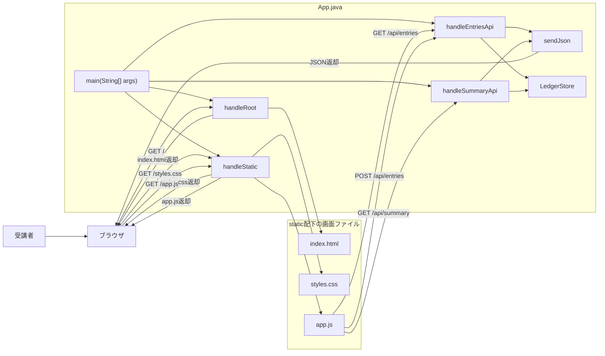
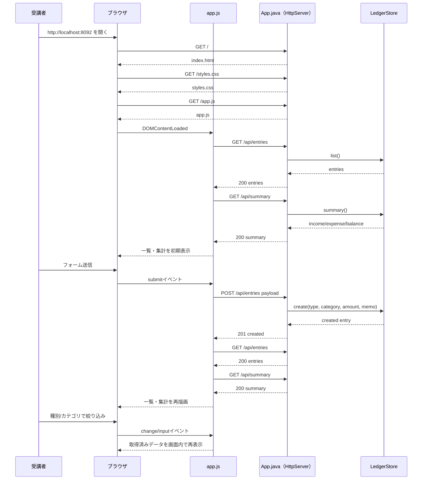
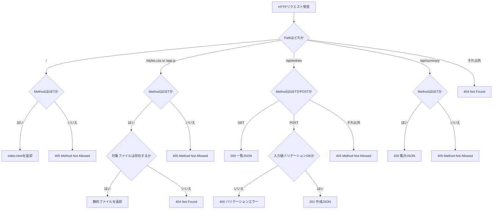

# Lesson3 集計と絞り込み（家計簿Lite Web）

## 目的（Lesson3でできるようになること）
- 入力値のバリデーションをサーバー側で実装できる
- 登録データの集計（収入合計 / 支出合計 / 差引）を表示できる
- JavaScript で一覧の検索・絞り込みを実装できる

## 前提
- Lesson1, Lesson2 を完了している
- Git Bash を使える
- JDK 17 がインストール済み

## Lesson3で作るもの
- 画面: 収支登録フォーム / 合計表示 / 一覧
- API:
  - `GET /api/entries`
  - `POST /api/entries`
  - `GET /api/summary`
- 動作: 登録・集計・絞り込み

### 全体構成図（ファイルと役割）


### JSON最小メモ（未学習者向け）
- JSONは「キー（項目名）: 値」の組でデータを表す文字列。
- 登録時の送信例（リクエスト）:
  ```json
  {"type":"EXPENSE","category":"食費","amount":1200,"memo":"ランチ"}
  ```
- 一覧取得の返却例（レスポンス）:
  ```json
  [{"id":1,"type":"EXPENSE","category":"食費","amount":1200,"memo":"ランチ","createdAt":"2026-04-15T12:34:56"}]
  ```
- 集計取得の返却例（レスポンス）:
  ```json
  {"income":5000,"expense":1200,"balance":3800}
  ```
- エラー時の例:
  ```json
  {"error":"カテゴリを入力してください"}
  {"error":"金額は1以上を入力してください"}
  ```

### 画面表示から登録・集計反映まで（正常系の時系列）


### ルーティングと異常系の分岐（404/405/400）


---

## 0. 事前確認（Git Bashで実行）

```bash
java -version
javac -version
```

---

## 1. 作業フォルダ
作業場所（絶対パス）:
- `~/order-management-springboot/practice/pre-springboot/step3-kakeibo-lite-web`

Git Bash:
```bash
cd ~/order-management-springboot
mkdir -p practice/pre-springboot/step3-kakeibo-lite-web/static
cd ~/order-management-springboot/practice/pre-springboot/step3-kakeibo-lite-web
```

---

## 2. ファイル構成を作成
以下の 4 ファイルを作成:

- `App.java`
- `static/index.html`
- `static/styles.css`
- `static/app.js`

---

## 3. `App.java` を作成
作成ファイル:
- `~/order-management-springboot/practice/pre-springboot/step3-kakeibo-lite-web/App.java`

### 演習中に確認する用語（このStepで使用）
- `record`: 値をまとめる不変データ型。このLessonでは `LedgerEntry`（明細1件）と `Summary`（集計結果）を分かりやすく表現する。
- `AtomicLong`: スレッド安全な連番カウンタ。このLessonでは登録明細の `id` 採番に使う。
- `synchronized`: 同時実行時の排他制御。このLessonでは `LedgerStore` の `create/list/summary` で整合性を守る。
- `LocalDateTime`: 日時を扱う型。このLessonでは登録時刻 `createdAt` を保持して履歴表示に使う。
- `createContext("/api/entries", ...)` と `createContext("/api/summary", ...)`: 明細操作APIと集計APIを別々の入口として登録するルーティング設定。

```java
// 1回分のHTTP通信（リクエスト情報 + レスポンス出力先）を扱う型
import com.sun.net.httpserver.HttpExchange;
// Java標準の簡易HTTPサーバー
import com.sun.net.httpserver.HttpServer;

// 入出力エラー例外
import java.io.IOException;
// 待受IP/ポートの指定に使う
import java.net.InetSocketAddress;
// UTF-8などの文字コード定数
import java.nio.charset.StandardCharsets;
// ファイル存在確認/読み込み
import java.nio.file.Files;
// OS差異を吸収してパスを扱う
import java.nio.file.Path;
// 日時（年月日 + 時分秒）
import java.time.LocalDateTime;
// 可変長リスト実装
import java.util.ArrayList;
// リスト型のインターフェース
import java.util.List;
// 大文字/小文字変換のロケール指定
import java.util.Locale;
// スレッド安全に連番を採番
import java.util.concurrent.atomic.AtomicLong;
// 正規表現の検索結果
import java.util.regex.Matcher;
// 正規表現パターン
import java.util.regex.Pattern;

// アプリ全体のエントリポイントクラス
public class App {
    // 引数でポート指定が無いときに使う既定ポート
    private static final int DEFAULT_PORT = 8092;
    // HTML/CSS/JS の静的ファイルを置くディレクトリ
    private static final Path STATIC_DIR = Path.of("static");
    // JSON本文から必要項目を取り出すための正規表現
    private static final Pattern TYPE_PATTERN = Pattern.compile("\"type\"\\s*:\\s*\"(.*?)\"");
    // JSON本文から必要項目を取り出すための正規表現
    private static final Pattern CATEGORY_PATTERN = Pattern.compile("\"category\"\\s*:\\s*\"(.*?)\"");
    // JSON本文から必要項目を取り出すための正規表現
    private static final Pattern AMOUNT_PATTERN = Pattern.compile("\"amount\"\\s*:\\s*(-?\\d+)");
    // JSON本文から必要項目を取り出すための正規表現
    private static final Pattern MEMO_PATTERN = Pattern.compile("\"memo\"\\s*:\\s*\"(.*?)\"");
    // メモリ上でデータを保持するストア
    private static final LedgerStore STORE = new LedgerStore();

    // アプリ起動の入口。ルーティングを登録してサーバーを開始する
    public static void main(String[] args) throws IOException {
        int port = resolvePort(args);

        HttpServer server = HttpServer.create(new InetSocketAddress(port), 0);
        // ルーティング登録: "/" にアクセスされたときの処理を関連付ける
        server.createContext("/", App::handleRoot);
        // ルーティング登録: "/styles.css" にアクセスされたときの処理を関連付ける
        // exchange は今回1回分のHTTP通信情報。handleStatic に委譲して静的ファイルを返す
        server.createContext("/styles.css", exchange -> handleStatic(exchange, "styles.css", "text/css; charset=UTF-8"));
        // ルーティング登録: "/app.js" にアクセスされたときの処理を関連付ける
        // exchange は今回1回分のHTTP通信情報。handleStatic に委譲して静的ファイルを返す
        server.createContext("/app.js", exchange -> handleStatic(exchange, "app.js", "application/javascript; charset=UTF-8"));
        // ルーティング登録: "/api/entries" にアクセスされたときの処理を関連付ける
        server.createContext("/api/entries", App::handleEntriesApi);
        // ルーティング登録: "/api/summary" にアクセスされたときの処理を関連付ける
        server.createContext("/api/summary", App::handleSummaryApi);
        // スレッド実行方式はデフォルト設定を使う
        server.setExecutor(null);
        // HTTPサーバーを起動して待受開始
        server.start();

        System.out.println("Kakeibo Lite Web started: http://localhost:" + port);
    }

    // 起動引数から使用ポートを決める（不正値なら既定ポート）
    private static int resolvePort(String[] args) {
        if (args.length == 0) {
            return DEFAULT_PORT;
        }
        try {
            return Integer.parseInt(args[0]);
        } catch (NumberFormatException ex) {
            return DEFAULT_PORT;
        }
    }

    // "/" へのアクセスを処理し、index.html を返す
    private static void handleRoot(HttpExchange exchange) throws IOException {
        // GET以外のHTTPメソッドは受け付けない
        if (!"GET".equalsIgnoreCase(exchange.getRequestMethod())) {
            sendJson(exchange, 405, "{\"error\":\"Method Not Allowed\"}");
            return;
        }
        if (!"/".equals(exchange.getRequestURI().getPath())) {
            sendJson(exchange, 404, "{\"error\":\"Not Found\"}");
            return;
        }
        handleStatic(exchange, "index.html", "text/html; charset=UTF-8");
    }

    // static配下のファイルを読み込み、指定Content-Typeで返す共通処理
    private static void handleStatic(HttpExchange exchange, String fileName, String contentType) throws IOException {
        // GET以外のHTTPメソッドは受け付けない
        if (!"GET".equalsIgnoreCase(exchange.getRequestMethod())) {
            sendJson(exchange, 405, "{\"error\":\"Method Not Allowed\"}");
            return;
        }
        Path file = STATIC_DIR.resolve(fileName);
        // 対象ファイルが存在しない場合は404を返す
        if (!Files.exists(file)) {
            sendJson(exchange, 404, "{\"error\":\"Not Found\"}");
            return;
        }

        byte[] body = Files.readAllBytes(file);
        // ブラウザが中身を正しく解釈できるようContent-Typeを設定
        exchange.getResponseHeaders().set("Content-Type", contentType);
        // ステータスコードとボディ長を先に送信する
        exchange.sendResponseHeaders(200, body.length);
        // レスポンス本文を書き込む
        exchange.getResponseBody().write(body);
        // 通信を終了してリソースを解放する
        exchange.close();
    }

    // 収支登録/一覧APIを処理する
    private static void handleEntriesApi(HttpExchange exchange) throws IOException {
        String method = exchange.getRequestMethod().toUpperCase(Locale.ROOT);

        if ("GET".equals(method)) {
            List<LedgerEntry> entries = STORE.list();
            sendJson(exchange, 200, toEntriesJson(entries));
            return;
        }

        if ("POST".equals(method)) {
            // リクエスト本文(JSON文字列)をUTF-8で読み取る
            String body = new String(exchange.getRequestBody().readAllBytes(), StandardCharsets.UTF_8);

            String type = extractString(body, TYPE_PATTERN).trim().toUpperCase(Locale.ROOT);
            String category = extractString(body, CATEGORY_PATTERN).trim();
            int amount = extractInt(body, AMOUNT_PATTERN);
            String memo = extractString(body, MEMO_PATTERN).trim();

            String error = validate(type, category, amount, memo);
            if (error != null) {
                sendJson(exchange, 400, "{\"error\":\"" + escapeJson(error) + "\"}");
                return;
            }

            LedgerEntry created = STORE.create(type, category, amount, memo);
            sendJson(exchange, 201, toEntryJson(created));
            return;
        }

        sendJson(exchange, 405, "{\"error\":\"Method Not Allowed\"}");
    }

    // 収支合計（収入/支出/差引）を返す
    private static void handleSummaryApi(HttpExchange exchange) throws IOException {
        // GET以外のHTTPメソッドは受け付けない
        if (!"GET".equalsIgnoreCase(exchange.getRequestMethod())) {
            sendJson(exchange, 405, "{\"error\":\"Method Not Allowed\"}");
            return;
        }
        Summary summary = STORE.summary();
        // 返却用のJSON文字列を組み立てる
        String json = "{"
            + "\"income\":" + summary.income + ","
            + "\"expense\":" + summary.expense + ","
            + "\"balance\":" + summary.balance
            + "}";
        sendJson(exchange, 200, json);
    }

    // 登録値の業務ルールチェックを行う
    private static String validate(String type, String category, int amount, String memo) {
        if (!"INCOME".equals(type) && !"EXPENSE".equals(type)) {
            return "type は INCOME または EXPENSE を指定してください";
        }
        if (category.isBlank()) {
            return "カテゴリを入力してください";
        }
        if (category.length() > 30) {
            return "カテゴリは30文字以内で入力してください";
        }
        if (amount <= 0) {
            return "金額は1以上を入力してください";
        }
        if (amount > 1_000_000_000) {
            return "金額が大きすぎます";
        }
        if (memo.length() > 100) {
            return "メモは100文字以内で入力してください";
        }
        return null;
    }

    // JSONから文字列項目を抜き出す
    private static String extractString(String body, Pattern pattern) {
        Matcher matcher = pattern.matcher(body);
        if (!matcher.find()) {
            return "";
        }
        return matcher.group(1)
            .replace("\\\"", "\"")
            .replace("\\\\", "\\")
            .replace("\\n", "\n")
            .replace("\\r", "\r")
            .replace("\\t", "\t");
    }

    // JSONから数値項目を抜き出す
    private static int extractInt(String body, Pattern pattern) {
        Matcher matcher = pattern.matcher(body);
        if (!matcher.find()) {
            return 0;
        }
        try {
            return Integer.parseInt(matcher.group(1));
        } catch (NumberFormatException ex) {
            return 0;
        }
    }

    // 収支一覧をJSON配列文字列へ変換する
    private static String toEntriesJson(List<LedgerEntry> entries) {
        StringBuilder builder = new StringBuilder();
        builder.append("[");
        for (int i = 0; i < entries.size(); i++) {
            if (i > 0) {
                builder.append(",");
            }
            builder.append(toEntryJson(entries.get(i)));
        }
        builder.append("]");
        return builder.toString();
    }

    // 収支1件をJSONオブジェクト文字列へ変換する
    private static String toEntryJson(LedgerEntry entry) {
        return "{"
            + "\"id\":" + entry.id + ","
            + "\"type\":\"" + escapeJson(entry.type) + "\","
            + "\"category\":\"" + escapeJson(entry.category) + "\","
            + "\"amount\":" + entry.amount + ","
            + "\"memo\":\"" + escapeJson(entry.memo) + "\","
            + "\"createdAt\":\"" + escapeJson(entry.createdAt) + "\""
            + "}";
    }

    // JSONレスポンスの共通送信処理
    private static void sendJson(HttpExchange exchange, int status, String json) throws IOException {
        byte[] body = json.getBytes(StandardCharsets.UTF_8);
        // ブラウザが中身を正しく解釈できるようContent-Typeを設定
        exchange.getResponseHeaders().set("Content-Type", "application/json; charset=UTF-8");
        // ステータスコードとボディ長を先に送信する
        exchange.sendResponseHeaders(status, body.length);
        // レスポンス本文を書き込む
        exchange.getResponseBody().write(body);
        // 通信を終了してリソースを解放する
        exchange.close();
    }

    // JSON文字列として安全になるようにエスケープする
    private static String escapeJson(String value) {
        return value
            .replace("\\", "\\\\")
            .replace("\"", "\\\"")
            .replace("\n", "\\n")
            .replace("\r", "\\r")
            .replace("\t", "\\t");
    }

    private record LedgerEntry(long id, String type, String category, int amount, String memo, String createdAt) {
    }

    private static final class Summary {
        private final int income;
        private final int expense;
        private final int balance;

        private Summary(int income, int expense) {
            this.income = income;
            this.expense = expense;
            this.balance = income - expense;
        }
    }

    private static final class LedgerStore {
        private final AtomicLong sequence = new AtomicLong(0);
        private final List<LedgerEntry> entries = new ArrayList<>();

        public synchronized LedgerEntry create(String type, String category, int amount, String memo) {
            LedgerEntry entry = new LedgerEntry(
                sequence.incrementAndGet(),
                type,
                category,
                amount,
                memo,
                LocalDateTime.now().toString()
            );
            entries.add(entry);
            return entry;
        }

        public synchronized List<LedgerEntry> list() {
            return new ArrayList<>(entries);
        }

        public synchronized Summary summary() {
            int income = 0;
            int expense = 0;
            for (LedgerEntry entry : entries) {
                if ("INCOME".equals(entry.type)) {
                    income += entry.amount;
                } else if ("EXPENSE".equals(entry.type)) {
                    expense += entry.amount;
                }
            }
            return new Summary(income, expense);
        }
    }
}
```

---

## 4. `index.html` を作成
作成ファイル:
- `~/order-management-springboot/practice/pre-springboot/step3-kakeibo-lite-web/static/index.html`

```html
<!-- HTML5文書であることを宣言 -->
<!doctype html>
<!-- このページの言語設定（日本語） -->
<html lang="ja">
<!-- 画面に表示しないメタ情報をまとめる領域 -->
<head>
  <!-- 文字コードをUTF-8にして文字化けを防ぐ -->
  <meta charset="utf-8">
  <!-- スマホ表示で幅を適切に合わせる -->
  <meta name="viewport" content="width=device-width, initial-scale=1">
  <!-- ブラウザタブに表示されるタイトル -->
  <title>家計簿Lite Web</title>
  <!-- CSSファイルを読み込む -->
  <link rel="stylesheet" href="/styles.css">
</head>
<!-- ユーザーに見える本体コンテンツ -->
<body>
  <!-- 画面の主コンテンツ領域 -->
  <main class="container">
    <!-- 画面の見出し領域 -->
    <header>
      <h1>家計簿Lite Web</h1>
      <p class="muted">収支登録 / 一覧 / 合計 / 絞り込み</p>
    </header>

    <section class="panel">
      <h2>収支を登録</h2>
      <!-- 入力フォーム。submitイベントをJSで受け取る -->
      <form id="entry-form" class="grid-form">
        <label>種別
          <select id="type" required>
            <option value="INCOME">収入</option>
            <option value="EXPENSE">支出</option>
          </select>
        </label>
        <label>カテゴリ
          <!-- ユーザーが値を入力する要素 -->
          <input id="category" type="text" maxlength="30" placeholder="例: 食費 / 給料" required>
        </label>
        <label>金額
          <!-- ユーザーが値を入力する要素 -->
          <input id="amount" type="number" min="1" step="1" placeholder="例: 3000" required>
        </label>
        <label>メモ（任意）
          <!-- ユーザーが値を入力する要素 -->
          <input id="memo" type="text" maxlength="100" placeholder="例: ランチ代">
        </label>
        <!-- 押下操作を行うボタン -->
        <button type="submit">登録</button>
      </form>
      <p id="form-message" class="muted"></p>
    </section>

    <section class="panel">
      <h2>合計</h2>
      <div class="summary-grid">
        <div class="summary-card">
          <p class="label">収入合計</p>
          <p id="income-total" class="value income">0円</p>
        </div>
        <div class="summary-card">
          <p class="label">支出合計</p>
          <p id="expense-total" class="value expense">0円</p>
        </div>
        <div class="summary-card">
          <p class="label">差引</p>
          <p id="balance-total" class="value">0円</p>
        </div>
      </div>
    </section>

    <section class="panel">
      <div class="row">
        <h2>一覧</h2>
        <span id="entry-count" class="muted"></span>
      </div>
      <div class="row filter-row">
        <label>種別絞り込み
          <select id="filter-type">
            <option value="">すべて</option>
            <option value="INCOME">収入</option>
            <option value="EXPENSE">支出</option>
          </select>
        </label>
        <label>カテゴリ検索
          <!-- ユーザーが値を入力する要素 -->
          <input id="filter-category" type="search" placeholder="カテゴリ名で検索">
        </label>
      </div>
      <!-- 一覧表示用テーブル -->
      <table>
        <thead>
          <tr>
            <th>ID</th>
            <th>種別</th>
            <th>カテゴリ</th>
            <th>金額</th>
            <th>メモ</th>
          </tr>
        </thead>
        <!-- JSで行を動的に追加する領域 -->
        <tbody id="entry-body"></tbody>
      </table>
    </section>
  </main>
  <!-- JavaScriptを読み込む。deferでHTML解析後に実行 -->
  <script src="/app.js" defer></script>
</body>
</html>
```

---

## 5. `styles.css` を作成
作成ファイル:
- `~/order-management-springboot/practice/pre-springboot/step3-kakeibo-lite-web/static/styles.css`

```css
/* 画面全体で再利用するデザイン変数を定義 */
:root {
  /* ページ背景色 */
  --bg: #f5f7fa;
  /* カード/パネル背景色 */
  --panel: #ffffff;
  /* 基本文字色 */
  --text: #111827;
  /* 補助文字色 */
  --muted: #6b7280;
  /* 枠線色 */
  --border: #d1d5db;
  /* 強調色（主ボタン等） */
  --accent: #0ea5e9;
  --income: #166534;
  --expense: #b91c1c;
}

/* 要素の幅計算を扱いやすくする共通設定 */
* {
  box-sizing: border-box;
}

/* ページ全体の基本見た目 */
body {
  margin: 0;
  font-family: "Segoe UI", sans-serif;
  background: var(--bg);
  color: var(--text);
}

/* コンテンツの最大幅と中央寄せ */
.container {
  max-width: 960px;
  margin: 0 auto;
  padding: 24px;
}

header {
  margin-bottom: 12px;
}

h1 {
  margin: 0 0 4px;
}

h2 {
  margin: 0 0 10px;
  font-size: 18px;
}

.muted {
  color: var(--muted);
}

/* カード風の共通パネルスタイル */
.panel {
  background: var(--panel);
  border: 1px solid var(--border);
  border-radius: 8px;
  padding: 16px;
  margin-bottom: 14px;
}

.grid-form {
  display: grid;
  gap: 10px;
}

label {
  display: flex;
  flex-direction: column;
  gap: 6px;
  font-size: 14px;
}

input,
select {
  border: 1px solid var(--border);
  border-radius: 6px;
  padding: 9px;
}

/* ボタン共通スタイル */
button {
  width: fit-content;
  border: none;
  border-radius: 6px;
  padding: 9px 14px;
  color: #fff;
  background: var(--accent);
  cursor: pointer;
}

.summary-grid {
  display: grid;
  grid-template-columns: repeat(3, minmax(0, 1fr));
  gap: 10px;
}

.summary-card {
  border: 1px solid var(--border);
  border-radius: 8px;
  padding: 10px;
}

.summary-card .label {
  margin: 0 0 4px;
  color: var(--muted);
}

.summary-card .value {
  margin: 0;
  font-size: 22px;
  font-weight: 700;
}

.income {
  color: var(--income);
}

.expense {
  color: var(--expense);
}

/* 横並び用の共通レイアウト */
.row {
  display: flex;
  align-items: center;
  gap: 10px;
  flex-wrap: wrap;
}

.filter-row {
  margin: 10px 0 12px;
}

/* テーブルの基本設定 */
table {
  width: 100%;
  border-collapse: collapse;
  font-size: 14px;
}

th,
td {
  border-bottom: 1px solid var(--border);
  text-align: left;
  padding: 8px;
}

td.amount {
  font-weight: 600;
}

/* 画面幅が狭い場合の表示調整 */
@media (max-width: 720px) {
  .summary-grid {
    grid-template-columns: 1fr;
  }
}
```

---

## 6. `app.js` を作成
作成ファイル:
- `~/order-management-springboot/practice/pre-springboot/step3-kakeibo-lite-web/static/app.js`

```javascript
// HTMLの読み込み完了後に初期化処理を開始する
document.addEventListener("DOMContentLoaded", () => {
  // HTML要素をIDで取得して、後続処理で使えるようにする
  const form = document.getElementById("entry-form");
  // HTML要素をIDで取得して、後続処理で使えるようにする
  const typeInput = document.getElementById("type");
  // HTML要素をIDで取得して、後続処理で使えるようにする
  const categoryInput = document.getElementById("category");
  // HTML要素をIDで取得して、後続処理で使えるようにする
  const amountInput = document.getElementById("amount");
  // HTML要素をIDで取得して、後続処理で使えるようにする
  const memoInput = document.getElementById("memo");
  // HTML要素をIDで取得して、後続処理で使えるようにする
  const message = document.getElementById("form-message");
  // HTML要素をIDで取得して、後続処理で使えるようにする
  const incomeTotal = document.getElementById("income-total");
  // HTML要素をIDで取得して、後続処理で使えるようにする
  const expenseTotal = document.getElementById("expense-total");
  // HTML要素をIDで取得して、後続処理で使えるようにする
  const balanceTotal = document.getElementById("balance-total");
  // HTML要素をIDで取得して、後続処理で使えるようにする
  const entryBody = document.getElementById("entry-body");
  // HTML要素をIDで取得して、後続処理で使えるようにする
  const entryCount = document.getElementById("entry-count");
  // HTML要素をIDで取得して、後続処理で使えるようにする
  const filterType = document.getElementById("filter-type");
  // HTML要素をIDで取得して、後続処理で使えるようにする
  const filterCategory = document.getElementById("filter-category");

  // 要素取得に失敗した場合は安全に処理を中断する
  if (!(form instanceof HTMLFormElement) ||
      !(typeInput instanceof HTMLSelectElement) ||
      !(categoryInput instanceof HTMLInputElement) ||
      !(amountInput instanceof HTMLInputElement) ||
      !(memoInput instanceof HTMLInputElement) ||
      !(message instanceof HTMLElement) ||
      !(incomeTotal instanceof HTMLElement) ||
      !(expenseTotal instanceof HTMLElement) ||
      !(balanceTotal instanceof HTMLElement) ||
      !(entryBody instanceof HTMLTableSectionElement) ||
      !(entryCount instanceof HTMLElement) ||
      !(filterType instanceof HTMLSelectElement) ||
      !(filterCategory instanceof HTMLInputElement)) {
    return;
  }

  let entries = [];

  const yen = (value) => `${value.toLocaleString("ja-JP")}円`;

  const setMessage = (text) => {
    message.textContent = text;
  };

  const renderSummary = async () => {
    // 通信成功時の処理
    try {
      // APIへHTTPリクエストを送信する
      const response = await fetch("/api/summary");
      // HTTPステータスが失敗系ならエラーメッセージを扱う
      if (!response.ok) {
        throw new Error("summary");
      }
      // レスポンスJSONをJavaScriptオブジェクトへ変換する
      const data = await response.json();
      incomeTotal.textContent = yen(data.income);
      expenseTotal.textContent = yen(data.expense);
      balanceTotal.textContent = yen(data.balance);
    // 通信失敗時の処理（ネットワークエラーなど）
    } catch (error) {
      incomeTotal.textContent = "-";
      expenseTotal.textContent = "-";
      balanceTotal.textContent = "-";
    }
  };

  const applyFilter = () => {
    const type = filterType.value;
    const categoryKeyword = filterCategory.value.trim().toLowerCase();

    const filtered = entries.filter((entry) => {
      const typeMatch = type === "" || entry.type === type;
      const categoryMatch = categoryKeyword === "" || entry.category.toLowerCase().includes(categoryKeyword);
      return typeMatch && categoryMatch;
    });

    entryCount.textContent = `表示件数: ${filtered.length}件 / 全${entries.length}件`;
    entryBody.innerHTML = "";

    if (filtered.length === 0) {
      const row = document.createElement("tr");
      row.innerHTML = `<td colspan="5" class="muted">データがありません。</td>`;
      entryBody.appendChild(row);
      return;
    }

    filtered.forEach((entry) => {
      const row = document.createElement("tr");
      const typeLabel = entry.type === "INCOME" ? "収入" : "支出";
      const amountClass = entry.type === "INCOME" ? "income amount" : "expense amount";
      row.innerHTML = `
        <td>${entry.id}</td>
        <td>${typeLabel}</td>
        <td>${escapeHtml(entry.category)}</td>
        <td class="${amountClass}">${yen(entry.amount)}</td>
        <td>${escapeHtml(entry.memo || "-")}</td>
      `;
      entryBody.appendChild(row);
    });
  };

  const loadEntries = async () => {
    // APIへHTTPリクエストを送信する
    const response = await fetch("/api/entries");
    // HTTPステータスが失敗系ならエラーメッセージを扱う
    if (!response.ok) {
      throw new Error("entries");
    }
    entries = await response.json();
    applyFilter();
    await renderSummary();
  };

  const createEntry = async (payload) => {
    // APIへHTTPリクエストを送信する
    const response = await fetch("/api/entries", {
      method: "POST",
      headers: {
        "Content-Type": "application/json"
      },
      body: JSON.stringify(payload)
    });

    // レスポンスJSONをJavaScriptオブジェクトへ変換する
    const data = await response.json();
    // HTTPステータスが失敗系ならエラーメッセージを扱う
    if (!response.ok) {
      throw new Error(data.error || "登録に失敗しました。");
    }
    return data;
  };

  // フォーム送信イベントを捕捉し、画面遷移を止めて非同期処理する
  form.addEventListener("submit", async (event) => {
    // 既定の送信動作（ページ再読み込み）を止める
    event.preventDefault();
    const amount = Number(amountInput.value);

    const payload = {
      type: typeInput.value,
      category: categoryInput.value.trim(),
      amount,
      memo: memoInput.value.trim()
    };

    // 通信成功時の処理
    try {
      await createEntry(payload);
      // 登録成功後にフォーム入力を初期化する
      form.reset();
      typeInput.value = "INCOME";
      await loadEntries();
      setMessage("登録しました。");
    // 通信失敗時の処理（ネットワークエラーなど）
    } catch (error) {
      setMessage(error.message || "登録に失敗しました。");
    }
  });

  // 選択値変更時に再描画/再取得する
  filterType.addEventListener("change", applyFilter);
  // 入力のたびに即時フィルタリングする
  filterCategory.addEventListener("input", applyFilter);

  // 初期表示に必要なデータを取得し、失敗時メッセージを表示する
  loadEntries().catch(() => {
    setMessage("初期データの取得に失敗しました。");
  });
});

function escapeHtml(value) {
  return String(value)
    .replaceAll("&", "&amp;")
    .replaceAll("<", "&lt;")
    .replaceAll(">", "&gt;")
    .replaceAll("\"", "&quot;")
    .replaceAll("'", "&#39;");
}
```

---

## 7. コンパイル
Git Bash:

```bash
cd ~/order-management-springboot/practice/pre-springboot/step3-kakeibo-lite-web
javac -encoding UTF-8 App.java
```

---

## 8. 起動
Git Bash:

```bash
cd ~/order-management-springboot/practice/pre-springboot/step3-kakeibo-lite-web
java App
```

起動メッセージ:
- `Kakeibo Lite Web started: http://localhost:8092`

---

## 9. 画面確認（必須）
1. ブラウザで `http://localhost:8092` を開く
2. 収入 1 件、支出 2 件を登録する
3. 合計欄（収入合計 / 支出合計 / 差引）が更新されることを確認
4. 種別絞り込みとカテゴリ検索が画面遷移なしで動くことを確認
5. 不正値（例: 金額 0）でエラーメッセージが表示されることを確認

---

## 10. 目的達成演習（必須）
1. 入力値バリデーションがサーバー側で実行される流れを説明できる
2. 集計表示（収入合計 / 支出合計 / 差引）が更新される処理を説明できる
3. 検索・絞り込みが画面遷移なしで反映される仕組みを説明できる

## 10.5 目的達成演習の具体手順
共通手順（各課題で共通）:
1. 該当ファイルを編集
2. コンパイル
   ```bash
   cd ~/order-management-springboot/practice/pre-springboot/step3-kakeibo-lite-web
   javac -encoding UTF-8 App.java
   ```
3. 起動（起動中なら `Ctrl + C` で再起動）
   ```bash
   cd ~/order-management-springboot/practice/pre-springboot/step3-kakeibo-lite-web
   java App
   ```
4. ブラウザで確認

### 1. サーバー側バリデーションの実行を確認する
編集ファイル:
- `~/order-management-springboot/practice/pre-springboot/step3-kakeibo-lite-web/static/index.html`

`index.html` 変更前:
```html
<input id="category" type="text" maxlength="30" placeholder="例: 食費 / 給料" required>
```

`index.html` を一時変更:
```html
<input id="category" type="text" maxlength="100" placeholder="例: 食費 / 給料" required>
```

コード解説:
- HTML側制約を緩めても、`App.java` の `validate` が最終チェックを行う
- 「フロント制約」と「サーバー制約」の責務が分かれる

確認:
- 31文字以上のカテゴリで送信するとエラーになること
- 確認後は `maxlength="30"` に戻すこと

### 2. 集計表示が更新される処理を確認する
編集ファイル:
- `~/order-management-springboot/practice/pre-springboot/step3-kakeibo-lite-web/static/app.js`

`loadEntries` 内を一時変更:
```javascript
entries = await response.json();
applyFilter();
// await renderSummary();
```

コード解説:
- 一覧更新（`applyFilter`）と集計更新（`renderSummary`）は別処理
- `renderSummary` を呼ばないと、一覧だけ更新されて合計値が古いままになる

確認:
- 登録後に一覧は増えるが、合計欄が更新されないこと
- 確認後は `await renderSummary();` を元に戻すこと

### 3. 絞り込みの即時反映（画面遷移なし）を確認する
編集ファイル:
- `~/order-management-springboot/practice/pre-springboot/step3-kakeibo-lite-web/static/app.js`

変更前:
```javascript
filterCategory.addEventListener("input", applyFilter);
```

変更後（一時変更）:
```javascript
filterCategory.addEventListener("change", applyFilter);
```

コード解説:
- `input` は入力中に都度発火、`change` は確定時のみ発火
- 同じ `applyFilter` でもイベント種別で UI 体験が変わる
- どちらもページ遷移なしで DOM 更新している点がポイント

確認:
- 検索欄入力中に即時反映されなくなること
- 確認後は `input` に戻すこと

### 4. 発展（任意）: 差引がマイナスのとき色を変更する
編集ファイル:
- `~/order-management-springboot/practice/pre-springboot/step3-kakeibo-lite-web/static/app.js`

`renderSummary` に追加:
```javascript
balanceTotal.classList.toggle("expense", data.balance < 0);
balanceTotal.classList.toggle("income", data.balance >= 0);
```

### 5. 発展（任意）: 件数表示の文言を変更する
編集ファイル:
- `~/order-management-springboot/practice/pre-springboot/step3-kakeibo-lite-web/static/app.js`

例:
```javascript
entryCount.textContent = `検索結果: ${filtered.length}件（全体 ${entries.length}件）`;
```

---

## 11. 理解ポイント
- バリデーションはクライアント側だけでなくサーバー側にも必要
- 一覧 API と集計 API を分けると責務が明確になる
- `input` / `change` イベントで即時の絞り込み UI を実現できる

---

## 12. つまずきポイント
- 登録できない:
  - `type` が `INCOME` または `EXPENSE` になっているか確認
- 合計が更新されない:
  - 登録後に `loadEntries()` が呼ばれているか確認
- 一覧が空のまま:
  - `/api/entries` のレスポンスをブラウザの Network タブで確認


