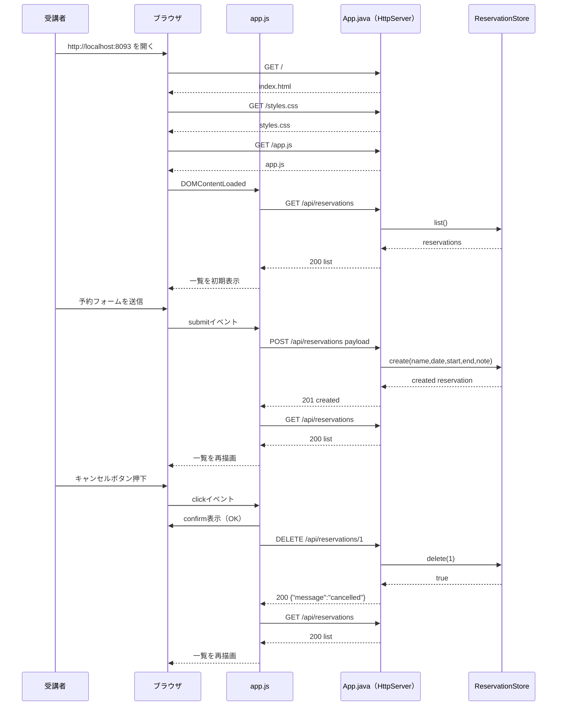

# Lesson4 入力ルール強化（予約フォームアプリ）

## 目的（Lesson4でできるようになること）
- 日付・時刻を扱うフォーム入力とサーバー検証を実装できる
- 予約の重複禁止など業務ルールをサーバー側に実装できる
- 一覧表示と削除（キャンセル）を組み合わせた UI を作れる

## 前提
- Lesson1～Lesson3 を完了している
- Git Bash を使える
- JDK 17 がインストール済み

## Lesson4で作るもの
- 画面: 予約登録フォーム + 予約一覧
- API:
  - `GET /api/reservations`
  - `POST /api/reservations`
  - `DELETE /api/reservations/{id}`
- 動作: 予約作成 / 一覧表示 / キャンセル / 重複予約禁止

### 全体構成図（ファイルと役割）
```mermaid
flowchart LR
  U[受講者] --> B[ブラウザ]

  subgraph ST[static配下の画面ファイル]
    IDX[index.html]
    CSS[styles.css]
    JS[app.js]
  end

  subgraph AP[App.java]
    MAIN["main(String[] args)"]
    ROOT[handleRoot]
    HSTATIC[handleStatic]
    RES[handleReservationsApi]
    RESID[handleReservationByIdApi]
    SJ[sendJson]
    STORE[ReservationStore]
  end

  MAIN --> ROOT
  MAIN --> HSTATIC
  MAIN --> RES
  MAIN --> RESID

  B -->|GET /| ROOT
  ROOT -->|index.html返却| B
  ROOT --> IDX

  B -->|GET /styles.css| HSTATIC
  HSTATIC -->|styles.css返却| B
  HSTATIC --> CSS

  B -->|GET /app.js| HSTATIC
  HSTATIC -->|app.js返却| B
  HSTATIC --> JS

  JS -->|GET /api/reservations| RES
  JS -->|POST /api/reservations| RES
  JS -->|DELETE /api/reservations/{id}| RESID

  RES --> STORE
  RESID --> STORE
  RES --> SJ
  RESID --> SJ
  SJ -->|JSON返却| B
```

### JSON最小メモ（未学習者向け）
- JSONは「キー（項目名）: 値」の組でデータを表す文字列。
- 登録時の送信例（リクエスト）:
  ```json
  {"name":"山田 太郎","date":"2026-04-15","startTime":"10:00","endTime":"11:00","note":"打合せ"}
  ```
- 一覧取得の返却例（レスポンス）:
  ```json
  [{"id":1,"name":"山田 太郎","date":"2026-04-15","startTime":"10:00","endTime":"11:00","note":"打合せ","createdAt":"2026-04-15T09:30:00"}]
  ```
- 削除時の返却例（レスポンス）:
  ```json
  {"message":"cancelled"}
  ```
- エラー時の例:
  ```json
  {"error":"終了時刻は開始時刻より後にしてください"}
  {"error":"同時間帯の予約がすでに存在します"}
  {"error":"invalid id"}
  ```

### 画面表示から予約作成・キャンセルまで（正常系の時系列）


### ルーティングと異常系の分岐（404/405/400/409）
```mermaid
flowchart TD
  A[HTTPリクエスト受信] --> P{Pathはどれか}

  P -->|/| R1{MethodはGETか}
  R1 -->|はい| OK1[index.htmlを返却]
  R1 -->|いいえ| E405A[405 Method Not Allowed]

  P -->|/styles.css or /app.js| R2{MethodはGETか}
  R2 -->|はい| F{対象ファイルは存在するか}
  F -->|はい| OK2[静的ファイルを返却]
  F -->|いいえ| E404A[404 Not Found]
  R2 -->|いいえ| E405B[405 Method Not Allowed]

  P -->|/api/reservations| R3{MethodはGETかPOSTか}
  R3 -->|GET| OK3[200 一覧JSON]
  R3 -->|POST| V1{必須/文字数の基本検証OKか}
  V1 -->|いいえ| E400A[400 バリデーションエラー]
  V1 -->|はい| V2{日付時刻形式OKか}
  V2 -->|いいえ| E400B[400 形式不正]
  V2 -->|はい| V3{終了時刻 > 開始時刻か}
  V3 -->|いいえ| E400C[400 時刻逆転]
  V3 -->|はい| V4{同時間帯の重複なし}
  V4 -->|いいえ| E409A[409 重複予約]
  V4 -->|はい| OK4[201 作成JSON]
  R3 -->|それ以外| E405C[405 Method Not Allowed]

  P -->|/api/reservations/{id}| R4{idは数値か}
  R4 -->|いいえ| E400D[400 invalid id]
  R4 -->|はい| M{MethodはDELETEか}
  M -->|いいえ| E405D[405 Method Not Allowed]
  M -->|はい| EX{対象予約は存在するか}
  EX -->|いいえ| E404B[404 reservation not found]
  EX -->|はい| OK5[200 cancelled]

  P -->|それ以外| E404C[404 Not Found]
```

---

## 0. 事前確認（Git Bashで実行）

```bash
java -version
javac -version
```

---

## 1. 作業フォルダ
作業場所（絶対パス）:
- `~/order-management-springboot/practice/pre-springboot/step4-reservation-form-app`

Git Bash:
```bash
cd ~/order-management-springboot
mkdir -p practice/pre-springboot/step4-reservation-form-app/static
cd ~/order-management-springboot/practice/pre-springboot/step4-reservation-form-app
```

---

## 2. ファイル構成を作成
以下の 4 ファイルを作成:

- `App.java`
- `static/index.html`
- `static/styles.css`
- `static/app.js`

---

## 3. `App.java` を作成
作成ファイル:
- `~/order-management-springboot/practice/pre-springboot/step4-reservation-form-app/App.java`

```java
// 1回分のHTTP通信（リクエスト情報 + レスポンス出力先）を扱う型
import com.sun.net.httpserver.HttpExchange;
// Java標準の簡易HTTPサーバー
import com.sun.net.httpserver.HttpServer;

// 入出力エラー例外
import java.io.IOException;
// 待受IP/ポートの指定に使う
import java.net.InetSocketAddress;
// UTF-8などの文字コード定数
import java.nio.charset.StandardCharsets;
// ファイル存在確認/読み込み
import java.nio.file.Files;
// OS差異を吸収してパスを扱う
import java.nio.file.Path;
// 日付のみ
import java.time.LocalDate;
// 日時（年月日 + 時分秒）
import java.time.LocalDateTime;
// 時刻のみ
import java.time.LocalTime;
// 日時文字列の解析失敗例外
import java.time.format.DateTimeParseException;
// 可変長リスト実装
import java.util.ArrayList;
// 並び替え条件を定義
import java.util.Comparator;
// リスト型のインターフェース
import java.util.List;
// 大文字/小文字変換のロケール指定
import java.util.Locale;
// スレッド安全に連番を採番
import java.util.concurrent.atomic.AtomicLong;
// 正規表現の検索結果
import java.util.regex.Matcher;
// 正規表現パターン
import java.util.regex.Pattern;

// アプリ全体のエントリポイントクラス
public class App {
    // 引数でポート指定が無いときに使う既定ポート
    private static final int DEFAULT_PORT = 8093;
    // HTML/CSS/JS の静的ファイルを置くディレクトリ
    private static final Path STATIC_DIR = Path.of("static");
    // JSON本文から必要項目を取り出すための正規表現
    private static final Pattern NAME_PATTERN = Pattern.compile("\"name\"\\s*:\\s*\"(.*?)\"");
    // JSON本文から必要項目を取り出すための正規表現
    private static final Pattern DATE_PATTERN = Pattern.compile("\"date\"\\s*:\\s*\"(.*?)\"");
    // JSON本文から必要項目を取り出すための正規表現
    private static final Pattern START_PATTERN = Pattern.compile("\"startTime\"\\s*:\\s*\"(.*?)\"");
    // JSON本文から必要項目を取り出すための正規表現
    private static final Pattern END_PATTERN = Pattern.compile("\"endTime\"\\s*:\\s*\"(.*?)\"");
    // JSON本文から必要項目を取り出すための正規表現
    private static final Pattern NOTE_PATTERN = Pattern.compile("\"note\"\\s*:\\s*\"(.*?)\"");
    // メモリ上でデータを保持するストア
    private static final ReservationStore STORE = new ReservationStore();

    // アプリ起動の入口。ルーティングを登録してサーバーを開始する
    public static void main(String[] args) throws IOException {
        int port = resolvePort(args);

        HttpServer server = HttpServer.create(new InetSocketAddress(port), 0);
        // ルーティング登録: "/" にアクセスされたときの処理を関連付ける
        server.createContext("/", App::handleRoot);
        // ルーティング登録: "/styles.css" にアクセスされたときの処理を関連付ける
        // exchange は今回1回分のHTTP通信情報。handleStatic に委譲して静的ファイルを返す
        server.createContext("/styles.css", exchange -> handleStatic(exchange, "styles.css", "text/css; charset=UTF-8"));
        // ルーティング登録: "/app.js" にアクセスされたときの処理を関連付ける
        // exchange は今回1回分のHTTP通信情報。handleStatic に委譲して静的ファイルを返す
        server.createContext("/app.js", exchange -> handleStatic(exchange, "app.js", "application/javascript; charset=UTF-8"));
        // ルーティング登録: "/api/reservations" にアクセスされたときの処理を関連付ける
        server.createContext("/api/reservations", App::handleReservationsApi);
        // ルーティング登録: "/api/reservations/" にアクセスされたときの処理を関連付ける
        server.createContext("/api/reservations/", App::handleReservationByIdApi);
        // スレッド実行方式はデフォルト設定を使う
        server.setExecutor(null);
        // HTTPサーバーを起動して待受開始
        server.start();

        System.out.println("Reservation Form App started: http://localhost:" + port);
    }

    // 起動引数から使用ポートを決める（不正値なら既定ポート）
    private static int resolvePort(String[] args) {
        if (args.length == 0) {
            return DEFAULT_PORT;
        }
        try {
            return Integer.parseInt(args[0]);
        } catch (NumberFormatException ex) {
            return DEFAULT_PORT;
        }
    }

    // "/" へのアクセスを処理し、index.html を返す
    private static void handleRoot(HttpExchange exchange) throws IOException {
        // GET以外のHTTPメソッドは受け付けない
        if (!"GET".equalsIgnoreCase(exchange.getRequestMethod())) {
            sendJson(exchange, 405, "{\"error\":\"Method Not Allowed\"}");
            return;
        }
        if (!"/".equals(exchange.getRequestURI().getPath())) {
            sendJson(exchange, 404, "{\"error\":\"Not Found\"}");
            return;
        }
        handleStatic(exchange, "index.html", "text/html; charset=UTF-8");
    }

    // static配下のファイルを読み込み、指定Content-Typeで返す共通処理
    private static void handleStatic(HttpExchange exchange, String fileName, String contentType) throws IOException {
        // GET以外のHTTPメソッドは受け付けない
        if (!"GET".equalsIgnoreCase(exchange.getRequestMethod())) {
            sendJson(exchange, 405, "{\"error\":\"Method Not Allowed\"}");
            return;
        }
        Path file = STATIC_DIR.resolve(fileName);
        // 対象ファイルが存在しない場合は404を返す
        if (!Files.exists(file)) {
            sendJson(exchange, 404, "{\"error\":\"Not Found\"}");
            return;
        }

        byte[] body = Files.readAllBytes(file);
        // ブラウザが中身を正しく解釈できるようContent-Typeを設定
        exchange.getResponseHeaders().set("Content-Type", contentType);
        // ステータスコードとボディ長を先に送信する
        exchange.sendResponseHeaders(200, body.length);
        // レスポンス本文を書き込む
        exchange.getResponseBody().write(body);
        // 通信を終了してリソースを解放する
        exchange.close();
    }

    // 予約一覧取得と予約作成を処理する
    private static void handleReservationsApi(HttpExchange exchange) throws IOException {
        String method = exchange.getRequestMethod().toUpperCase(Locale.ROOT);

        if ("GET".equals(method)) {
            sendJson(exchange, 200, toListJson(STORE.list()));
            return;
        }

        if ("POST".equals(method)) {
            // リクエスト本文(JSON文字列)をUTF-8で読み取る
            String body = new String(exchange.getRequestBody().readAllBytes(), StandardCharsets.UTF_8);

            String name = extractString(body, NAME_PATTERN).trim();
            String dateText = extractString(body, DATE_PATTERN).trim();
            String startText = extractString(body, START_PATTERN).trim();
            String endText = extractString(body, END_PATTERN).trim();
            String note = extractString(body, NOTE_PATTERN).trim();

            String validationError = validateBasic(name, dateText, startText, endText, note);
            if (validationError != null) {
                sendJson(exchange, 400, "{\"error\":\"" + escapeJson(validationError) + "\"}");
                return;
            }

            LocalDate date;
            LocalTime startTime;
            LocalTime endTime;
            try {
                date = LocalDate.parse(dateText);
                startTime = LocalTime.parse(startText);
                endTime = LocalTime.parse(endText);
            } catch (DateTimeParseException ex) {
                sendJson(exchange, 400, "{\"error\":\"日付または時刻の形式が不正です\"}");
                return;
            }

            if (!endTime.isAfter(startTime)) {
                sendJson(exchange, 400, "{\"error\":\"終了時刻は開始時刻より後にしてください\"}");
                return;
            }

            if (STORE.hasOverlap(date, startTime, endTime)) {
                sendJson(exchange, 409, "{\"error\":\"同時間帯の予約がすでに存在します\"}");
                return;
            }

            Reservation reservation = STORE.create(name, date, startTime, endTime, note);
            sendJson(exchange, 201, toJson(reservation));
            return;
        }

        sendJson(exchange, 405, "{\"error\":\"Method Not Allowed\"}");
    }

    // 予約ID指定のキャンセル処理を行う
    private static void handleReservationByIdApi(HttpExchange exchange) throws IOException {
        String method = exchange.getRequestMethod().toUpperCase(Locale.ROOT);
        String path = exchange.getRequestURI().getPath();

        if (!path.startsWith("/api/reservations/")) {
            sendJson(exchange, 404, "{\"error\":\"Not Found\"}");
            return;
        }

        String idPart = path.substring("/api/reservations/".length()).trim();
        if (idPart.isBlank()) {
            sendJson(exchange, 404, "{\"error\":\"Not Found\"}");
            return;
        }

        long id;
        try {
            id = Long.parseLong(idPart);
        } catch (NumberFormatException ex) {
            sendJson(exchange, 400, "{\"error\":\"invalid id\"}");
            return;
        }

        if ("DELETE".equals(method)) {
            boolean deleted = STORE.delete(id);
            if (!deleted) {
                sendJson(exchange, 404, "{\"error\":\"reservation not found\"}");
                return;
            }
            sendJson(exchange, 200, "{\"message\":\"cancelled\"}");
            return;
        }

        sendJson(exchange, 405, "{\"error\":\"Method Not Allowed\"}");
    }

    // 予約入力の基本バリデーションを行う
    private static String validateBasic(String name, String dateText, String startText, String endText, String note) {
        if (name.isBlank()) {
            return "名前を入力してください";
        }
        if (name.length() > 40) {
            return "名前は40文字以内で入力してください";
        }
        if (dateText.isBlank()) {
            return "日付を入力してください";
        }
        if (startText.isBlank() || endText.isBlank()) {
            return "開始時刻と終了時刻を入力してください";
        }
        if (note.length() > 100) {
            return "メモは100文字以内で入力してください";
        }
        return null;
    }

    // JSONから文字列項目を抜き出す
    private static String extractString(String body, Pattern pattern) {
        Matcher matcher = pattern.matcher(body);
        if (!matcher.find()) {
            return "";
        }
        return matcher.group(1)
            .replace("\\\"", "\"")
            .replace("\\\\", "\\")
            .replace("\\n", "\n")
            .replace("\\r", "\r")
            .replace("\\t", "\t");
    }

    // 予約一覧をJSON配列へ変換する
    private static String toListJson(List<Reservation> reservations) {
        StringBuilder builder = new StringBuilder();
        builder.append("[");
        for (int i = 0; i < reservations.size(); i++) {
            if (i > 0) {
                builder.append(",");
            }
            builder.append(toJson(reservations.get(i)));
        }
        builder.append("]");
        return builder.toString();
    }

    // 単一データをJSON文字列へ変換する
    private static String toJson(Reservation reservation) {
        return "{"
            + "\"id\":" + reservation.id + ","
            + "\"name\":\"" + escapeJson(reservation.name) + "\","
            + "\"date\":\"" + reservation.date + "\","
            + "\"startTime\":\"" + reservation.startTime + "\","
            + "\"endTime\":\"" + reservation.endTime + "\","
            + "\"note\":\"" + escapeJson(reservation.note) + "\","
            + "\"createdAt\":\"" + reservation.createdAt + "\""
            + "}";
    }

    // JSONレスポンスの共通送信処理
    private static void sendJson(HttpExchange exchange, int status, String json) throws IOException {
        byte[] body = json.getBytes(StandardCharsets.UTF_8);
        // ブラウザが中身を正しく解釈できるようContent-Typeを設定
        exchange.getResponseHeaders().set("Content-Type", "application/json; charset=UTF-8");
        // ステータスコードとボディ長を先に送信する
        exchange.sendResponseHeaders(status, body.length);
        // レスポンス本文を書き込む
        exchange.getResponseBody().write(body);
        // 通信を終了してリソースを解放する
        exchange.close();
    }

    // JSON文字列として安全になるようにエスケープする
    private static String escapeJson(String value) {
        return value
            .replace("\\", "\\\\")
            .replace("\"", "\\\"")
            .replace("\n", "\\n")
            .replace("\r", "\\r")
            .replace("\t", "\\t");
    }

    private record Reservation(
        long id,
        String name,
        LocalDate date,
        LocalTime startTime,
        LocalTime endTime,
        String note,
        LocalDateTime createdAt
    ) {
    }

    private static final class ReservationStore {
        private final AtomicLong sequence = new AtomicLong(0);
        private final List<Reservation> reservations = new ArrayList<>();

        public synchronized List<Reservation> list() {
            List<Reservation> copy = new ArrayList<>(reservations);
            copy.sort(Comparator
                .comparing(Reservation::date)
                .thenComparing(Reservation::startTime)
                .thenComparing(Reservation::id));
            return copy;
        }

        public synchronized Reservation create(String name, LocalDate date, LocalTime startTime, LocalTime endTime, String note) {
            Reservation reservation = new Reservation(
                sequence.incrementAndGet(),
                name,
                date,
                startTime,
                endTime,
                note,
                LocalDateTime.now()
            );
            reservations.add(reservation);
            return reservation;
        }

        public synchronized boolean hasOverlap(LocalDate date, LocalTime startTime, LocalTime endTime) {
            for (Reservation reservation : reservations) {
                if (!reservation.date.equals(date)) {
                    continue;
                }
                boolean overlap = startTime.isBefore(reservation.endTime) && endTime.isAfter(reservation.startTime);
                if (overlap) {
                    return true;
                }
            }
            return false;
        }

        public synchronized boolean delete(long id) {
            for (int i = 0; i < reservations.size(); i++) {
                if (reservations.get(i).id == id) {
                    reservations.remove(i);
                    return true;
                }
            }
            return false;
        }
    }
}
```

---

## 4. `index.html` を作成
作成ファイル:
- `~/order-management-springboot/practice/pre-springboot/step4-reservation-form-app/static/index.html`

```html
<!-- HTML5文書であることを宣言 -->
<!doctype html>
<!-- このページの言語設定（日本語） -->
<html lang="ja">
<!-- 画面に表示しないメタ情報をまとめる領域 -->
<head>
  <!-- 文字コードをUTF-8にして文字化けを防ぐ -->
  <meta charset="utf-8">
  <!-- スマホ表示で幅を適切に合わせる -->
  <meta name="viewport" content="width=device-width, initial-scale=1">
  <!-- ブラウザタブに表示されるタイトル -->
  <title>予約フォームアプリ</title>
  <!-- CSSファイルを読み込む -->
  <link rel="stylesheet" href="/styles.css">
</head>
<!-- ユーザーに見える本体コンテンツ -->
<body>
  <!-- 画面の主コンテンツ領域 -->
  <main class="container">
    <!-- 画面の見出し領域 -->
    <header>
      <h1>予約フォームアプリ</h1>
      <p class="muted">予約作成 / 一覧 / キャンセル / 重複予約禁止</p>
    </header>

    <section class="panel">
      <h2>予約登録</h2>
      <!-- 入力フォーム。submitイベントをJSで受け取る -->
      <form id="reservation-form" class="grid-form">
        <label>名前
          <!-- ユーザーが値を入力する要素 -->
          <input id="name" type="text" maxlength="40" placeholder="例: 山田 太郎" required>
        </label>
        <label>日付
          <!-- ユーザーが値を入力する要素 -->
          <input id="date" type="date" required>
        </label>
        <label>開始時刻
          <!-- ユーザーが値を入力する要素 -->
          <input id="start-time" type="time" required>
        </label>
        <label>終了時刻
          <!-- ユーザーが値を入力する要素 -->
          <input id="end-time" type="time" required>
        </label>
        <label>メモ（任意）
          <!-- ユーザーが値を入力する要素 -->
          <input id="note" type="text" maxlength="100" placeholder="例: 面談">
        </label>
        <!-- 押下操作を行うボタン -->
        <button type="submit">予約する</button>
      </form>
      <p id="message" class="muted"></p>
    </section>

    <section class="panel">
      <div class="row">
        <h2>予約一覧</h2>
        <span id="count" class="muted"></span>
      </div>
      <!-- 一覧表示用テーブル -->
      <table>
        <thead>
          <tr>
            <th>ID</th>
            <th>名前</th>
            <th>日付</th>
            <th>時間</th>
            <th>メモ</th>
            <th>操作</th>
          </tr>
        </thead>
        <!-- JSで行を動的に追加する領域 -->
        <tbody id="reservation-body"></tbody>
      </table>
    </section>
  </main>
  <!-- JavaScriptを読み込む。deferでHTML解析後に実行 -->
  <script src="/app.js" defer></script>
</body>
</html>
```

---

## 5. `styles.css` を作成
作成ファイル:
- `~/order-management-springboot/practice/pre-springboot/step4-reservation-form-app/static/styles.css`

```css
/* 画面全体で再利用するデザイン変数を定義 */
:root {
  /* ページ背景色 */
  --bg: #f6f8fb;
  /* カード/パネル背景色 */
  --panel: #ffffff;
  /* 基本文字色 */
  --text: #1f2937;
  /* 補助文字色 */
  --muted: #6b7280;
  /* 枠線色 */
  --border: #d1d5db;
  /* 強調色（主ボタン等） */
  --accent: #0284c7;
  /* 危険操作色（削除ボタン等） */
  --danger: #dc2626;
}

/* 要素の幅計算を扱いやすくする共通設定 */
* {
  box-sizing: border-box;
}

/* ページ全体の基本見た目 */
body {
  margin: 0;
  font-family: "Segoe UI", sans-serif;
  background: var(--bg);
  color: var(--text);
}

/* コンテンツの最大幅と中央寄せ */
.container {
  max-width: 980px;
  margin: 0 auto;
  padding: 24px;
}

header {
  margin-bottom: 12px;
}

h1 {
  margin: 0 0 4px;
}

h2 {
  margin: 0 0 10px;
  font-size: 18px;
}

.muted {
  color: var(--muted);
}

/* カード風の共通パネルスタイル */
.panel {
  background: var(--panel);
  border: 1px solid var(--border);
  border-radius: 8px;
  padding: 16px;
  margin-bottom: 14px;
}

.grid-form {
  display: grid;
  grid-template-columns: repeat(2, minmax(0, 1fr));
  gap: 10px;
}

label {
  display: flex;
  flex-direction: column;
  gap: 6px;
  font-size: 14px;
}

input {
  border: 1px solid var(--border);
  border-radius: 6px;
  padding: 9px;
}

/* ボタン共通スタイル */
button {
  width: fit-content;
  border: none;
  border-radius: 6px;
  padding: 9px 14px;
  color: #fff;
  background: var(--accent);
  cursor: pointer;
}

button.cancel {
  background: var(--danger);
}

/* 横並び用の共通レイアウト */
.row {
  display: flex;
  align-items: center;
  gap: 10px;
  flex-wrap: wrap;
}

/* テーブルの基本設定 */
table {
  width: 100%;
  border-collapse: collapse;
  font-size: 14px;
}

th,
td {
  border-bottom: 1px solid var(--border);
  text-align: left;
  padding: 8px;
}

/* 画面幅が狭い場合の表示調整 */
@media (max-width: 780px) {
  .grid-form {
    grid-template-columns: 1fr;
  }
}
```

---

## 6. `app.js` を作成
作成ファイル:
- `~/order-management-springboot/practice/pre-springboot/step4-reservation-form-app/static/app.js`

```javascript
// HTMLの読み込み完了後に初期化処理を開始する
document.addEventListener("DOMContentLoaded", () => {
  // HTML要素をIDで取得して、後続処理で使えるようにする
  const form = document.getElementById("reservation-form");
  // HTML要素をIDで取得して、後続処理で使えるようにする
  const nameInput = document.getElementById("name");
  // HTML要素をIDで取得して、後続処理で使えるようにする
  const dateInput = document.getElementById("date");
  // HTML要素をIDで取得して、後続処理で使えるようにする
  const startTimeInput = document.getElementById("start-time");
  // HTML要素をIDで取得して、後続処理で使えるようにする
  const endTimeInput = document.getElementById("end-time");
  // HTML要素をIDで取得して、後続処理で使えるようにする
  const noteInput = document.getElementById("note");
  // HTML要素をIDで取得して、後続処理で使えるようにする
  const message = document.getElementById("message");
  // HTML要素をIDで取得して、後続処理で使えるようにする
  const count = document.getElementById("count");
  // HTML要素をIDで取得して、後続処理で使えるようにする
  const body = document.getElementById("reservation-body");

  // 要素取得に失敗した場合は安全に処理を中断する
  if (!(form instanceof HTMLFormElement) ||
      !(nameInput instanceof HTMLInputElement) ||
      !(dateInput instanceof HTMLInputElement) ||
      !(startTimeInput instanceof HTMLInputElement) ||
      !(endTimeInput instanceof HTMLInputElement) ||
      !(noteInput instanceof HTMLInputElement) ||
      !(message instanceof HTMLElement) ||
      !(count instanceof HTMLElement) ||
      !(body instanceof HTMLTableSectionElement)) {
    return;
  }

  const setMessage = (text) => {
    message.textContent = text;
  };

  const formatTime = (value) => value.slice(0, 5);

  const renderReservations = (reservations) => {
    body.innerHTML = "";
    count.textContent = `件数: ${reservations.length}`;

    if (reservations.length === 0) {
      const row = document.createElement("tr");
      row.innerHTML = `<td colspan="6" class="muted">予約がありません。</td>`;
      body.appendChild(row);
      return;
    }

    reservations.forEach((reservation) => {
      const row = document.createElement("tr");
      row.innerHTML = `
        <td>${reservation.id}</td>
        <td>${escapeHtml(reservation.name)}</td>
        <td>${reservation.date}</td>
        <td>${formatTime(reservation.startTime)} - ${formatTime(reservation.endTime)}</td>
        <td>${escapeHtml(reservation.note || "-")}</td>
        <td><button type="button" class="cancel">キャンセル</button></td>
      `;

      const cancelButton = row.querySelector("button.cancel");
      if (cancelButton instanceof HTMLButtonElement) {
        // ボタンクリック時の処理を登録する
        cancelButton.addEventListener("click", () => cancelReservation(reservation.id, reservation.name));
      }

      body.appendChild(row);
    });
  };

  const loadReservations = async () => {
    // APIへHTTPリクエストを送信する
    const response = await fetch("/api/reservations");
    // HTTPステータスが失敗系ならエラーメッセージを扱う
    if (!response.ok) {
      throw new Error("一覧取得に失敗しました。");
    }
    const reservations = await response.json();
    renderReservations(reservations);
  };

  const createReservation = async (payload) => {
    // APIへHTTPリクエストを送信する
    const response = await fetch("/api/reservations", {
      method: "POST",
      headers: {
        "Content-Type": "application/json"
      },
      body: JSON.stringify(payload)
    });

    // レスポンスJSONをJavaScriptオブジェクトへ変換する
    const data = await response.json();
    // HTTPステータスが失敗系ならエラーメッセージを扱う
    if (!response.ok) {
      throw new Error(data.error || "登録に失敗しました。");
    }
    return data;
  };

  const cancelReservation = async (id, name) => {
    // ユーザーに最終確認ダイアログを表示する
    const ok = window.confirm(`「${name}」の予約をキャンセルします。よろしいですか？`);
    if (!ok) {
      return;
    }

    // 通信成功時の処理
    try {
      // APIへHTTPリクエストを送信する
      const response = await fetch(`/api/reservations/${id}`, { method: "DELETE" });
      // レスポンスJSONをJavaScriptオブジェクトへ変換する
      const data = await response.json();
      // HTTPステータスが失敗系ならエラーメッセージを扱う
      if (!response.ok) {
        throw new Error(data.error || "キャンセルに失敗しました。");
      }
      await loadReservations();
      setMessage("キャンセルしました。");
    // 通信失敗時の処理（ネットワークエラーなど）
    } catch (error) {
      setMessage(error.message || "キャンセルに失敗しました。");
    }
  };

  // フォーム送信イベントを捕捉し、画面遷移を止めて非同期処理する
  form.addEventListener("submit", async (event) => {
    // 既定の送信動作（ページ再読み込み）を止める
    event.preventDefault();

    const payload = {
      name: nameInput.value.trim(),
      date: dateInput.value,
      startTime: startTimeInput.value,
      endTime: endTimeInput.value,
      note: noteInput.value.trim()
    };

    if (payload.startTime >= payload.endTime) {
      setMessage("終了時刻は開始時刻より後にしてください。");
      return;
    }

    // 通信成功時の処理
    try {
      await createReservation(payload);
      // 登録成功後にフォーム入力を初期化する
      form.reset();
      await loadReservations();
      setMessage("予約を登録しました。");
    // 通信失敗時の処理（ネットワークエラーなど）
    } catch (error) {
      setMessage(error.message || "登録に失敗しました。");
    }
  });

  // 初期表示に必要なデータを取得し、失敗時メッセージを表示する
  loadReservations().catch((error) => {
    setMessage(error.message || "初期表示に失敗しました。");
  });
});

function escapeHtml(value) {
  return String(value)
    .replaceAll("&", "&amp;")
    .replaceAll("<", "&lt;")
    .replaceAll(">", "&gt;")
    .replaceAll("\"", "&quot;")
    .replaceAll("'", "&#39;");
}
```

---

## 7. コンパイル
Git Bash:

```bash
cd ~/order-management-springboot/practice/pre-springboot/step4-reservation-form-app
javac -encoding UTF-8 App.java
```

---

## 8. 起動
Git Bash:

```bash
cd ~/order-management-springboot/practice/pre-springboot/step4-reservation-form-app
java App
```

起動メッセージ:
- `Reservation Form App started: http://localhost:8093`

---

## 9. 画面確認（必須）
1. ブラウザで `http://localhost:8093` を開く
2. 予約を 1 件登録し、一覧に表示されることを確認
3. 同じ日付・重なる時間帯で登録し、エラーになることを確認
4. キャンセルボタン押下時に確認ダイアログが出ることを確認
5. OK で一覧から削除されることを確認

---

## 10. 目的達成演習（必須）
1. 日付・時刻入力とサーバー検証の流れを説明できる
2. 予約重複禁止の業務ルールがサーバー側で判定される理由を説明できる
3. 一覧表示とキャンセル操作の連携（確認ダイアログ含む）を説明できる

## 10.5 目的達成演習の具体手順
共通手順（各課題で共通）:
1. 該当ファイルを編集
2. コンパイル
   ```bash
   cd ~/order-management-springboot/practice/pre-springboot/step4-reservation-form-app
   javac -encoding UTF-8 App.java
   ```
3. 起動（起動中なら `Ctrl + C` で再起動）
   ```bash
   cd ~/order-management-springboot/practice/pre-springboot/step4-reservation-form-app
   java App
   ```
4. ブラウザで確認

### 1. 時刻検証の流れ（フロント + サーバー）を確認する
編集ファイル:
- `~/order-management-springboot/practice/pre-springboot/step4-reservation-form-app/static/app.js`

一時変更（フロント側チェックを無効化）:
```javascript
if (payload.startTime >= payload.endTime) {
  setMessage("終了時刻は開始時刻より後にしてください。");
  return;
}
```

上記を次のように一時変更:
```javascript
if (false && payload.startTime >= payload.endTime) {
  setMessage("終了時刻は開始時刻より後にしてください。");
  return;
}
```

コード解説:
- フロントチェックを外しても、サーバーの `!endTime.isAfter(startTime)` が不正値を拒否する
- 入力検証は「フロントで早期通知」「サーバーで最終保証」の二段構えになる

確認:
- `開始 10:00 / 終了 09:00` で送信し、サーバーエラーになること
- 確認後は `if (payload.startTime >= payload.endTime)` に戻すこと

### 2. 重複予約禁止がサーバー側で効いていることを確認する
編集ファイル:
- `~/order-management-springboot/practice/pre-springboot/step4-reservation-form-app/App.java`

一時変更（重複判定を無効化）:
```java
if (STORE.hasOverlap(date, startTime, endTime)) {
    sendJson(exchange, 409, "{\"error\":\"同時間帯の予約がすでに存在します\"}");
    return;
}
```

上記ブロックを一時的にコメントアウトして動作確認後、必ず元に戻す。

コード解説:
- 重複禁止は `App.java` の業務ルール判定で成立している
- フロント側は重複データを持たないため、最終判定はサーバーで行う必要がある

確認:
- 同一日時帯の予約が通ってしまうことを確認
- 確認後は元の重複判定ブロックを戻すこと

### 3. キャンセル確認ダイアログと一覧更新の連携を確認する
編集ファイル:
- `~/order-management-springboot/practice/pre-springboot/step4-reservation-form-app/static/app.js`

`cancelReservation` のキャンセル分岐を変更:
```javascript
if (!ok) {
  setMessage("キャンセルを中止しました。");
  return;
}
```

コード解説:
- `return` で API 呼び出し（DELETE）を止める分岐になる
- OK時は `await loadReservations();` で一覧を再取得し、画面遷移なしで更新される

確認:
- キャンセル押下時に DELETE リクエストが送られないこと
- OK押下時は一覧から対象予約が消えること

### 4. 発展（任意）: 名前最大文字数を 30 に変更する
編集ファイル:
- `~/order-management-springboot/practice/pre-springboot/step4-reservation-form-app/App.java`
- `~/order-management-springboot/practice/pre-springboot/step4-reservation-form-app/static/index.html`

例:
```java
if (name.length() > 30) {
    return "名前は30文字以内で入力してください";
}
```

### 5. 発展（任意）: 一覧に `createdAt` を表示する
編集ファイル:
- `~/order-management-springboot/practice/pre-springboot/step4-reservation-form-app/static/index.html`
- `~/order-management-springboot/practice/pre-springboot/step4-reservation-form-app/static/app.js`

---

## 11. 理解ポイント
- 業務ルール（時間重複禁止）はサーバー側で必ずチェックする
- 日付/時刻は `LocalDate` `LocalTime` で扱うと比較しやすい
- UI 側でも事前チェックを入れると操作体験が向上する

---

## 12. つまずきポイント
- `409` エラーになる:
  - 同時間帯の予約が既に登録されていないか確認
- 時刻比較が意図通り動かない:
  - `startTime` と `endTime` の入力値を確認
- 削除できない:
  - URL が `/api/reservations/{id}` になっているか確認


